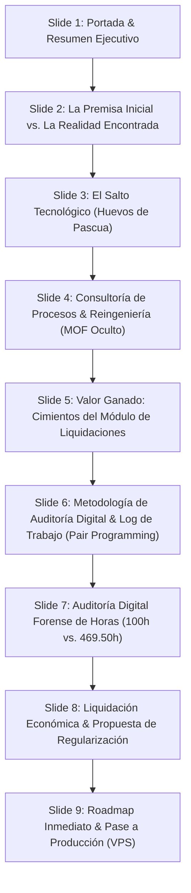

# 📑 ESTRUCTURA & ESQUELETO DE PRESENTACIÓN V2 (PPT)
## SUSTENTO DE MODIFICACIÓN DE ALCANCE, CONSULTORÍA DE PROCESOS Y AUDITORÍA DE HORAS DEVENGADAS
**Proyecto:** PETRAL SMART DASHBOARD & MOTOR MULTICOTIZADOR  
**Proveedor / Consultor:** GEEKSOFT (Richard Gutiérrez)  
**Cliente:** NAVIERA PETRAL S.A.  
**Fecha de Emisión:** Agosto 2026 (Actualización Dinámica al 31 de Agosto)  
**Documento Fuente:** [`COTIZACION_MODULAR_PETRAL_V10.RG.pdf`](file:///C:/Users/rguti/PETRAL.SMART.DASHBOARD/COTIZACION_MODULAR_PETRAL_V10.RG.pdf)  
**Entregables Interactivos (Sliders HTML):** 
- Versión V2: [`Informe_Sustento_Modificacion_Alcance_Petral_V2.html`](file:///C:/Users/rguti/PETRAL.SMART.DASHBOARD/Desarrollo.Profesional/Obsidian.Refactorizacion.Multicotizador/Informe_Sustento_Modificacion_Alcance_Petral_V2.html) | [`presentation.html`](file:///C:/Users/rguti/PETRAL.SMART.DASHBOARD/presentation.html)
- Versión V1 (Histórica 25-Ago): [`Informe_Sustento_Modificacion_Alcance_Petral.html`](file:///C:/Users/rguti/PETRAL.SMART.DASHBOARD/Desarrollo.Profesional/Obsidian.Refactorizacion.Multicotizador/Informe_Sustento_Modificacion_Alcance_Petral.html)  
**Script Generador Dinámico V2:** [`generar_sustento_slide_by_slide_v2.py`](file:///C:/Users/rguti/PETRAL.SMART.DASHBOARD/scratch/generar_sustento_slide_by_slide_v2.py)  

---

## 🎯 OBJETIVO DE LA PRESENTACIÓN
Presentar a la Gerencia y Dirección de Naviera Petral el sustento técnico, operativo y forense del **desborde del alcance inicial**, evidenciando que el proyecto evolucionó de una **hoja de cálculo inteligente** a una **Plataforma Integral de Inteligencia Comercial + Consultoría de Reingeniería de Procesos + Bases de un ERP de Gestión de Flota**, respaldado por una auditoría digital inalterable de **469.50 horas reales de trabajo** (actualizadas al 31 de Agosto de 2026).

---

## ⚡ PROTOCOLO DE ACTUALIZACIÓN EN VIVO (MIENTRAS EL PROYECTO SIGUE EN CURSO)

Dado que el desarrollo continúa activo, las horas y los eventos de Git/IDE aumentan con cada jornada. Para regenerar y actualizar toda la presentación HTML con los números exactos al segundo, se ejecuta un único comando en terminal:

```powershell
python "C:\Users\rguti\PETRAL.SMART.DASHBOARD\scratch\generar_sustento_slide_by_slide_v2.py"
```

**¿Qué hace este script automáticamente en 5 segundos?**
1. Escanea todos los commits y ramas de Git en el repositorio.
2. Lee los timestamps de modificación de todos los archivos (`.tsx`, `.py`, `.sql`, `.md`, `.html`).
3. Agrupa las sesiones continuas con corte de inactividad de 2.5h y buffer de 30 min de warmup.
4. Totaliza las jornadas, eventos, horas devengadas y montos valorizados en USD.
5. Inyecta los KPIs actualizados directamente en `Informe_Sustento_Modificacion_Alcance_Petral_V2.html` y `presentation.html`.

---

## 📽️ ESTRUCTURA DIAPOSITIVA POR DIAPOSITIVA (9 SLIDES)



---

### 🔹 SLIDE 1: Portada & Resumen Ejecutivo
* **Título:** Navigating the Future: Inteligencia Comercial
* **Subtítulo:** Sustento de Modificación de Alcance, Consultoría de Procesos y Auditoría Forense de Horas Devengadas.
* **Mensaje Clave del Dictamen:**
  * Presentar a la Gerencia y Dirección de **Naviera Petral S.A.** el sustento del desborde del alcance inicial: el proyecto evolucionó de una **hoja de cálculo inteligente** a una **Plataforma Integral de Inteligencia Comercial + Consultoría de Reingeniería de Procesos + Bases de un ERP de Gestión de Flota**, respaldada por una auditoría digital forense inalterable de **469.50 horas reales ejecutadas** en IDE/Git.
* **Métricas Principales (KPI Boxes al 31/08/2026):**
  * **Contrato Estimado:** 100.00 hrs (Cotización Base Junio 2026).
  * **Horas Reales Auditadas:** 469.50 hrs (Algoritmo inalterable IDE Git / 3,414 eventos en 107 jornadas).
  * **Sobreesfuerzo Devengado:** +369.50 hrs (+369.5% de valor incremental entregado).
  * **Estado de Producción:** 100% VIVO en `https://forecast.geeksoft.tech` (VPS Contabo).

---

### 🔹 SLIDE 2: La Premisa Inicial vs. La Realidad Encontrada
* **Título:** Premisa Inicial vs. Diagnóstico Operativo Real.
* **Subtítulo:** El punto de quiebre donde la simple automatización requirió un saneamiento estructural integral.
* **Contenido Comparativo:**
  * **Lo que se cotizó (Premisa Teórica - Junio 2026):**
    * **Automatización Lineal:** Conversión de hoja Excel con fórmulas fijas a una web interactiva con un repositorio de datos centralizados.
    * **Supuesto de Datos Limpios:** Estructuras de costos portuarios, tarifas de agenciamiento y distancias dadas por sentado.
    * **Esfuerzo Estimado:** 100 horas hombre de programación directa bajo reglas supuestamente estables expresados en los exceles iniciales Voyage Calculations que presentaban datos estáticos y claros.
  * **La Realidad Operativa Encontrada (Diagnóstico Forense):**
    * **Ausencia de Flujos Formalizados:** Manuales de funciones tácitos no documentados; divergencias de criterio entre áreas operativas y comerciales.
    * **Maestros Desalineados:** Duplicidad en nombres de agencias, dobles nomenclaturas (MGO vs MDO) y demoras sin regla uniforme.
    * **Fugas de Cálculo:** Inconsistencias históricas en liquidaciones de viajes que requerían auditoría matemática previa.
* **Principio de Ingeniería de Datos:** *"No se podía construir un rascacielos digital moderno sobre cimientos de datos inconsistentes sin antes ejecutar un saneamiento estructural y de procesos profundo."*

---

### 🔹 SLIDE 3: El Salto de Alcance Tecnológico ("Huevos de Pascua")
* **Título:** Evolución Arquitectónica: De Prototipo a Sistema Transaccional Enterprise.
* **Subtítulo:** Módulos transaccionales de alto valor desarrollados e incorporados fuera del alcance inicial.
* **Tabla de Funcionalidades Agregadas (Fuera de Alcance Original):**
  1. **Matriz Financiera Modular Multimes:** Modelamiento de escenarios paralelos con desglose exhaustivo de P&L, yield flete puro, demoras dinámicas y dockage revenue en tiempo real.
  2. **Ruteador SPOT Multileg & Algoritmos de Fondeo:** Cálculo interactivo de rutas marítimas, matrices de distancias en nudos, tiempos de navegación vs. fondeo y auto-selección de tarifas de agenciamiento.
  3. **Motor Exportador PDF de Grado Pericial:** Generación automatizada de reportes y cotizaciones oficiales con sellos forenses ("Printed By", timestamps de emisión y firmas digitales inmutables).
  4. **Seguridad Granular & Despliegue VPS Dedicado:** Control de accesos y roles (Admin, Comercial, Auditor), persistencia multi-usuario en Supabase y arquitectura productiva en VPS Contabo dedicado.

---

### 🔹 SLIDE 4: Consultoría de Procesos & Reingeniería (El "MOF Oculto")
* **Título:** Mucho más que Software: Consultoría y Creación del Ecosistema Operativo.
* **Subtítulo:** Entregables no tangibles de consultoría incorporados orgánicamente a la plataforma.
* **Pilares de Consultoría Incorporados:**
  * **Estandarización de Criterios de Costos:** Reglas formales para demoras (Modo 0 vs. Demoras Reales), combustible en puerto vs. mar, y tarifas de agenciamiento por zona portuaria.
  * **Homologación Internacional de Datos:** Unificación internacional MGO = MDO en todas las bases del negocio, eliminando duplicidades en inventarios y facturación.
  * **Detección y Corrección de Errores (Cero Fugas):** Auditorías de convergencia que eliminaron discrepancias de cálculo y diferencias de centavos entre Comercial y Contabilidad.
  * **Manual Operativo Vivo (Gobernanza):** El software hoy actúa como el Manual de Organización y Funciones (MOF) digitalizado y vivo de Petral, blindando a la compañía contra errores operativos.

---

### 🔹 SLIDE 5: Anticipación Estratégica: El Cimiento de las Liquidaciones Dinámicas
* **Título:** Valor Futuro Ya Construido: La Plataforma para Liquidación Real de Viajes.
* **Subtítulo:** Valor futuro ya construido: la base para la comparación Presupuestado vs. Real ejecutado.
* **Puntos Clave:**
  * **Arquitectura Espejo Ya Implementada:** El multicotizador servirá directamente como la matriz receptora donde los analistas registrarán las ejecuciones reales de cada viaje:
    * Comparación de combustible presupuestado vs. facturado por Petroperú/Repsol.
    * Días reales de muelle y fondeo para liquidación de demoras exactas.
    * Costos de agenciamiento y practicaje liquidados contra proyecciones SPOT.
  * **Ahorro de Tiempo Futuro (-60% TTM):** Este esfuerzo adelantado reduce en un 60% el tiempo de desarrollo de la siguiente fase de liquidación de Petral al compartir la misma base de datos, maestros y esquemas validados.

---

### 🔹 SLIDE 6 (NUEVO): Metodología de Auditoría Digital: Registro de Sesiones & Pair Programming
* **Título:** Metodología de Auditoría: Registro de Sesiones & Pair Programming con IA.
* **Subtítulo:** Cómo se audita matemáticamente el tiempo efectivo de interacción y desarrollo continuo con el agente.
* **Pilares Metodológicos:**
  1. **Sesión Activa Humano + IA:** El consultor formula requerimientos de negocio, revisa modelos comerciales de Petral, diseña especificaciones y valida la ejecución en tiempo real.
  2. **Triple Evidencia Inmutable:** Cada instrucción genera **Git Commits** (hashes SHA inmutables), **MTime IDE** (timestamps a milisegundos) y **Logs de Trabajo** cronológicos.
  3. **Clustering de Sesiones Activas:** Ventana móvil con corte de inactividad a 2.5h + buffer de 30 min por warmup y análisis previo. Si no hay interacción, el reloj se detiene automáticamente.

---

### 🔹 SLIDE 7: Auditoría Forense de Actividad Digital (Evidencia Inalterable)
* **Título:** Trazabilidad y Transparencia: Registro de Actividad frente a la Plataforma.
* **Subtítulo:** Trazabilidad matemática e inalterable basada en logs de Git y sesiones continuas de IDE al 31 de Agosto de 2026.
* **Métricas Auditadas (Algoritmo Forense de Sesiones):**
  * **Total de Jornadas:** 107 días de trabajo continuo.
  * **Total de Eventos / Commits Git:** 3,414 eventos registrados.
  * **Horas Reales de Programación & Consultoría:** **469.50 horas**.
  * **Horas Ofrecidas en Cotización:** 100.00 horas.
  * **Horas Adicionales Dedicadas:** **+369.50 horas (+369.5% de sobreesfuerzo).**
* **Algoritmo de Cálculo:** Ventana móvil de inactividad de 2.5 horas + buffer de 30 minutos de warmup por sesión de planificación.

---

### 🔹 SLIDE 8: Balance Económico & Propuesta de Regularización
* **Título:** Valorización Económica y Esquema de Cierre Comercial.
* **Subtítulo:** Valorización formal del servicio entregado y esquema comercial de regularización al 31 de Agosto de 2026.

| Concepto / Entregable | Horas | Tarifa Ref. | Subtotal (USD) | Estado Operativo |
| :--- | :---: | :---: | :---: | :---: |
| **Presupuesto Inicial Aprobado (One-Timers)**<br><small>Módulos 1, 2, 3, 4 + Carga de Datos y Onboarding</small> | 150.00 hrs | $50 - $100 | **$9,100.00** | <span style="color: #1E40AF; font-weight: bold;">Base Contratada</span> |
| **Horas Adicionales Devengadas (Sobreesfuerzo)**<br><small>Consultoría de Procesos, Algoritmos SPOT, Seguridad VPS & Reingeniería</small> | 369.50 hrs | $60.00 | **$22,169.77** | <span style="color: #B45309; font-weight: bold;">Valor Entregado</span> |
| **VALOR TOTAL REAL ENTREGADO A NAVIERA PETRAL** | **519.50 hrs** | — | **$31,269.77** | <span style="color: #15803D; font-weight: bold;">En Operación</span> |

* **Propuesta de Acuerdo Comercial (Opciones de Regularización):**
  * **Opción A (Paquete Cerrado por Hitos Adicionales):** Regularización de un monto pactado por la consultoría de procesos, auditorías forenses y módulos enterprise no previstos.
  * **Opción B (Integración con Fase de Liquidaciones Dinámicas):** Amortización parcial vinculada al kickoff del módulo de liquidaciones reales y activación del fee mensual de mantenimiento VPS ($500/mes).

---

### 🔹 SLIDE 9: Conclusiones & Próximos Pasos (Go-Live)
* **Título:** Estado Actual: Sistema Listo para Producción.
* **Subtítulo:** Hitos de cierre, puesta en marcha y soporte continuo para Naviera Petral.
* **Hitos Inmediatos:**
  1. **Despliegue al VPS en Vivo:** Plataforma 100% operativa en `https://forecast.geeksoft.tech` (VPS Contabo).
  2. **Capacitación y Onboarding:** Sesiones con J. Neyra, F. Harten, M.E. Castro e I. Zavala.
  3. **Transición a Soporte Continuo:** Activación del fee de soporte, hosting Contabo y base de datos Supabase ($500/mes).
  4. **Kickoff Módulo Liquidaciones:** Inicio de la carga de ejecuciones reales sobre la arquitectura ya construida.

---

## 🛠️ ANEXO TÉCNICO: SCRIPT DE AUDITORÍA FORENSE DE HORAS

Este script en Python procesa de forma inmutable la historia de commits Git y los timestamps de modificación de código en el repositorio, calculando con precisión matemática los bloques de sesiones y horas hombre reales dedicadas.

### 📌 Código del Algoritmo (`summarize_real_hours.py`)

```python
import os
import sys
import subprocess
import argparse
from datetime import datetime

HOURLY_RATE_USD = 60.0  # Tarifa estandar de desarrollo segun cotizacion

def record_activity(day_activity, day_str, dt):
    if day_str not in day_activity:
        day_activity[day_str] = []
    day_activity[day_str].append(dt)

def analyze_workspace(ws_path, hourly_rate=60.0):
    day_activity = {}
    git_by_date = {}

    # 1. Analisis de Commits Git
    cmd = ['git', 'log', '--all', '--pretty=format:%ad|%h|%s', '--date=iso']
    res = subprocess.run(cmd, capture_output=True, text=True, cwd=ws_path)

    for line in res.stdout.strip().split('\n'):
        if line:
            parts = line.split('|', 2)
            if len(parts) == 3:
                try:
                    dt = datetime.strptime(parts[0][:19], '%Y-%m-%d %H:%M:%S')
                    day_str = dt.strftime('%Y-%m-%d')
                    record_activity(day_activity, day_str, dt)
                    if day_str not in git_by_date:
                        git_by_date[day_str] = []
                    git_by_date[day_str].append(f"[{parts[1]}] {parts[2]}")
                except Exception:
                    pass

    # 2. Analisis de Archivos Modificados
    valid_exts = ('.py', '.tsx', '.ts', '.js', '.md', '.sql', '.html', '.json', '.png', '.svg', '.txt', '.pdf', '.css')
    ignore_dirs = {'node_modules', '.git', 'dist', '.vite', '.vscode', '.obsidian'}

    for root, dirs, files in os.walk(ws_path):
        dirs[:] = [d for d in dirs if d not in ignore_dirs]
        for f in files:
            if f.endswith(valid_exts):
                path = os.path.join(root, f)
                try:
                    mtime = os.path.getmtime(path)
                    dt = datetime.fromtimestamp(mtime)
                    day_str = dt.strftime('%Y-%m-%d')
                    record_activity(day_activity, day_str, dt)
                except Exception:
                    pass

    summary = []
    total_hours_project = 0.0
    total_events_project = 0

    # 3. Clustering de Sesiones por Intervalo de Tiempo
    for idx, day in enumerate(sorted(day_activity.keys()), start=1):
        timestamps = sorted(day_activity[day])
        sessions = []
        curr_start = timestamps[0]
        curr_end = timestamps[0]

        for t in timestamps[1:]:
            if (t - curr_end).total_seconds() <= 9000:  # Umbral de inactividad de 2.5 horas
                curr_end = t
            else:
                sessions.append((curr_start, curr_end))
                curr_start = t
                curr_end = t
        sessions.append((curr_start, curr_end))

        day_sec = 0
        for s_start, s_end in sessions:
            sec = (s_end - s_start).total_seconds()
            sec += 1800  # Buffer de 30 min por sesion de warmup / planificacion
            day_sec += sec

        hours = day_sec / 3600.0
        day_amount = hours * hourly_rate
        total_hours_project += hours
        total_events_project += len(timestamps)

        commits_list = git_by_date.get(day, [])
        if commits_list:
            commits_text = "; ".join([c.split(' ', 1)[1] for c in commits_list[:2]])
        else:
            commits_text = "Desarrollo de interfaz, ruteo y actualizacion de datos"

        if len(commits_text) > 85:
            commits_text = commits_text[:82] + "..."

        summary.append({
            'num': idx,
            'day': day,
            'events': len(timestamps),
            'start': timestamps[0].strftime('%H:%M'),
            'end': timestamps[-1].strftime('%H:%M'),
            'hours': round(hours, 2),
            'amount_usd': round(day_amount, 2),
            'tasks': commits_text
        })

    return summary, round(total_hours_project, 2), total_events_project, round(total_hours_project * hourly_rate, 2)

def main():
    parser = argparse.ArgumentParser(description="Calculador de horas trabajadas y monto de cobro.")
    parser.add_argument("--repo", default=r"C:\Users\rguti\PETRAL.SMART.DASHBOARD", help="Ruta del repositorio a analizar")
    parser.add_argument("--rate", type=float, default=60.0, help="Tarifa por hora en USD")
    args = parser.parse_args()

    ws_path = os.path.abspath(args.repo)
    repo_name = os.path.basename(ws_path)

    summary, total_hours, total_events, total_usd = analyze_workspace(ws_path, hourly_rate=args.rate)

    print("=" * 125)
    print(f"      RESUMEN FORENSE DE HORAS Y LIQUIDACION (TARIFA USD {args.rate}/H) - PROYECTO: {repo_name}")
    print("=" * 125)
    print(f"{'No':<3} | {'FECHA':<10} | {'EVENTOS':<7} | {'INICIO':<6} | {'FIN':<6} | {'HORAS REALES':<12} | {'MONTO (USD)':<12} | {'LOGROS Y TAREAS PRINCIPALES':<45}")
    print("-" * 125)

    for item in summary:
        print(f"{item['num']:<3} | {item['day']:<10} | {item['events']:<7} | {item['start']:<6} | {item['end']:<6} | {item['hours']:>8.2f} hrs | ${item['amount_usd']:>9.2f} | {item['tasks']:<45}")

    print("=" * 125)
    print(f"{'TOTAL':<3} | {len(summary)} DIAS    | {total_events:<7} | {'--':<6} | {'--':<6} | {total_hours:>8.2f} hrs | ${total_usd:>9.2f} | REPOSITORIO {repo_name}")
    print("=" * 125)

if __name__ == '__main__':
    main()
```

### 🚀 Comando de Ejecución Terminal
```powershell
python "C:\Users\rguti\Petral.MARK\Reporte.Horas.Cobro\summarize_real_hours.py" --repo "C:\Users\rguti\PETRAL.SMART.DASHBOARD" --rate 60
```
