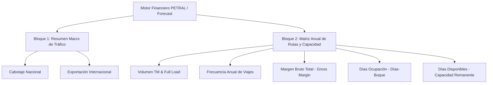

# 📊 Reporte Ejecutivo MEC vs. Matriz Financiera PETRAL

**Documento Técnico & Financiero de Homologación**  
**Fecha de Auditoría:** 26 de Agosto de 2026  
**Origen de Datos:** `FORMATO.MEC.BUDGETS.2026.xlsx` & Motor Financiero PETRAL

---

## 1. 🎯 Objetivo Estratégico

Homologar y vincular estructuralmente el **Formato Presupuestal MEC (Budgets 2026)** utilizado por la alta dirección con la **Matriz Financiera y Comercial** del ecosistema PETRAL SMART DASHBOARD, permitiendo la generación automática de reportes ejecutivos de asignación de capacidad de flota y control presupuestal.

---

## 2. 🏛️ Arquitectura del Formato MEC Budget

El formato MEC se compone de **dos bloques analíticos interconectados**:



---

## 3. 📑 Bloque 1: Distribución Macro por Tipo de Tráfico (Cabotaje vs. Exportación)

Este bloque consolida el balance operativo de la flota agrupando las rutas según su régimen comercial:

| Tipo de Tráfico | Nº Viajes | Volumen TM | % |
| :--- | :---: | :---: | :---: |
| **Viajes cabotaje** | $29$ | $391,500$ | $0.49$ |
| **Viajes exportación** | $30$ | $405,000$ | $0.51$ |
| **Total** | **$59$** | **$796,500$** | **$1$** |

### 📐 Lógica de Clasificación en PETRAL:
- **Cabotaje:** Puertos de Origen y Destino situados en el litoral peruano (ej. `ILO-MATARANI`, `CALLAO-BAYOVAR`, `PISCO-CALLAO`).
- **Exportación / Internacional:** Rutas con puertos fuera de la jurisdicción nacional (ej. `ILO-MARCONA-EXPORT`, `CALLAO-ANTOFAGASTA`, etc.).

---

## 4. 🔬 Bloque 2: Matriz de Desglose por Ruta y Rendimiento Anual

A continuación se detalla la matriz exacta del Excel `FORMATO.MEC.BUDGETS.2026.xlsx` y su homologación matemática 1:1 con las métricas del motor PETRAL:

| Ruta | TM Anual | Full load | Nº viajes | P/L x Viaje | Total Gross Margin | % | Dias ocupación | Dias disponibles |
| :--- | :---: | :---: | :---: | :---: | :---: | :---: | :---: | :---: |
| **ILO-MATARANI** | $135,000$ | $13,500$ | $10$ | $\$148,393.00$ | $\$1,483,930.00$ | $0.1695$ | $55.0$ | |
| **ILO-MARCONA** | $256,500$ | $13,500$ | $19$ | $\$136,725.00$ | $\$2,597,775.00$ | $0.3220$ | $104.5$ | |
| **ILO-MEJILLONES** | $405,000$ | $13,500$ | $30$ | $\$101,430.00$ | $\$3,042,900.00$ | $0.5085$ | $300.0$ | |
| **Total** | **$796,500$** | — | **$59$** | — | **$\$7,124,605.00$** | **$1$** | **$459.5$** | **$0$** |

### 🧮 Regla de Negocio: P/L Ponderado en Rutas Multi-Buque
Cuando una misma ruta es operada por **dos o más buques** (con diferentes costos diarios de Hire, consumos de bunker o capacidades de carga):
1. **P/L x Viaje Ponderado:**
   $$\overline{\text{P/L}}_{\text{ruta}} = \frac{\sum_{b} \left( \text{P/L}_{b} \times N_{b} \right)}{\sum_{b} N_{b}} = \frac{\text{Total Gross Margin de la Ruta}}{\text{Total Viajes de la Ruta}}$$
   *(donde $N_b$ son los viajes realizados por el buque $b$ y $\text{P/L}_b$ es su resultado por viaje).*

2. **Full Load Ponderado:**
   $$\overline{\text{Full Load}}_{\text{ruta}} = \frac{\sum_{b} \left( \text{Capacidad}_{b} \times N_{b} \right)}{\text{Total Viajes de la Ruta}} = \frac{\text{TM Anual de la Ruta}}{\text{Total Viajes de la Ruta}}$$

---

## 5. 🔗 Matriz de Mapeo 1:1: Formato MEC ↔ Motor PETRAL SMART DASHBOARD

| Campo Formato MEC | Variable en PETRAL Backend (`Geeksoft_Engine`) | Campo Frontend React (`ForecastGrid.tsx`) | Fórmula / Mapeo |
| :--- | :--- | :--- | :--- |
| **Ruta** | `route_name` | `row.routeName` | Identificador de la ruta comercial |
| **TM Anual** | `annual_tonnage` | Columna `TOTAL ACUM` de `Toneladas` | $\sum_{m=1}^{12} \text{Carga Unit.} \times \text{Viajes}(m)$ |
| **Full Load** | `unit_cargo` | `carga_unit` (Multicotizador) | Capacidad nominal de carga del buque |
| **Nº Viajes** | `annual_trips` | Columna `TOTAL ACUM` de `Viajes (freq)` | $\sum_{m=1}^{12} \text{Viajes}(m)$ |
| **P/L x Viaje** | `voyage_pnl` | `voyage_result_unit` | $\text{Gross Revenue} - \text{Hire} - \text{Bunker} - \text{Ports}$ |
| **Total Gross Margin** | `annual_gross_margin` | Columna `TOTAL ACUM` de `(=) P&L` | $\sum_{m=1}^{12} \text{P/L Mensual}$ |
| **$\%$ Participación** | `volume_share_pct` | Cálculo dinámico | $\frac{\text{TM Anual Ruta}}{\text{Total TM Flota}} \times 100$ |
| **Días Ocupación** | `annual_ship_days` | Columna `TOTAL ACUM` de `Días-Buque` | $\sum_{m=1}^{12} \text{Días Duración} \times \text{Viajes}(m)$ |
| **Días Disponibles** | `available_ship_days` | Balance de capacidad | $(\text{Nº Buques} \times 360) - \text{Días Ocupación}$ |

---

## 6. 💡 Propuesta de Integración en la Interfaz de Usuario

Para que la alta dirección de PETRAL visualice este reporte de forma instantánea sin hojas de cálculo externas, se proponen dos alternativas en la plataforma:

1. **Tercer Modo de Matriz (Tab Switcher):**
   ```
   [ FORMATO:  PETRAL  |  NAVITRANSO  |  MEC BUDGET 2026 ]
   ```
   Al seleccionar `MEC BUDGET`, la grilla proyectada se transforma instantáneamente en la tabla resumida de 2 bloques (Cabotaje/Exportación y Matriz Anual de 8 columnas).

2. **Panel / Tarjeta de Resumen Presupuestal Anual (MEC Summary Card):**
   Un widget colapsable situado inmediatamente sobre la grilla que muestra las 3 tarjetas de control ejecutivo:
   - 📦 **Volumen Total:** `800,000 MT`
   - 💰 **Margen Bruto Total:** `$7,380,747.11 USD`
   - ⏱️ **Utilización de Flota:** `431 / 720 Días-Buque (59.8% Ocupación - 289 Días Libres)`

---
*Documento registrado en el repositorio maestro de auditoría PETRAL.*
