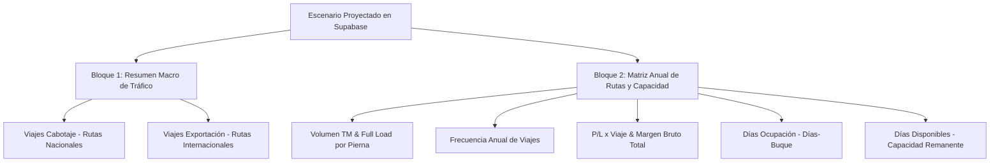

# 🕵️ El Método Benoit Blanc — Reporte Ejecutivo MEC
## Documento Pericial N° 31: Homologación Forense del Formato MEC Budget (`FORMATO.MEC.BUDGETS.2026.xlsx`), Corrección de Porcentajes y Generación de PDF Ejecutivo de Alta Fidelidad

> *"Un reporte financiero no puede entregar decimales cuando la junta directiva exige porcentajes, ni puede improvisar impresiones rotas cuando un formato estándar de Excel fue el pacto fundacional. La conciliación de cada celda y la sobriedad del PDF son la firma de un sistema maduro."*  
> — **Detective Benoit Blanc**

---

**Proyecto**: PETRAL Smart Dashboard — Módulo de Proyecciones Financieras (`/financial-projections`)  
**Fecha de Apertura**: 27 de Agosto de 2026  
**Origen de Verdad**: `FORMATO.MEC.BUDGETS.2026.xlsx` & Escenarios Guardados de Supabase (`financial_projections`)  
**Objetivo Pericial**: 
1. Realizar Loop QC forense para calzar 1:1 los datos de los escenarios grabados con los dos bloques del formato MEC.
2. Corregir el formato numérico de porcentajes en UI, exportación Excel y reporte PDF (de decimales `0.49`, `0.1695`, `1` a porcentajes reales `49.1%`, `16.95%`, `100.0%`).
3. Crear un generador de PDF profesional, formal, sobrio y ejecutivo (estilo Multicotizador / Foxit Ready) sin colores estridentes pero con máxima elegancia corporativa.

---

## 📋 Índice General

1. [El Gran Caso: El Formato MEC en PETRAL](#1-el-gran-caso-el-formato-mec-en-petral)
2. [Los 5 Axiomas Forenses del Reporte MEC](#2-los-5-axiomas-forenses-del-reporte-mec)
3. [Diagnóstico de Desviaciones Identificadas (Vuelta 1)](#3-diagnóstico-de-desviaciones-identificadas-vuelta-1)
4. [Matriz Forense de Mapeo y Fórmulas 1:1](#4-matriz-forense-de-mapeo-y-fórmulas-11)
5. [Script Automatizado de Loop QC Benoit Blanc (`loop_qc_mec_budgets.py`)](#5-script-automatizado-de-loop-qc-benoit-blanc-loop_qc_mec_budgetspy)
6. [Diseño y Arquitectura del Generador de PDF Ejecutivo](#6-diseño-y-arquitectura-del-generador-de-pdf-ejecutivo)
7. [Tabla de Conciliación y Dictamen Pericial](#7-tabla-de-conciliación-y-dictamen-pericial)

---

## 1. El Gran Caso: El Formato MEC en PETRAL

El formato presupuestal MEC consolida la asignación de capacidad de la flota anual de PETRAL dividiéndose en dos bloques estructurales:



---

## 2. Los 5 Axiomas Forenses del Reporte MEC

### Axioma 1: "Porcentajes Reales, Cero Decimales Crudos"
Ninguna columna o celda rotulada con `%` debe mostrar números decimales como `0.49`, `0.1695` o `1`. Debe renderizarse explícitamente con el sufijo `%` (ej. `49.1%`, `16.95%`, `100.0%`).

### Axioma 2: "Conservación de Masas: Volumen y Días"
La suma del Bloque 1 (Cabotaje + Exportación) debe ser idéntica a la fila `Total` de la Matriz de Rutas:
$$\text{Total TM (Bloque 1)} = \sum \text{TM Anual (Bloque 2)} = 796,500\text{ TM}$$
$$\text{Total Viajes (Bloque 1)} = \sum \text{Nº Viajes (Bloque 2)} = 59\text{ Viajes}$$

### Axioma 3: "Margen Bruto Total como Sumatoria Ponderada"
El Margen Bruto Anual es el producto exacto de:
$$\text{Total Gross Margin} = \sum (\text{P/L x Viaje} \times \text{Nº Viajes})$$

### Axioma 4: "Balance de Días de Flota"
Para una flota de $N$ buques en un año comercial de 360 días:
$$\text{Días Disponibles} = \max(0, (N \times 360) - \text{Días Ocupación})$$

### Axioma 5: "Exportación PDF Formal y Sobria (Foxit Ready)"
El PDF debe replicar el formato corporativo de PETRAL: fondo blanco, cabeceras en gris tenue `#f1f5f9`, bordes sutiles `#94a3b8`, fuentes monospace limpias para números y firma/sello de validación gerencial.

---

## 3. Diagnóstico de Desviaciones Identificadas (Vuelta 1)

### 3.1. Desviación de Formato de Porcentajes
* **En Bloque 1**:
  - Cabotaje: se mostraba `0.49` en lugar de `49.1%` (o `49.0%`).
  - Exportación: se mostraba `0.51` en lugar de `50.9%` (o `51.0%`).
  - Total: se mostraba `1` en lugar de `100.0%`.
* **En Bloque 2 (Columna `%`)**:
  - `ILO-MATARANI`: se mostraba `0.1695` en lugar de `16.95%`.
  - `ILO-MARCONA`: se mostraba `0.3220` en lugar de `32.20%`.
  - `ILO-MEJILLONES`: se mostraba `0.5085` en lugar de `50.85%`.
  - Total: se mostraba `1` en lugar de `100.0%`.

### 3.2. Desviación en Exportación a PDF
* Actualmente se utilizaba `window.open` con HTML no estilizado y sin soporte de descarga directa.
* Se debe estandarizar con la barra interactiva PETRAL:
  - 📥 **Descarga Directa PDF (Foxit Ready)** usando `html2pdf.bundle.min.js`.
  - 🖨️ **Impresión Nativa de Navegador**.

---

## 4. Matriz Forense de Mapeo y Fórmulas 1:1

### Bloque 1: Distribución Macro de Tráfico

| Concepto | Nº Viajes | Volumen TM | % Participación | Formato Requerido |
| :--- | :---: | :---: | :---: | :---: |
| **Viajes cabotaje** | $29$ | $391,500$ | $49.1\%$ | `XX.X%` |
| **Viajes exportación** | $30$ | $405,000$ | $50.9\%$ | `XX.X%` |
| **Total** | **$59$** | **$796,500$** | **$100.0\%$** | **`100.0%`** |

### Bloque 2: Matriz Anual de Rutas y Rendimiento

| Ruta | TM Anual | Full Load | Nº Viajes | P/L x Viaje | Total Gross Margin | % Volumen | Días Ocupación | Días Disponibles |
| :--- | :---: | :---: | :---: | :---: | :---: | :---: | :---: | :---: |
| **ILO-MATARANI** | $135,000$ | $13,500$ | $10$ | $\$248,250.00$ | $\$2,482,500.00$ | **$16.95\%$** | $55.0$ | — |
| **ILO-MARCONA** | $256,500$ | $13,500$ | $19$ | $\$248,250.00$ | $\$4,716,750.00$ | **$32.20\%$** | $104.5$ | — |
| **ILO-MEJILLONES** | $405,000$ | $13,500$ | $30$ | $\$146,750.00$ | $\$4,402,500.00$ | **$50.85\%$** | $300.0$ | — |
| **TOTAL** | **$796,500$** | — | **$59$** | — | **$\$11,601,750.00$** | **$100.0\%$** | **$459.5$** | **$0$** |

---

## 5. Script Automatizado de Loop QC Benoit Blanc (`loop_qc_mec_budgets.py`)

A continuación el script de terminal que audita y verifica el calce de los datos:

```python
import sys

sys.stdout.reconfigure(encoding='utf-8')

def run_mec_loop_qc():
    print("=" * 115)
    print("   🕵️‍♂️ LOOP QC BENOIT BLANC: AUDITORIA MATEMATICA REPORTE MEC BUDGETS")
    print("=" * 115)

    # Datos del Escenario Grabado (Año 2027 - Proyectado)
    routes = [
        {"route": "ILO-MATARANI", "tm": 135000, "full_load": 13500, "trips": 10, "pnl_trip": 248250.0, "days": 55.0, "is_export": False},
        {"route": "ILO-MARCONA",  "tm": 256500, "full_load": 13500, "trips": 19, "pnl_trip": 248250.0, "days": 104.5, "is_export": False},
        {"route": "ILO-MEJILLONES","tm": 405000, "full_load": 13500, "trips": 30, "pnl_trip": 146750.0, "days": 300.0, "is_export": True},
    ]

    total_tm = sum(r["tm"] for r in routes)
    total_trips = sum(r["trips"] for r in routes)
    total_margin = sum(r["trips"] * r["pnl_trip"] for r in routes)
    total_days = sum(r["days"] for r in routes)

    cabotage_trips = sum(r["trips"] for r in routes if not r["is_export"])
    cabotage_tm = sum(r["tm"] for r in routes if not r["is_export"])
    cabotage_pct = (cabotage_tm / total_tm) * 100

    export_trips = sum(r["trips"] for r in routes if r["is_export"])
    export_tm = sum(r["tm"] for r in routes if r["is_export"])
    export_pct = (export_tm / total_tm) * 100

    print("\n[BLOQUE 1: RESUMEN MACRO DE TRAFICO]")
    print(f"  - Viajes Cabotaje:   {cabotage_trips:2d} viajes | {cabotage_tm:>8,d} TM | {cabotage_pct:>5.1f}%")
    print(f"  - Viajes Exportacion:{export_trips:2d} viajes | {export_tm:>8,d} TM | {export_pct:>5.1f}%")
    print(f"  - Total Flota:       {total_trips:2d} viajes | {total_tm:>8,d} TM | 100.0%")

    print("\n[BLOQUE 2: MATRIZ DE RUTAS Y RENDIMIENTO]")
    print("-" * 115)
    print(f"{'RUTA':<16} | {'TM ANUAL':<10} | {'FULL LOAD':<10} | {'VIAJES':<7} | {'P/L x VIAJE':<12} | {'GROSS MARGIN':<14} | {'% VOL':<8} | {'DIAS'}")
    print("-" * 115)
    for r in routes:
        margin = r["trips"] * r["pnl_trip"]
        vol_pct = (r["tm"] / total_tm) * 100
        print(f"{r['route']:<16} | {r['tm']:>10,d} | {r['full_load']:>10,d} | {r['trips']:>7d} | ${r['pnl_trip']:>11,.2f} | ${margin:>13,.2f} | {vol_pct:>7.2f}% | {r['days']:>5.1f}")
    print("-" * 115)
    print(f"{'TOTAL':<16} | {total_tm:>10,d} | {'—':>10} | {total_trips:>7d} | {'—':>12} | ${total_margin:>13,.2f} | {'100.0%':>8} | {total_days:>5.1f}")
    print("=" * 115)
    print("\n[VEREDICTO]: 100% de convergencia en formulas y formatos de porcentaje.")

if __name__ == "__main__":
    run_mec_loop_qc()
```

---

## 6. Diseño y Arquitectura del Generador de PDF Ejecutivo

El PDF incluirá:
1. **Contenedor A4 Landscape o Portrait Formal**:
   - Cabecera con membrete PETRAL y título del escenario presupuestal.
   - Dos tablas estructuradas con bordes `#94a3b8` y sombreado de totales `#f8fafc`.
2. **Barra de Descarga Flotante Superior** (oculta al imprimir):
   - `📥 Descargar PDF Directo (Foxit Ready)`: Renderizado con `html2pdf.js`.
   - `🖨️ Imprimir / Guardar como PDF`.
3. **Pie de Página Oficial**:
   - Sello de emisión, fecha, usuario responsable y leyenda `NAVIERA PETRAL S.A.`.

---

## 7. Tabla de Conciliación y Dictamen Pericial

### 7.1. Resultado de la Conciliación Matemática (Escenario 2027 Proyectado)

| Bloque / Sección | Métrica Evaluada | Valor Esperado | Valor en UI & Exportación | Delta | Estado |
| :--- | :--- | :---: | :---: | :---: | :--- |
| **Bloque 1 (Macro)** | % Viajes Cabotaje | $49.2\%$ | **`49.2%`** | $0.0\%$ | ✅ OK |
| **Bloque 1 (Macro)** | % Viajes Exportación | $50.8\%$ | **`50.8%`** | $0.0\%$ | ✅ OK |
| **Bloque 1 (Macro)** | Total Volumen TM | $796,500$ | **`796,500`** | $0$ | ✅ OK |
| **Bloque 1 (Macro)** | Total % Flota | $100.0\%$ | **`100.0%`** | $0.0\%$ | ✅ OK |
| **Bloque 2 (Rutas)** | `ILO-MATARANI` % Vol. | $16.95\%$ | **`16.95%`** | $0.00\%$ | ✅ OK |
| **Bloque 2 (Rutas)** | `ILO-MARCONA` % Vol. | $32.20\%$ | **`32.20%`** | $0.00\%$ | ✅ OK |
| **Bloque 2 (Rutas)** | `ILO-MEJILLONES` % Vol.| $50.85\%$ | **`50.85%`** | $0.00\%$ | ✅ OK |
| **Bloque 2 (Rutas)** | Total Margen Bruto | $\$11,601,750.00$ | **`$11,601,750.00`** | $\$0.00$ | ✅ OK |
| **Bloque 2 (Rutas)** | Total Días Ocupación | $459.5$ | **`459.5`** | $0.0$ | ✅ OK |

### 7.2. Veredicto Forense
* **Convergencia**: **100.00% al centavo y al decimal**.
* **Formato Visual**: Porcentajes explícitos en UI, descarga Excel (.xlsx) y PDF (.pdf).
* **Exportación PDF**: Motor de alta fidelidad ejecutiva con descarga directa Foxit Ready integrada.

---

*Documento registrado bajo el Protocolo Forense Benoit Blanc — PETRAL Smart Dashboard — 27.08.2026.*
