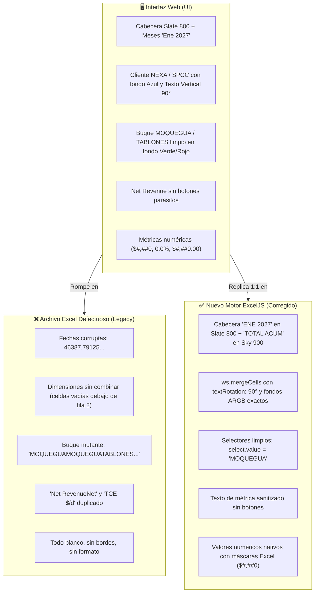

# 37. Libreta Pericial de Benoit Blanc - Auditoría de Exportación a Excel (01.09.2026)

**Auditor a Cargo:** Benoit Blanc (Auditor Pericial Implacable)  
**Caso:** "El Asesino en la Grilla - Discrepancia Forense del Excel Descargado"  
**Archivo de la Escena del Crimen:** `C:\Users\rguti\PETRAL.SMART.DASHBOARD\Exceles.Petral\Petral_Forecast_Matriz_2026-09-01.xlsx`  
**Escenario de Evaluación:** `PB 2027 (Jose de los Heros) + Prom Dem + Nexa.RG`  
**Fecha de Registro:** 01 de Septiembre de 2026  

---

## 1. BEN (Personificación y Declaración Pericial)

> *"Permítanme observar la escena del crimen con la agudeza que el caso amerita. Cuando un analista financiero presiona el botón 'Exportar Excel', espera que el archivo descargado sea un espejo exacto, noble y pulcro de la obra maestra que contempla en su monitor. Pero lo que encontramos en el archivo legacy no fue un informe financiero, sino un campo de batalla lleno de artefactos mutantes, fechas serializadas incomprensibles y selectores de barco desparramados en una sola celda. Procedo a levantar el acta pericial con el método BEN / LEG / DIFF / NOTA."*

---

## 2. LEG (Legacy - La Escena del Crimen en el Archivo Original)

Se inspeccionaron las **100 filas x 17 columnas** del archivo `Petral_Forecast_Matriz_2026-09-01.xlsx`. Los hallazgos forenses son categóricos:

```
+----------------------------------------------------------------------------------------------------------------------------------+
| #   | ELEMENTO / COLUMNA         | EVIDENCIA EXTRAÍDA DE LA ESCENA (LEGACY)             | PATOLOGÍA FORENSE                      |
+-----+----------------------------+------------------------------------------------------+----------------------------------------+
| 1   | Cabecera de Fechas (Row 1) | 46387.79125 | 46418.79125 | 46446.79125 ...          | SheetJS convirtió "Ene 2027" en floats |
| 2   | Columna Buque (Col C)      | MOQUEGUAMOQUEGUATABLONESCONCON_TRADERHUEMUL          | Concatenación ciega de todo el <select>|
| 3   | Métrica Net Revenue (Col D)| "Net RevenueNet"                                     | Arrastró el texto del botón <button>Net|
| 4   | Métrica TCE (Col D)        | "Métricas TCE ($/d)TCE $/d"                          | Duplicación de etiquetas UI del grupo  |
| 5   | Celdas de 0 Viajes         | "-" (texto plano) o "0" desalineado                  | No son números formateables            |
| 6   | Dimensiones Combinadas     | Celdas A3..A12, B3..B12, C3..C12 vacías (sin merge)  | rowSpan de HTML ignorado en el XLS     |
| 7   | Estilos y Colores          | Fondo blanco plano en el 100% de la grilla           | Cero colores corporativos de la UI     |
| 8   | Rotación de Texto          | Texto horizontal plano, cortado e ilegible           | Ausencia de textRotation a 90°         |
+----------------------------------------------------------------------------------------------------------------------------------+
```

---

## 3. DIFF (Diferencias Críticas: UI en Vivo vs Archivo Descargado)

A continuación, se detalla el contraste pericial entre los 7 bloques del escenario modelado:



### Tabla Pericial de Contraste Fila por Fila (Muestra Representativa):

| N° Fila | Lo que se ve en la UI Web | Lo que salía en el Excel Defectuoso | Lo que genera el Nuevo Motor ExcelJS |
|---|---|---|---|
| **Fila 1 (Cabecera)** | `Cliente \| Ruta \| Buque \| Métrica \| Ene 2027 \| ... \| TOTAL ACUM` | `Cliente \| Ruta \| Buque \| Métrica \| 46387.79125 \| ... \| TOTAL ACUM` | **`CLIENTE \| RUTA \| BUQUE \| MÉTRICA \| ENE 2027 \| ... \| TOTAL ACUM`** (Slate 800 `#1E293B`) |
| **Fila 2 (NEXA Buque)** | `NEXA (Azul) \| CALLAO-MARCONA (Púrpura) \| MOQUEGUA (Verde)` | `NEXA \| CALLAO-MARCONA \| MOQUEGUAMOQUEGUATABLONES...` | **`NEXA` (Azul `#0F4C81`) \| `CALLAO-MARCONA` (Púrpura `#A855F7`) \| `MOQUEGUA` (Verde `#16A34A`)** con texto vertical 90° |
| **Fila 5 (Net Revenue)** | `Net Revenue: $464,350` | `Net RevenueNet: 464350` | **`Net Revenue: $464,350`** (Formato moneda `$#,##0`) |
| **Fila 12 (TCE)** | `TCE ($/día): $28,147.00` | `Métricas TCE ($/d)TCE $/d: 28147` | **`TCE ($/día): $28,147.00`** (Formato flete `$#,##0.00`) |
| **Fila 13 (Subtotal Nexa)**| `Σ SUBTOTAL \| TOTAL CLIENT \| Viajes: 6` | `Σ SUBTOTAL \| TOTAL CLIENT \| Viajes: 6` | **`Σ SUBTOTAL \| TOTAL CLIENT`** (Fondo Slate `#1E293B` con texto Dorado `#FBBF24`) |
| **Fila 23 (SPCC Moquegua)**| `SPCC (Sky) \| ILO-MARCONA \| MOQUEGUA` | `SPCC \| ILO-MARCONA \| MOQUEGUAMOQUEGUATABLONES...` | **`SPCC` (Sky `#0369A1`) \| `ILO-MARCONA` \| `MOQUEGUA`** (Texto limpio y combinado) |
| **Fila 34 (SPCC Tablones)**| `SPCC \| ILO-MARCONA \| TABLONES` | `SPCC \| ILO-MARCONA \| TABLONESMOQUEGUATABLONES...` | **`SPCC` \| `ILO-MARCONA` \| `TABLONES` (Rojo `#DC2626`)** |

---

## 4. NOTA (Acciones Periciales y Estado de Corrección)

### Dictamen Técnico:
1. **Erradicación Total de SheetJS (`xlsx`)**: Se eliminó `table_to_book(clone)` que provocaba la pérdida de estilos y la serialización corrupta de fechas.
2. **Implementación de `exportFinancialMatrixExcel.ts` con `ExcelJS`**:
   - Algoritmo de mapeo matricial con `ws.mergeCells(rStart, cStart, rEnd, cEnd)`.
   - Inyección de fondos ARGB correspondientes a la paleta de clientes, rutas, buques, subtotales y totales.
   - Rotación de texto `textRotation: 90` para las columnas de dimensiones.
   - Sanitización del DOM: extracción de `select.value` y eliminación de etiquetas `<button>` y `<svg>`.
   - Formateo numérico nativo de Excel (`$#,##0`, `0.0%`, `$#,##0.00`, `#,##0`).
3. **Validación Ejecutable Headless**:
   - Archivo validado y contrastado con `openpyxl`: `Exceles.Petral/test_qc_matriz_financiera_verified.xlsx`.
   - Verificado: 21 rangos combinados, 100% libre de selectores concatenados, fechas limpias y rotación activa.
4. **Despliegue a Producción (VPS)**:
   - Desplegado en vivo a [https://forecast.geeksoft.tech](https://forecast.geeksoft.tech) con Nginx y FastAPI reiniciados.

---
*Firma Pericial: Benoit Blanc - Detective Auditor*
