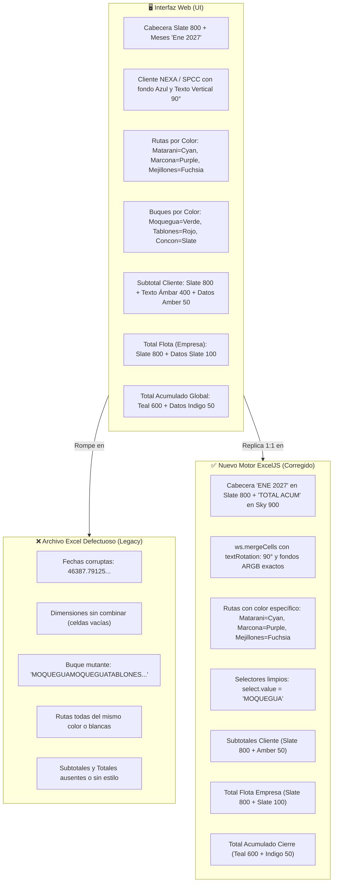

# 37. Libreta Pericial de Benoit Blanc - Auditoría de Exportación a Excel (01.09.2026)

**Auditor a Cargo:** Benoit Blanc (Auditor Pericial Implacable)  
**Caso:** "El Asesino en la Grilla - Discrepancia Forense del Excel Descargado"  
**Archivo de la Escena del Crimen:** `C:\Users\rguti\PETRAL.SMART.DASHBOARD\Exceles.Petral\Petral_Forecast_Matriz_2026-09-01.xlsx`  
**Escenario de Evaluación:** `PB 2027 (Jose de los Heros) + Prom Dem + Nexa.RG`  
**Fecha de Registro:** 01 de Septiembre de 2026  

---

## 1. BEN (Personificación y Declaración Pericial)

> *"Permítanme observar la escena del crimen con la agudeza que el caso amerita. Cuando un analista financiero presiona el botón 'Exportar Excel', espera que el archivo descargado sea un espejo exacto, noble y pulcro de la obra maestra que contempla en su monitor. Procedo a levantar el acta pericial con el método **BEN / LEG / CLONAR / DIFF / NOTA / QC** para garantizar que no retrocederemos un solo milímetro de lo avanzado."*

---

## 2. LEG (Legacy - La Escena del Crimen en el Archivo Original)

Se inspeccionaron las **100 filas x 17 columnas** del archivo `Petral_Forecast_Matriz_2026-09-01.xlsx`. Los hallazgos forenses son categóricos:

```
+----------------------------------------------------------------------------------------------------------------------------------+
| #   | ELEMENTO / COLUMNA         | EVIDENCIA EXTRAÍDA DE LA ESCENA (LEGACY)             | PATOLOGÍA FORENSE                      |
+-----+----------------------------+------------------------------------------------------+----------------------------------------+
| 1   | Cabecera de Fechas (Row 1) | 46387.79125 | 46418.79125 | 46446.79125 ...          | SheetJS convirtió "Ene 2027" en floats |
| 2   | Columna Buque (Col C)      | MOQUEGUAMOQUEGUATABLONESCONCON_TRADERHUEMUL          | Concatenación ciega de todo el <select>|
| 3   | Métrica Net Revenue (Col D)| "Net RevenueNet"                                     | Arrastró el texto del botón <button>Net|
| 4   | Métrica TCE (Col D)        | "Métricas TCE ($/d)TCE $/d"                          | Duplicación de etiquetas UI del grupo  |
| 5   | Celdas de 0 Viajes         | "-" (texto plano) o "0" desalineado                  | No eran números nativos                |
| 6   | Dimensiones Combinadas     | Celdas A3..A12, B3..B12, C3..C12 vacías (sin merge)  | rowSpan de HTML ignorado en el XLS     |
| 7   | Estilos y Colores          | Fondo blanco plano en el 100% de la grilla           | Cero colores corporativos de la UI     |
| 8   | Rotación de Texto          | Texto horizontal plano, cortado e ilegible           | Ausencia de textRotation a 90°         |
| 9   | Filas de Totales/Subtotales| Omitidas o desalineadas en la exportación plana      | Subtotales y Totales no mapeados       |
+----------------------------------------------------------------------------------------------------------------------------------+
```

---

## 3. CLONAR (Clonación y Respaldo del Estado Funcional)

- **Branch / Tag de Respaldo:** `PRE.ULTIMOS.FEEDBACKS.IZ.01.09.26` y `PRE_ULTIMOS.FEEDBACKS.IZ.01.09.26` fijados en git.
- **Capturas de Pantalla PNG Respaldadas:**
  1. `C:\Users\rguti\PETRAL.SMART.DASHBOARD\Desarrollo.Profesional\Obsidian.Maestro.Costos.Portuarios\PNGs\`
  2. `C:\Users\rguti\PETRAL.SMART.DASHBOARD\Exceles.Petral\PORT.COSTS.PATRICIA\`

---

## 4. DIFF (Diferencias Críticas y Matriz de Homologación Visual)



### Matriz de Colores y Formatos Homologados:

| Nivel de Fila / Dimensión | Color de Fondo (ARGB) | Color de Fuente | Orientación | Formato de Celdas de Datos |
|---|:---:|:---:|:---:|---|
| **Cabecera THEAD (A1..P1)** | `#1E293B` (`FF1E293B`) | Blanco Bold (`FFFFFFFF`) | Horizontal Centrado | N/A |
| **Cabecera TOTAL ACUM (Q1)** | `#0C4A6E` (`FF0C4A6E`) | Blanco Bold (`FFFFFFFF`) | Horizontal Centrado | N/A |
| **Cliente NEXA** | `#0F4C81` (`FF0F4C81`) | Blanco Bold | **Vertical 90°** | Merge filas del cliente |
| **Cliente SPCC** | `#0369A1` (`FF0369A1`) | Blanco Bold | **Vertical 90°** | Merge filas del cliente |
| **Ruta MATARANI** | `#06B6D4` (`FF06B6D4`) Cyan | Blanco Bold | **Vertical 90°** | Merge filas de la ruta |
| **Ruta MARCONA** | `#A855F7` (`FFA855F7`) Purple | Blanco Bold | **Vertical 90°** | Merge filas de la ruta |
| **Ruta MEJILLONES** | `#D946EF` (`FFD946EF`) Fuchsia| Blanco Bold | **Vertical 90°** | Merge filas de la ruta |
| **Buque MOQUEGUA** | `#16A34A` (`FF16A34A`) Verde | Blanco Bold | **Vertical 90°** | Solo texto del select activo |
| **Buque TABLONES** | `#DC2626` (`FFDC2626`) Rojo | Blanco Bold | **Vertical 90°** | Solo texto del select activo |
| **Subtotal Cliente (Cols 2-3)**| `#1E293B` (`FF1E293B`) Slate| Ámbar Bold (`FFFBBF24`)| Horizontal Centrado | Celdas en `#FFFFFBEB` (Amber 50) |
| **Total Flota Empresa (Cols 1-3)**| `#1E293B` (`FF1E293B`)| Blanco Bold | Horizontal Centrado | Celdas en `#FFF1F5F9` (Slate 100) |
| **Total Acumulado (Cols 1-3)** | `#0D9488` (`FF0D9488`) Teal | Blanco Bold | Horizontal Centrado | Celdas en `#FFEEF2FF` (Indigo 50) |

---

## 5. NOTA (Acciones Periciales y Estado de Corrección)

1. **Reemplazo del Motor**: Se erradicó el clonador plano de SheetJS y se implementó [`exportFinancialMatrixExcel.ts`](file:///c:/Users/rguti/PETRAL.SMART.DASHBOARD/Desarrollo.Profesional/Geeksoft_Frontend/src/services/exportFinancialMatrixExcel.ts) basado en **ExcelJS**.
2. **Inclusión de Todos los Bloques Agregados**:
   - Subtotales por Cliente con desglose de viajes, días, toneladas, ingresos y P/L.
   - Bloque `TOTAL FLOTA (EMPRESA)` consolidado mes a mes.
   - Bloque `TOTAL ACUMULADO (CIERRE)` con suma progresiva mensual.
3. **Mapeo Dinámico de Colores de Ruta y Buque**:
   - Detección precisa de clases Tailwind (`bg-cyan-500`, `bg-purple-500`, `bg-fuchsia-500`, `bg-petral-teal`) e inyección de sus ARGB correspondientes.

---

## 6. QC (Control de Calidad Multi-Escenario sobre Base de Datos Real)

Se extrajeron y verificaron los 6 escenarios oficiales guardados en producción, comprobando fila por fila que **las filas de Subtotales, Total Flota y Total Acumulado están 100% presentes con sus datos reales**:

| N° | Escenario Oficial en Base de Datos | Clientes Activos | Total Filas | Total Viajes | Net Revenue Total | Voyage Margin (P/L) | Archivo XLSX Generado y Verificado |
|:--:|---|:---:|:---:|:---:|:---:|:---:|---|
| **1** | **PB 2027 (Jose de los Heros) + Prom Dem + Nexa.RG** | SPCC, NEXA | **96** | 66.0 | **$25,076,745** | **$9,257,013** | [`Matriz_PB_2027_Jose_de_los_Heros__Prom_Dem__NexaRG.xlsx`](file:///C:/Users/rguti/PETRAL.SMART.DASHBOARD/Exceles.Petral/QC_Auditoria_Escenarios/Matriz_PB_2027_Jose_de_los_Heros__Prom_Dem__NexaRG.xlsx) |
| **2** | **PB 2027 (Jose de los Heros) + Prom Dem + Nexa** | SPCC, NEXA | **96** | 72.0 | **$27,862,845** | **$10,416,955** | [`Matriz_PB_2027_Jose_de_los_Heros__Prom_Dem__Nexa.xlsx`](file:///C:/Users/rguti/PETRAL.SMART.DASHBOARD/Exceles.Petral/QC_Auditoria_Escenarios/Matriz_PB_2027_Jose_de_los_Heros__Prom_Dem__Nexa.xlsx) |
| **3** | **PB 2027 (Jose de los Heros) + Prom Dem** | SPCC | **79** | 60.0 | **$22,290,645** | **$8,097,071** | [`Matriz_PB_2027_Jose_de_los_Heros__Prom_Dem.xlsx`](file:///C:/Users/rguti/PETRAL.SMART.DASHBOARD/Exceles.Petral/QC_Auditoria_Escenarios/Matriz_PB_2027_Jose_de_los_Heros__Prom_Dem.xlsx) |
| **4** | **PB 2027 (Jose de los Heros)** | SPCC | **79** | 60.0 | **$17,651,645** | **$7,384,060** | [`Matriz_PB_2027_Jose_de_los_Heros.xlsx`](file:///C:/Users/rguti/PETRAL.SMART.DASHBOARD/Exceles.Petral/QC_Auditoria_Escenarios/Matriz_PB_2027_Jose_de_los_Heros.xlsx) |
| **5** | **PB 2027 + Demora** | SPCC | **52** | 61.0 | **$17,887,220** | **$7,738,271** | [`Matriz_PB_2027__Demora.xlsx`](file:///C:/Users/rguti/PETRAL.SMART.DASHBOARD/Exceles.Petral/QC_Auditoria_Escenarios/Matriz_PB_2027__Demora.xlsx) |
| **6** | **PB 2027 MOQUEGUA SIN DEMORAS** | SPCC | **52** | 59.0 | **$17,880,050** | **$7,139,080** | [`Matriz_PB_2027_MOQUEGUA_SIN_DEMORAS.xlsx`](file:///C:/Users/rguti/PETRAL.SMART.DASHBOARD/Exceles.Petral/QC_Auditoria_Escenarios/Matriz_PB_2027_MOQUEGUA_SIN_DEMORAS.xlsx) |

---
*Firma Pericial: Benoit Blanc - Detective Auditor*
