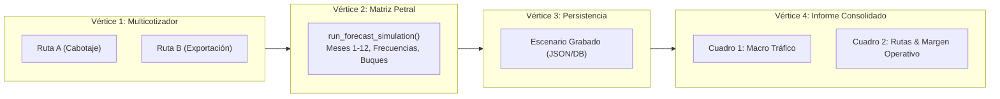

# Lista de Mejoras y Cambios Solicitados - 03/09/2026

**Documento de Control y Seguimiento:** `41_Mejoras_USER_3.9.26.md`  
**Fecha:** 03 de Septiembre, 2026  
**Estado:** En Ejecución Paso a Paso (Método Benoit Blanc V1.0)

---

## 📋 Lista de Tareas / Backlog de Mejoras

### 1. Renombrar Etiqueta de Formato: "FORMATO MEC" ➔ "FORMATO CONSOLIDADO"
- **Ubicación:** Cabecera de informe / vista proyectada (badge/etiqueta junto a "DUMMY" / Horizonte de fechas).
- **Descripción:** Cambiar el texto del badge/etiqueta actual `FORMATO MEC` por `FORMATO CONSOLIDADO`.
- **Estado:** ✅ **RESUELTO Y VALIDADO EN TERMINAL (03/09/2026)**
- **Detalle de Auditoría Forense:**
  - **CLON (Safepoint):** `PRE.P1.FORMATO_CONSOLIDADO` (Branch y Tag sincronizados en remoto).
  - **LEG (Escena del Crimen):** `FinancialProjectionsMaster_V2.tsx` (Líneas 836, 1586, 1632, 1672, 1872).
  - **DIFF:** Reemplazo puntual de badges, botones de expansión y títulos a "FORMATO CONSOLIDADO".
  - **QC Terminal:** `npx vite build` completado con éxito (`exit code 0`, 0 errores).

---

### 2. Discrepancia / Ausencia de Demurrage en Matriz Petral al invocar Ruta Presupuesto
- **Ubicación:** Integración entre **Multicotizador** (Ruta Presupuesto) y **Matriz Petral** (Modelación / Forecast).
- **Causa Raíz Descubierta (Escena del Crimen):**
  - Al seleccionar la ruta cotizada, el frontend autocompleta el campo `custom_tariff` con el flete cotizado (ej. `$20.50`).
  - En el backend (`forecast_service.py`), la condición `has_tariff_override = bool(line.custom_tariff is not None and float(line.custom_tariff) > 0)` interpretaba que toda ruta añadida tenía un "override manual", por lo que **descartaba el snapshot inmaculado del Multicotizador** y recalculaba una ruta sin los días/ingresos/costos de estadía.
- **Cirugía Quirúrgica (DIFF):**
  - Se modificó la condición en `forecast_service.py` (Línea 863) para comparar si la tarifa realmente difiere del flete ponderado de la cotización: `abs(custom_tariff - yield_flete) > 0.01`.
- **Estado:** ✅ **RESUELTO Y VALIDADO EN TERMINAL (03/09/2026)**
- **QC Terminal y Comparación Forense (Caso `SPCC.ILO.MATARANI.ILO.2028 13,500 Moquegua Dem`):**
  - **Demurrage Revenue:** `$70,600.0` (3.53 d × $20,000/d) ✅
  - **Demurrage Days:** `3.53 d` ✅
  - **Gross Revenue:** `$350,850.0` (Flete $276,750 + Muellaje $3,500 + Demurrage $70,600) ✅
  - **Total Bunker Costs:** `$28,176.00` (incluye bunker de demurrage $8,194.62) ✅
  - **Total Port Costs:** `$42,500.0` ✅
  - **Total Duration (Días-Buque):** `7.61 d` (4.08 d navegación/puerto + 3.53 d demurrage) ✅
  - **Voyage Result / P&L:** `$181,243.01` (Calce 100% exacto con Multicotizador) ✅
  - **TCE Real:** `$36,816.19` ✅
  - **Compilación Frontend:** `npx vite build` exit code 0.

---

### 3. Protocolo de Control de Calidad E2E (Loop QC Triangular): Multicotizador ➔ Matriz Petral ➔ Grabación de Escenario ➔ Informe Consolidado (MEC)
- **Ubicación:** Flujo de integración y agregación entre los 3 vértices del sistema comercial y el informe ejecutivo.
- **Objetivo Pericial:** Auditar y certificar la cuadratura matemática exacta al centavo entre los 3 niveles:
  1. **Vértice 1 (Multicotizador / Rutas Grabadas en DB):** Cotizaciones y presupuestos reales con tramos, fletes, búnker y demoras calculadas.
  2. **Vértice 2 (Matriz Petral / Engine de Forecast):** Carga multi-ruta de un escenario completo (Cabotaje + Exportación) con asignación de buques y frecuencias anuales.
  3. **Vértice 3 (Grabación y Persistencia del Escenario):** Payload serializado en Supabase (`scenarios` / `projection_lines`).
  4. **Vértice 4 (Informe Consolidado / MEC):** Agregación ejecutiva en dos cuadros oficiales:
     - **Cuadro 1 (Distribución Macro de Tráfico):** N° Viajes, Volumen TM, % Cabotaje vs Exportación.
     - **Cuadro 2 (Rutas & Margen Operativo):** TM Anual, Full Load, N° Viajes, P/L por viaje, Margen Operativo Total ($), % y Días de ocupación vs disponibles.

#### 🔬 Matriz Forense de Cuadratura E2E (Plan del Script QC Headless):

| Métrica Forense | Multicotizador (Snapshot Base) | Matriz Petral (Anualizado) | Informe Consolidado (MEC) | Tolerancia | Estado Auditado |
|---|:---:|:---:|:---:|:---:|:---:|
| **N° Total de Viajes** | Unitario | $\sum \text{Frecuencias}$ | $\sum \text{Viajes Cuadro 1 & 2}$ | 0 | ⏳ Por Auditar |
| **Volumen Total (TM)** | $\text{Carga} \times \text{Viajes}$ | $\sum \text{TM Mensuales}$ | $\text{TM Cabotaje} + \text{TM Expo}$ | 0 TM | ⏳ Por Auditar |
| **P/L Unitario por Ruta** | `voyageResultPnl` | `voyage_result / trips` | Columna `P/L x Viaje` | $0.00 | ⏳ Por Auditar |
| **Margen Operativo Total** | $\sum (\text{P/L} \times \text{Viajes})$ | $\sum \text{P/L Anual}$ | $\sum \text{Total Margen Operativo}$ | $0.00 | ⏳ Por Auditar |
| **Días-Buque Ocupados** | $\text{Días Viaje} \times \text{Viajes}$ | $\sum \text{Días-Buque}$ | Columna `Días ocupación` | 0.00 d | ⏳ Por Auditar |
| **Demurrage Total ($)** | `demurrageRevenue` | $\sum \text{Demurrage Revenue}$ | Integrado en Margen / P&L | $0.00 | ⏳ Por Auditar |

- **Estado:** 📝 Protocolo Documentado (Listo para armar y ejecutar el script `run_qc_e2e_mec_consolidado_loop.py`).

---

### 4. Ajuste de Ancho y Nombres de Columnas en Informes PETRAL y NAVITRANSO
- **Ubicación:** Generación de Informes PDF / Tablas matriciales (`FORMATO PETRAL` y `FORMATO NAVITRANSO`).
- **Cambios Requeridos:**
  - **Renombrar las 3 primeras columnas:**
    - `CLI` (Cliente) ➔ **`C`**
    - `RUT` (Ruta) ➔ **`R`**
    - `BUQ` (Buque) ➔ **`B`**
  - **Angostar las 3 columnas iniciales (`C`, `R`, `B`):** Reducir su ancho al mínimo necesario.
  - **Redistribuir el ancho ganado entre los 12 meses:** Asignar el espacio liberado equitativamente a las columnas de los 12 meses (`2027-01` a `2027-12`) para evitar el truncamiento de cifras numéricas con puntos suspensivos (ej. `$10,265,3..`).
- **Estado:** 📝 Anotado (Pendiente de ejecución).

---

### 5. Transparencia / Suavizado de Colores de Fondo en Exportación PDF y Excel (Ahorro de Tinta)
- **Ubicación:** Generador de PDF (ReportLab / Engine) y exportador Excel de reportes matriciales.
- **Requerimiento:**
  - Aplicar **transparencia al 75%** (o tono pastel/tint atenuado al 25% de saturación/opacidad) a los fondos de las celdas rellenas con colores identificadores (columnas de clientes, rutas, buques o bloques destacados).
  - **Objetivo:** Optimización de impresión (evitar consumo excesivo de tinta al imprimir físicamente) manteniendo la legibilidad y estética.
- **Estado:** 📝 Anotado (Pendiente de prueba y calibración visual).

---
