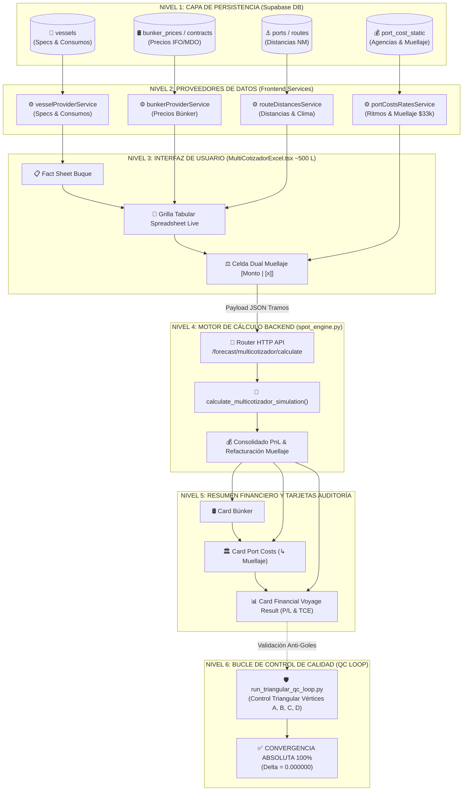

# 📌 PLAN MAESTRO DE REFACTORIZACIÓN MODULAR Y SERVICIOS — MULTICOTIZADOR PETRAL V1.0

**Fecha de Congelación Funcional:** 13 de Agosto de 2026  
**Estado de la Funcionalidad:** 100% Validada en Producción VPS (`https://forecast.geeksoft.tech/multicotizador`) y convergencia 0.000000 contra Excel PETRAL.  
**Objetivo de la Refactorización:** Reducir el componente monolítico `MultiCotizadorExcel.tsx` de **3,819 líneas a ~500 líneas**, despiezando la lógica comercial en micro-servicios proveedores y subcomponentes visuales aislados *a prueba de balas*.

---

## 📦 1. Inventario Oficial de Backups y Puntos de Partida

Antes de modificar una sola línea de código, se ha verificado e inventariado la red de seguridad con los puntos de restauración exactos:

### 🅰️ Frontend (React Components) — `Desarrollo.Profesional/Geeksoft_Frontend/src/components/CommercialForecast/`
1. **`MultiCotizadorExcel_PRE_REFACTOR_13.08.26.tsx`** *(¡NUEVO RESPALDO CONGELADO!)*  
   - Punto de partida directo de esta refactorización con la regla de muellaje `$33,333` y celda dual `[Monto | [x]]` 100% probada.
2. **`MultiCotizadorExcel_CONVERGENTE_12.08.26.tsx`**  
   - Resguardo de la convergencia inicial de la grilla multi-tramo.
3. **`MULTICOTIZADOR_CONVERGENTE_12.08.26.tsx`**  
   - Resguardo de la vista consolidada previa.
4. **`MultiCotizadorExcel_legacy.tsx`**  
   - Resguardo heredado de la primera versión funcional.
5. **`MultiCotizadorExcel_backup.tsx`**  
   - Backup de seguridad general.

### 🅱️ Backend (FastAPI Python Engine) — `Desarrollo.Profesional/Geeksoft_Engine/backend/`
1. **`spot_engine.py`** *(Versión Activa en Producción VPS)*  
   - Core matemático consolidado multi-tramo con evaluación de unicidad de recalas y refacturación de muellaje.
2. **`spot_engine_CONVERGENTE_12.08.26.py`**  
   - Resguardo convergente del motor.
3. **`spot_engine_V1.py`**  
   - Resguardo de la versión V1.
4. **`spot_engine_backup.py`**  
   - Backup de seguridad del motor Python.

---

## 🗺️ 2. Flujograma de Arquitectura en Cascada Vertical (Top-to-Bottom)

El siguiente flujo representa la arquitectura objetivo donde el componente de UI únicamente consume servicios puros de provisión de datos:



---

## 📐 3. Plan de Despiece Modular Paso a Paso

### 🚀 FASE 1: Creación del Directorio de Servicios Proveedores
Crear la estructura física en `Geeksoft_Frontend/src/services/providers/`:
- `bunkerProviderService.ts`: Lógica pura de resolución de combustibles.
- `vesselProviderService.ts`: Lógica pura de extracción de specs y consumos del buque.
- `routeDistancesService.ts`: Lógica pura de distancias NM y factores de clima.
- `portCostsRatesService.ts`: Lógica pura de ritmos, overheads y autocompletado de muellaje ($33,333).

### 🎨 FASE 2: Creación de Subcomponentes Visuales UI
Crear la estructura física en `Geeksoft_Frontend/src/components/CommercialForecast/multicotizador/`:
- `VesselFactSheetHeader.tsx`: Cabecera editable del buque (~150 líneas).
- `SpreadsheetTramosGrid.tsx`: Tabla interactiva con celda dual de muellaje (~350 líneas).
- `FinancialResultCards.tsx`: Tarjetas de resumen Búnker, Port Costs y Result (~300 líneas).
- `pdfExportTemplate.ts`: Plantilla aislada de impresión PDF (~300 líneas).

### 🧩 FASE 3: Reensamblaje del Componente Principal `MultiCotizadorExcel.tsx`
- Reducir el componente principal a **~500 líneas**.
- Toda interacción de usuario delegará en los servicios de la Fase 1 y renderizará los componentes de la Fase 2.

---

## 🛡️ 4. Protocolo de Control de Calidad Anti-Goles (QC Loop)

En cada paso de la refactorización se ejecutará el script de auditoría triangular:
```bash
python Desarrollo.Profesional\Obsidian.Refactorizacion.Multicotizador\scripts\run_triangular_qc_loop.py
```

### Criterios de Aprobación Obligatorios:
1. **Delta Cuantitativo:** 0.000000 desviación en fletes, búnker, port costs y TCE real contra el Excel oficial PETRAL.
2. **Prueba Vértice D (Anti-Goles Mejillones):** Verificación de unicidad en la refacturación de muellaje ($33,333.00).
3. **Build TypeScript Limpio:** `npm run build` con código de salida 0.
4. **Despliegue VPS Automático:** Ejecución mediante `python deploy_forecast_kickoff.py`.

---

### 📄 Documentos Relacionados
- **Flujograma Python:** [`FLUJOGRAMA_Arquitectura_Multicotizador_V1.py`](file:///C:/Users/rguti/PETRAL.SMART.DASHBOARD/Desarrollo.Profesional/Obsidian.Refactorizacion.Multicotizador/FLUJOGRAMA_Arquitectura_Multicotizador_V1.py)
- **PDF de Arquitectura:** [`FLUJOGRAMA_Arquitectura_Multicotizador_V1.pdf`](file:///C:/Users/rguti/PETRAL.SMART.DASHBOARD/Desarrollo.Profesional/Obsidian.Refactorizacion.Multicotizador/FLUJOGRAMA_Arquitectura_Multicotizador_V1.pdf)
- **Imagen PNG:** [`FLUJOGRAMA_Arquitectura_Multicotizador_V1.png`](file:///C:/Users/rguti/PETRAL.SMART.DASHBOARD/Desarrollo.Profesional/Obsidian.Refactorizacion.Multicotizador/FLUJOGRAMA_Arquitectura_Multicotizador_V1.png)
