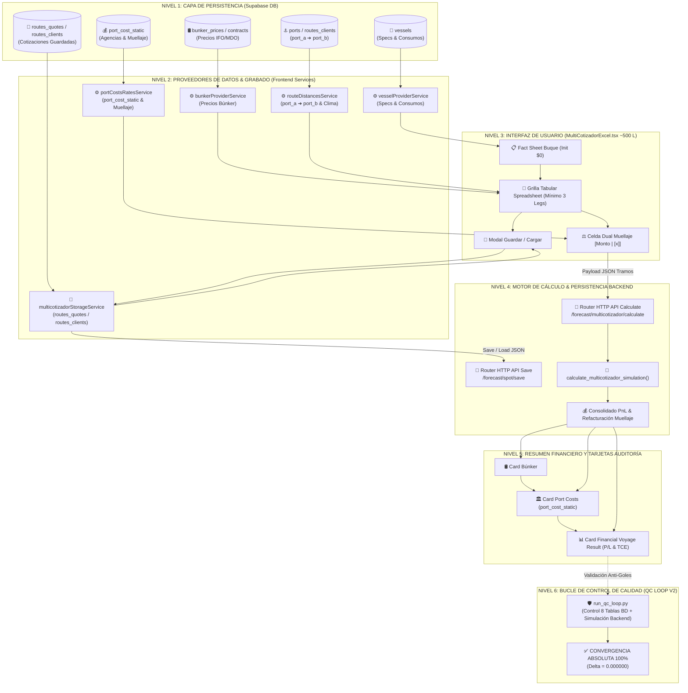

# 📌 PLAN MAESTRO DE REFACTORIZACIÓN MODULAR Y SERVICIOS — MULTICOTIZADOR PETRAL V1.0

**Fecha de Congelación Funcional:** 13 de Agosto de 2026  
**Estado de la Funcionalidad:** 100% Validada en Producción VPS (`https://forecast.geeksoft.tech/multicotizador`) y convergencia 0.000000 contra Excel PETRAL.  
**Objetivo de la Refactorización:** Reducir el componente monolítico `MultiCotizadorExcel.tsx` de **3,819 líneas a ~500 líneas**, despiezando la lógica comercial en micro-servicios proveedores, el servicio de grabado/persistencia y subcomponentes visuales aislados *a prueba de balas*.

---

## 📦 1. Inventario Oficial de Backups y Puntos de Partida

Antes de modificar una sola línea de código, se ha verificado e inventariado la red de seguridad con los puntos de restauración exactos:

### 🅰️ Frontend (React Components) — `Desarrollo.Profesional/Geeksoft_Frontend/src/components/CommercialForecast/`
1. **`MultiCotizadorExcel_PRE_REFACTOR_13.08.26.tsx`** *(¡NUEVO RESPALDO CONGELADO!)*  
   - Punto de partida directo de esta refactorización con la regla de muellaje `$33,333` y celda dual `[Monto | [x]]` 100% probada.
2. **`MultiCotizadorExcel_CONVERGENTE_12.08.26.tsx`**  
   - Resguardo de la convergencia inicial de la grilla multi-tramo.
3. **`MULTICOTIZADOR_CONVERGENTE_12.08.26.tsx`**  
   - Resguardo de la vista consolidada previa.
4. **`MultiCotizadorExcel_legacy.tsx`**  
   - Resguardo heredado de la primera versión funcional.
5. **`MultiCotizadorExcel_backup.tsx`**  
   - Backup de seguridad general.

### 🅱️ Backend (FastAPI Python Engine) — `Desarrollo.Profesional/Geeksoft_Engine/backend/`
1. **`spot_engine.py`** *(Versión Activa en Producción VPS)*  
   - Core matemático consolidado multi-tramo con evaluación de unicidad de recalas y refacturación de muellaje.
2. **`spot_engine_CONVERGENTE_12.08.26.py`**  
   - Resguardo convergente del motor.
3. **`spot_engine_V1.py`**  
   - Resguardo de la versión V1.
4. **`spot_engine_backup.py`**  
   - Backup de seguridad del motor Python.

---

## 🗺️ 2. Flujograma de Arquitectura en Cascada Vertical (Top-to-Bottom)

El siguiente flujo representa la arquitectura objetivo donde el componente de UI únicamente consume servicios puros de provisión de datos y persistencia:



---

## 📐 3. Plan de Despiece Modular Paso a Paso

### 🚀 FASE 1: Creación del Directorio de Servicios Proveedores y Persistencia
Crear la estructura física en `Geeksoft_Frontend/src/services/providers/`:
1. `bunkerProviderService.ts`: Lógica pura de resolución de combustibles.
2. `vesselProviderService.ts`: Lógica pura de extracción de specs y consumos del buque.
3. `routeDistancesService.ts`: Lógica pura de distancias NM y factores de clima desde `routes_clients` (`port_a` / `port_b`).
4. `portCostsRatesService.ts`: Lógica pura de ritmos, overheads y autocompletado de tarifa estática desde `port_cost_static`.
5. **`multicotizadorStorageService.ts`** *(¡NUEVO SERVICIO DE GRABADO!)*:
   - `saveMulticotizadorQuote()`: Empaqueta y guarda la cotización enriquecida en Supabase DB (`/forecast/spot/save`).
   - `listMulticotizadorQuotes()`: Lista y filtra cotizaciones guardadas por cliente activo (`routes_clients`) / prospecto (`routes_quotes`).
   - `loadMulticotizadorQuote()`: Carga y desempaca tramos, `puertosConfig` y parámetros en la grilla UI.
   - `deleteMulticotizadorQuote()`: Elimina o archiva cotizaciones.

### 🎨 FASE 2: Creación de Subcomponentes Visuales UI
Crear la estructura física en `Geeksoft_Frontend/src/components/CommercialForecast/multicotizador/`:
- `VesselFactSheetHeader.tsx`: Cabecera editable del buque (~150 líneas).
- `SpreadsheetTramosGrid.tsx`: Tabla interactiva con celda dual de muellaje (~350 líneas).
- `FinancialResultCards.tsx`: Tarjetas de resumen Búnker, Port Costs y Result (~300 líneas).
- `SaveLoadQuoteModals.tsx`: Modales para guardar y cargar cotizaciones (~180 líneas).
- `pdfExportTemplate.ts`: Plantilla aislada de impresión PDF (~300 líneas).

### 🧩 FASE 3: Reensamblaje del Componente Principal `MultiCotizadorExcel.tsx`
- Reducir el componente principal a **~500 líneas**.
- Toda interacción de usuario delegará en los 5 servicios de la Fase 1 y renderizará los componentes de la Fase 2.

---

## 📋 4. Protocolo Estricto de Datos Reales de Base de Datos (Mapeo BD Verified)

1. **Paso 1: Selector de Cliente (`1. SELECCIONAR CLIENTE`)**
   - **Pestaña `ACTIVOS`:** Consulta la tabla `clients` de Supabase DB (`["NEXA", "SPCC"]`). Muestra estrictamente los clientes con contratos vigentes en la empresa.
   - **Pestaña `PROSPECTOS`:** Consulta la tabla `routes_quotes` (cotizaciones comerciales). Si no existen prospectos guardados en ese momento en la BD, muestra el mensaje neutro **`[NO HAY PROSPECTOS REGISTRADOS EN BD]`**, **jamás mezclando clientes activos como NEXA o SPCC**.

2. **Paso 2: Selector de Ruta (`2. CARGAR RUTA`)**
   - **Tabla BD:** `routes_clients` (`/forecast/routes`).
   - **Campos Reales:** **`port_a`** *(Origen)* y **`port_b`** *(Destino)*.
   - **Formato Visual:** Muestra siempre el par exacto **`port_a ➔ port_b`** (`MANTA ➔ TALARA`, `CALLAO ➔ MANTA`, `BAYOVAR ➔ MANTA`, etc.). Cero flechas vacías ` ➔ `.

3. **Paso 3: Cargar Cotización (`📁 3. CARGAR COTIZACIÓN`)**
   - **Tabla BD:** `routes_quotes` (para Prospectos) y `routes_clients` (para Activos).

4. **Paso 4: Selector de Buque (`4. SELECCIONAR BUQUE`)**
   - **Tabla BD:** `vessels` (`SANTA SOFIA`, `PETRAL EXPLORER`, `NEOAUTO VOYAGER`).
   - **Estado Inicial:** Mientras no se seleccione un buque (`[SELECCIONAR BUQUE]`), todos los consumos, Hire diario y PnL permanecen en **`$0` estricto**.

5. **Paso 5: Gastos de Puerto (Fijo Estático)**
   - Eliminado el conmutador `MATRIX` de la UI. Consulta de tarifas fijada permanentemente a la tabla **`port_cost_static`**.

6. **Grilla Spreadsheet Live:**
   - La tabla inicializa siempre con el **mínimo reglamentario de 3 piernas/tramos** (Leg 1, Leg 2, Leg 3) y 4 configuraciones de puerto (`tramos.length >= 3`).

---

## 🛡️ 5. Protocolo de Control de Calidad Anti-Goles (QC Loop V2)

En cada paso de la refactorización se ejecutará el script de auditoría triangular ampliado:
```bash
python Push.VPS\run_qc_loop.py
```

### Criterios de Aprobación Obligatorios:
1. **Auditoría de Servicios BD:** Verificación con respuesta OK (PASS) en los 5 servicios (`clients`, `routes_clients`, `routes_quotes`, `vessels`, `port_cost_static`).
2. **Delta Cuantitativo:** 0.000000 desviación en fletes, búnker, port costs y TCE real contra el Excel oficial PETRAL.
3. **Prueba Vértice D (Anti-Goles Mejillones):** Verificación de unicidad en la refacturación de muellaje ($33,333.00).
4. **Prueba Persistencia (Save / Load):** Guardar una cotización simulada y recargarla verificando 100% de paridad.
5. **Build TypeScript Limpio:** `npm run build` con código de salida 0.
6. **Despliegue VPS Automático:** Ejecución mediante `python deploy_forecast_kickoff.py` con invalidación de caché Nginx (`Cache-Control: no-cache`).

---

### 📄 Documentos Relacionados
- **Flujograma Python:** [`FLUJOGRAMA_Arquitectura_Multicotizador_V1.py`](file:///C:/Users/rguti/PETRAL.SMART.DASHBOARD/Desarrollo.Profesional/Obsidian.Refactorizacion.Multicotizador/FLUJOGRAMA_Arquitectura_Multicotizador_V1.py)
- **PDF de Arquitectura:** [`FLUJOGRAMA_Arquitectura_Multicotizador_V1.pdf`](file:///C:/Users/rguti/PETRAL.SMART.DASHBOARD/Desarrollo.Profesional/Obsidian.Refactorizacion.Multicotizador/FLUJOGRAMA_Arquitectura_Multicotizador_V1.pdf)
- **Imagen PNG:** [`FLUJOGRAMA_Arquitectura_Multicotizador_V1.png`](file:///C:/Users/rguti/PETRAL.SMART.DASHBOARD/Desarrollo.Profesional/Obsidian.Refactorizacion.Multicotizador/FLUJOGRAMA_Arquitectura_Multicotizador_V1.png)
