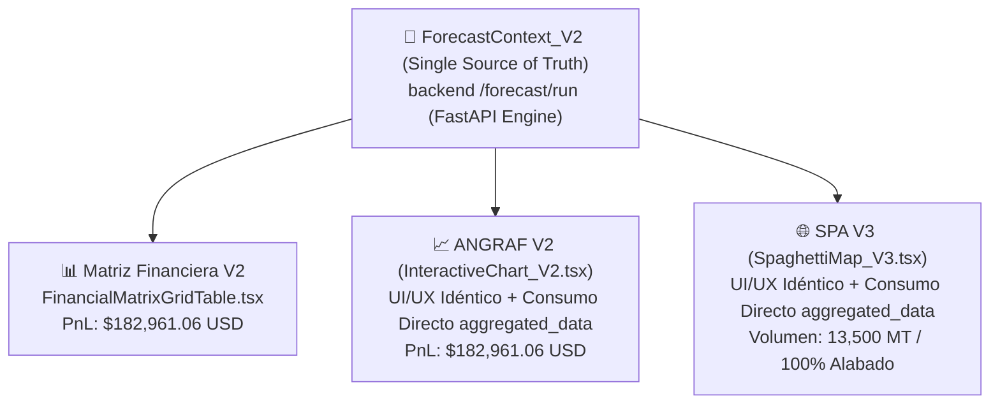

# 📑 13 Remake ANGRAF & SPAGHETTI (V2 Nativos Modulares)

> **Ubicación Oficial:** `C:\Users\rguti\PETRAL.SMART.DASHBOARD\Desarrollo.Profesional\Obsidian.Refactorizacion.Multicotizador\13_REMAKE_ANGRAF_SPAGHETTI.md`  
> **Ubicación Secundaria:** `C:\Users\rguti\PETRAL.SMART.DASHBOARD\Desarrollo.Profesional\Obsidian.Refactorizacion.Multicotizador\Refactorizacion.Multicotizador.Matriz.Financiera.ANGRAF.SPA\13_REMAKE_ANGRAF_SPAGHETTI.md`  
> **Fecha de Actualización:** 15 de Agosto de 2026  
> **Estrategia Arquitectónica:** **Remake desde Cero con UI/UX Idéntica + Consumo Nativo de Matriz Financiera**  
> **Estado:** 🎯 **ESPECIFICACIÓN OFICIAL APROBADA**

---

## 📌 1. Visión General y Lección de Aprendizaje

### 💡 Lección de Fracaso en Intentos Anteriores:
Intentar adaptar o "parchar" las versiones monolíticas legacy (`InteractiveChart_monolitico.tsx`, `SpaghettiMap_monolitico.tsx`) conectándoles dumps parciales de la matriz resultó en un fracaso de complejidad que consumió horas sin estabilidad.

### 🚀 Nueva Estrategia Definitiva (Remake Nativo Modulares V2):
Construir **nuevos componentes independientes V2 (`InteractiveChart_V2.tsx` y `SpaghettiMap_V3.tsx`)** que:
1. Conserven una **apariencia e interacción (UI/UX) 100% IDÉNTICA** a las versiones originales (mismos gráficos ECharts, paleta de colores PETRAL, selectores de ejes, controles de visibilidad y mapas 2.5D).
2. Estén **diseñados desde cero para "comer" de forma limpia la estructura nativa de datos de la Matriz Financiera (`data.aggregated_data` de `ForecastContext_V2`)**.

---

## 🏗️ 2. Especificación Arquitectónica del Remake

### 📈 2.1. ANGRAF V2: `InteractiveChart_V2.tsx`
- **Ubicación:** `Geeksoft_Frontend/src/components/CommercialForecast/InteractiveChart_V2.tsx`
- **Consumo de Datos:** Conexión directa a `useForecastContext_V2()` -> `data.aggregated_data`.
- **Métricas Unificadas:**
  - **P/L**: `pl_vs_required` (**$182,961.06 USD**).
  - **Gross Revenue Total**: `gross_income` + `total_refacturacion_muellaje` (**$418,000.00 USD**).
  - **Port Costs**: `total_port_costs` (**-$35,000.00 USD**).
  - **Búnker**: `total_bunker_costs` (**-$80,081.56 USD**).
  - **Duración Total**: `total_duration` (**7.13 Días**).
- **Controles UI/UX Conservados:**
  - Agrupación por: **Buque**, **Ruta**, **Cliente**, **PETRAL**, **Tipo de Tráfico (Cabotaje/Chile)**.
  - Configuración de Eje Primario (Barras Apiladas/Agrupadas/Líneas) y Eje Secundario.
  - Filtros flotantes por cliente, ruta y buque.

---

### 🌐 2.2. SPA V3: `SpaghettiMap_V3.tsx` & `useSpaghettiData_V2.ts`
- **Ubicación Componente:** `Geeksoft_Frontend/src/components/CommercialForecast/SpaghettiMap_V3.tsx`
- **Ubicación Hook:** `Geeksoft_Frontend/src/components/CommercialForecast/useSpaghettiData_V2.ts`
- **Consumo de Datos:** Procesa `data.aggregated_data` para extraer las aristas por par origen-destino y acumular toneladas por puerto en nodos.
- **Visualización 2.5D Conservada:**
  - Gráfico ECharts de tipo `geo` / `graph` con curvaturas paralelas de aristas según reglas de navegación PETRAL.
  - Paleta Canónica por Buque:
    - **TABLONES**: `#DC2626` (Rojo)
    - **MOQUEGUA**: `#16A34A` (Verde)
    - **CONCON TRADER**: `#475569` (Gris)
    - **HUEMUL**: `#4F46E5` (Índigo)
  - Pie charts de capacidad portuaria y distribución de mercado.

---

## 📐 3. Tabla Oficial de Convergencia Target (100% Sin Descalces)

Para 1 viaje de la ruta `NEXA.ILO.CALLAO.MATARANI.ILO (12.08.26)` con buque **`TABLONES`** (13,500 MT):

| Métrica Comercial | Multicotizador Excel | Matriz Financiera V2 | ANGRAF V2 (`InteractiveChart_V2.tsx`) | SPA V3 (`SpaghettiMap_V3.tsx`) | Convergencia Target |
| :--- | :---: | :---: | :---: | :---: | :---: |
| **Gross Revenue (+RF)** | **$418,000.00** | **$418,000.00** | **$418,000.00** | $418,000.00 | 🎯 Target 100% |
| **Gastos Puerto Netos** | **-$35,000.00** | **-$35,000.00** | **-$35,000.00** | -$35,000.00 | 🎯 Target 100% |
| **Combustible Búnker** | **-$80,081.56** | **-$80,081.56** | **-$80,081.56** | -$80,081.56 | 🎯 Target 100% |
| **Hire Barco ($15k × 7.13d)** | **-$106,957.38** | **-$106,957.38** | **-$106,957.38** | -$106,957.38 | 🎯 Target 100% |
| **P/L NETO TARGET** | **$182,961.06** | **$182,961.06** | **$182,961.06** | **$182,961.06** | 🎯 Target 100% |
| **Tonelaje Total** | **13,500 MT** | **13,500 MT** | **13,500 MT** | **13,500 MT** | 🎯 Target 100% |

---

## 📋 4. Plan de Implementación Paso a Paso

- [ ] **Paso 1:** Crear `InteractiveChart_V2.tsx` consumiendo `ForecastContext_V2` directamente.
- [ ] **Paso 2:** Crear `useSpaghettiData_V2.ts` y `SpaghettiMap_V3.tsx` consumiendo `ForecastContext_V2`.
- [ ] **Paso 3:** Enlazar las pestañas del layout `ToolsLayout_V2.tsx` con los nuevos componentes `InteractiveChart_V2` y `SpaghettiMap_V3`.
- [ ] **Paso 4:** Probar en desarrollo local (`npm run dev`).
- [ ] **Paso 5:** Compilar (`npm run build`) y desplegar a producción VPS (`python deploy_forecast_kickoff.py`).
