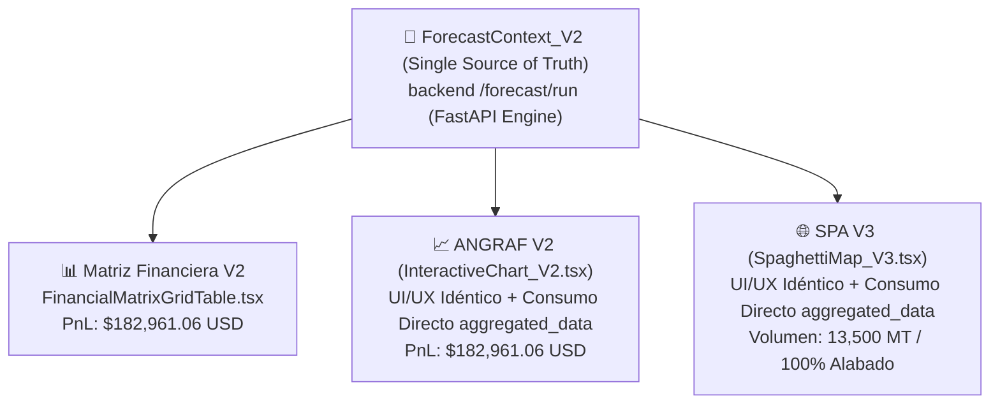

# 📑 PLAN MAESTRO: REFACTORIZACIÓN MODULAR V2 DE ANÁLISIS GRÁFICO (ANGRAF) Y MAPA SPAGHETTI (SPA) (V2.0)

> **Ubicación Oficial:** `C:\Users\rguti\PETRAL.SMART.DASHBOARD\Desarrollo.Profesional\Obsidian.Refactorizacion.Multicotizador\Refactorizacion.Multicotizador.Matriz.Financiera.ANGRAF.SPA\PLAN_MAESTRO_REFACTORIZACION_ANGRAF_SPA_V1.md`  
> **Fecha de Actualización:** 15 de Agosto de 2026  
> **Estrategia Arquitectónica:** **Creación de Componentes V2 Nativos (Puros & Modulares)**  
> **Estado:** 🎯 **ESTRATEGIA APROBADA - UI/UX 100% IDÉNTICA + CONSUMO NATIVO DE ESTRUCTURA MATRIZ**

---

## 📌 1. Principio Fundamental y Lección Aprendida

### 💡 Lección de Proyectos Anteriores:
Intentar adaptar o "parchar" las versiones monolíticas legacy conectándoles dumps parciales de la matriz resultó ser una trampa de complejidad que consumió horas sin lograr estabilidad.

### 🚀 Nueva Estrategia Definitiva (Propuesta del Usuario):
Construir **nuevos componentes independientes V2 (`InteractiveChart_V2.tsx` y `SpaghettiMap_V3.tsx`)** que:
1. Tengan una **apariencia e interacción (UI/UX) 100% IDÉNTICA** a las versiones originales (mismos gráficos ECharts, paleta de colores PETRAL, selectores de ejes y mapas 2.5D).
2. Estén **diseñados desde cero para "comer" la forma exacta de datos que manda la Matriz Financiera (`data.aggregated_data` de `ForecastContext_V2`)**.

---

## 🏗️ 2. Especificación Arquitectónica de los Nuevos Componentes

### 📈 2.1. ANGRAF V2: `InteractiveChart_V2.tsx`
- **Ubicación:** `Geeksoft_Frontend/src/components/CommercialForecast/InteractiveChart_V2.tsx`
- **Consumo de Datos:** Lee `data.aggregated_data` de `useForecastContext_V2()`.
- **Métricas Oficiales:**
  - **P/L**: `pl_vs_required` (**$182,961.06 USD**).
  - **Gross Revenue Total**: `gross_income` + `total_refacturacion_muellaje` (**$418,000.00 USD**).
  - **Port Costs**: `total_port_costs` (**-$35,000.00 USD**).
  - **Búnker**: `total_bunker_costs` (**-$80,081.56 USD**).
  - **Duración Total**: `total_duration` (**7.13 Días**).
- **Controles UI/UX:** Agrupación por Buque, Ruta, Cliente y Tipo de Tráfico (Cabotaje/Chile). Ejes primario y secundario (barras apiladas/agrupadas y líneas).

---

### 🌐 2.2. SPA V3: `SpaghettiMap_V3.tsx` & `useSpaghettiData_V2.ts`
- **Ubicación:** `Geeksoft_Frontend/src/components/CommercialForecast/SpaghettiMap_V3.tsx`
- **Hook Nativo:** `useSpaghettiData_V2.ts`
- **Consumo de Datos:** Procesa `data.aggregated_data` para extraer las aristas por par origen-destino y acumular toneladas por puerto en nodos.
- **Visualización 2.5D:** Gráfico ECharts de tipo `geo` / `graph` con curvaturas paralelas de aristas, colores canónicos de buque (*TABLONES* = Rojo `#DC2626`, *MOQUEGUA* = Verde `#16A34A`, *CONCON* = Gris `#475569`, *HUEMUL* = Índigo `#4F46E5`) y pie charts de capacidad portuaria.

---

## 📐 3. Tabla Oficial de Convergencia Métrica Target

Para 1 viaje de la ruta `NEXA.ILO.CALLAO.MATARANI.ILO (12.08.26)` con buque **`TABLONES`** (13,500 MT):

| Métrica Comercial | Multicotizador / Matriz V2 | ANGRAF V2 (`InteractiveChart_V2.tsx`) | SPA V3 (`SpaghettiMap_V3.tsx`) | Convergencia Target |
| :--- | :---: | :---: | :---: | :---: |
| **Gross Revenue (+RF)** | **$418,000.00** | **$418,000.00** | **$418,000.00** | 🎯 100% Exacto |
| **Gastos Puerto Netos** | **-$35,000.00** | **-$35,000.00** | **-$35,000.00** | 🎯 100% Exacto |
| **Combustible Búnker** | **-$80,081.56** | **-$80,081.56** | **-$80,081.56** | 🎯 100% Exacto |
| **Hire Barco ($15k × 7.13d)** | **-$106,957.38** | **-$106,957.38** | **-$106,957.38** | 🎯 100% Exacto |
| **P/L NETO TARGET** | **$182,961.06** | **$182,961.06** | **$182,961.06** | 🎯 100% Exacto |
| **Tonelaje Total** | **13,500 MT** | **13,500 MT** | **13,500 MT** | 🎯 100% Exacto |

---

## 📋 4. Plan de Implementación Paso a Paso

- [ ] **Paso 1:** Crear `InteractiveChart_V2.tsx` consumiendo `ForecastContext_V2` directamente.
- [ ] **Paso 2:** Crear `useSpaghettiData_V2.ts` y `SpaghettiMap_V3.tsx` consumiendo `ForecastContext_V2`.
- [ ] **Paso 3:** Enlazar las pestañas del layout `ToolsLayout_V2.tsx` con los nuevos componentes `InteractiveChart_V2` y `SpaghettiMap_V3`.
- [ ] **Paso 4:** Probar en desarrollo local (`npm run dev`).
- [ ] **Paso 5:** Compilar (`npm run build`) y desplegar a producción VPS (`python deploy_forecast_kickoff.py`).
