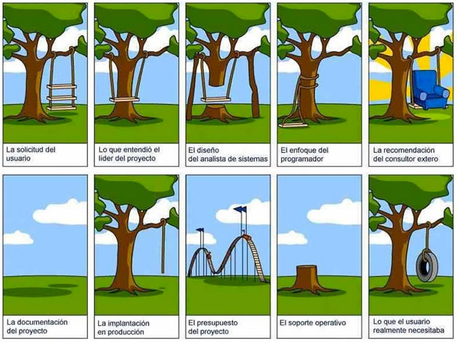
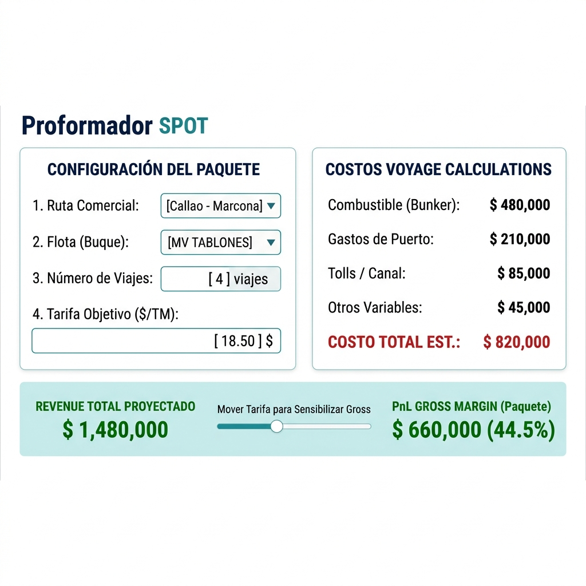

<!-- 
REGLAS INVIOLABLES DE GENERACION DE PDF (Heredadas del Boilerplate):
1. Cada sección principal con título H2 (##) debe ir en su propio slide separado.
2. NUNCA fuerces la fusión de dos secciones H2 en un mismo slide.
3. Si el contenido de un slide se desborda al siguiente, RESUME el texto.
-->

    
    <h1 style="color: #0f2c59; font-size: 28pt; margin-bottom: 5px; page-break-before: avoid; border: none !important; border-bottom: none !important; text-decoration: none;">Navigating the Future: Inteligencia Comercial</h1>
    

        <em>Transición de procesos legacy a un ecosistema de datos centralizado y automatizado</em>
    

    

        <strong>Objetivo:</strong> Modernización integral de la gestión de Forecast y Operaciones.
    

## .

## Roadmap: Enfoque AGILE (Proceso Iterativo)

    
    

        
1. Alcance

        

            <strong style="color: #0f2c59; font-size: 9.5pt; white-space: nowrap;">Diseño del Sistema</strong>  
            Llegar al mejor entendimiento de la necesidad.
        

    

    
    
➔

    
    

        
2. Desarrollo

        

            <strong style="color: #1565c0; font-size: 9.5pt; white-space: nowrap;">Escribir el Software</strong>  
            Stack tecnológico que se usará para construir SW.
        

    

    
    
➔

    
    

        
3. ETL

        

            <strong style="color: #f9a825; font-size: 9.5pt; white-space: nowrap;">Carga de Datos</strong>  
            Extraer, Transformar y Cargar la data de ejecución del 2026.
        

    

    
    
➔

    
    

        
4. Onboarding

        

            <strong style="color: #1e8449; font-size: 9.5pt; white-space: nowrap;">Implementación</strong>  
            Despliegue y capacitación operativa.
        

    

    
    
➔

    
    

        
5. In Situ

        

            <strong style="color: #e65100; font-size: 9.5pt; white-space: nowrap;">Acompañamiento</strong>  
            Mejora continua operando en Petral.
        

    

    <svg width="100%" viewBox="0 0 1000 130" style="overflow: visible;">
        <defs>
            <marker id="arrow0f2c59" markerWidth="10" markerHeight="10" refX="9" refY="5" orient="auto">
                <polygon points="0,0 10,5 0,10" fill="#0f2c59" />
            </marker>
            <marker id="arrow1565c0" markerWidth="10" markerHeight="10" refX="9" refY="5" orient="auto">
                <polygon points="0,0 10,5 0,10" fill="#1565c0" />
            </marker>
            <marker id="arrowf9a825" markerWidth="10" markerHeight="10" refX="9" refY="5" orient="auto">
                <polygon points="0,0 10,5 0,10" fill="#f9a825" />
            </marker>
            <marker id="arrow1e8449" markerWidth="10" markerHeight="10" refX="9" refY="5" orient="auto">
                <polygon points="0,0 10,5 0,10" fill="#1e8449" />
            </marker>
            <marker id="arrowe65100" markerWidth="10" markerHeight="10" refX="9" refY="5" orient="auto">
                <polygon points="0,0 10,5 0,10" fill="#e65100" />
            </marker>
        </defs>
        
        <!-- Path 1: 2 -> 1 -->
        <path d="M 290 0 L 290 40 Q 290 50 280 50 L 95 50 Q 85 50 85 40 L 85 15" fill="none" stroke="#0f2c59" stroke-width="3" stroke-dasharray="8,4" marker-end="url(#arrow0f2c59)" />
        <text x="187" y="73" font-family="sans-serif" font-size="12" font-weight="bold" fill="#0f2c59" text-anchor="middle">Modifica Alcance</text>

        <!-- Path 2: 3 -> 2 -->
        <path d="M 495 0 L 495 40 Q 495 50 485 50 L 300 50 Q 290 50 290 40 L 290 15" fill="none" stroke="#1565c0" stroke-width="3" stroke-dasharray="8,4" marker-end="url(#arrow1565c0)" />
        <text x="392" y="73" font-family="sans-serif" font-size="12" font-weight="bold" fill="#1565c0" text-anchor="middle">Ajusta Software</text>

        <!-- Path 3: 4 -> 3 -->
        <path d="M 700 0 L 700 40 Q 700 50 690 50 L 505 50 Q 495 50 495 40 L 495 15" fill="none" stroke="#f9a825" stroke-width="3" stroke-dasharray="8,4" marker-end="url(#arrowf9a825)" />
        <text x="597" y="73" font-family="sans-serif" font-size="12" font-weight="bold" fill="#f9a825" text-anchor="middle">Mejora Extracción</text>

        <!-- Path 4: 5 -> 4 -->
        <path d="M 905 0 L 905 40 Q 905 50 895 50 L 710 50 Q 700 50 700 40 L 700 15" fill="none" stroke="#1e8449" stroke-width="3" stroke-dasharray="8,4" marker-end="url(#arrow1e8449)" />
        <text x="802" y="73" font-family="sans-serif" font-size="12" font-weight="bold" fill="#1e8449" text-anchor="middle">Calibra Onboarding</text>
        
        <!-- Large Loop: 5 -> 1 -->
        <path d="M 930 0 L 930 85 Q 930 95 920 95 L 75 95 Q 65 95 65 85 L 65 15" fill="none" stroke="#e65100" stroke-width="3" stroke-dasharray="10,5" marker-end="url(#arrowe65100)" />
        <text x="500" y="118" font-family="sans-serif" font-size="16" font-weight="bold" fill="#e65100" text-anchor="middle">Feedback Constante (El campo mejora el sistema)</text>
    </svg>

<!-- PAGE_BREAK -->

## Fase 1: Diseño del Sistema (Alcance Comercial)

    <strong style="color: #0d47a1; font-size: 18pt; display: block; margin-bottom: 15px;">La Propuesta de Valor: Control a Nivel Viaje</strong>
    
        Analizar la rentabilidad por <strong>"Mes"</strong> permite que los viajes altamente rentables oculten las ineficiencias de las rutas con pérdidas.  
        Al bajar la granularidad a nivel <strong>"Viaje"</strong>, el sistema entregará tres superpoderes comerciales a Petral:  
        <strong>1. Anticipación:</strong> Proyectar el P&L exacto de cada ruta antes de ejecutar (Forecast). 
        <strong>2. Agilidad Comercial:</strong> Cotizar viajes fuera de contrato estructurando "paquetes" altamente rentables en segundos (SPOT). 
        <strong>3. Mejora Continua:</strong> Auditar la ejecución real vs lo proyectado para ajustar los costos de futuros contratos.
    

## Fase 1: Los Tres Pilares Lógicos

Para materializar este nivel de control, diseñaremos la herramienta sobre tres pilares complementarios:

<table style="width: 100%; border-collapse: collapse; font-size: 11pt; margin-top: 10px; page-break-inside: avoid;">
    <tr><th style="background-color: #0f2c59; color: white; padding: 8px; text-align: left; border: 1px solid #ccc; width: 25%;">Pilar A: Commercial Forecast</th>
    <td style="padding: 8px; border: 1px solid #ccc; background-color: #f9f9f9;">
        <strong>Objetivo:</strong> Usar "VOYAGE CALCULATIONS" como base estática para determinar costos por ruta y asegurar el margen operativo. 
        <strong>Alcance:</strong> Sistematizar los Maestros en una base centralizada y automatizar el P&L por viaje.
    </td></tr>
    <tr><th style="background-color: #9c27b0; color: white; padding: 8px; text-align: left; border: 1px solid #ccc;">Pilar B: Proformador SPOT</th>
    <td style="padding: 8px; border: 1px solid #ccc; background-color: #f9f9f9;">
        <strong>Objetivo:</strong> Simular y cotizar viajes fuera de contrato (SPOT) con agilidad y precisión. 
        <strong>Alcance:</strong> Traer costos de ruta/barco y mover tarifas para cotizar propuestas SPOT (paquetes de viajes).
    </td></tr>
    <tr><th style="background-color: #e65100; color: white; padding: 8px; text-align: left; border: 1px solid #ccc;">Pilar C: Control de Gestión</th>
    <td style="padding: 8px; border: 1px solid #ccc; background-color: #f9f9f9;">
        <strong>Objetivo:</strong> Medir la precisión de pronósticos proyectados vs ejecución operativa real en puerto. 
        <strong>Alcance:</strong> Interfaz para ingreso de fletes/gastos reales. Ajustará el VOYAGE CALCULATIONS para futuros contratos.
    </td></tr>
</table>

<!-- PAGE_BREAK -->

## Demostración Visual: Pilar A - Commercial Forecast

    

        Impacto del Pilar A: Visibilidad predictiva por barco y por ruta.
    

    

        
        <!-- GRAFICO -->
        

            
Ventas Mensuales por Ruta y Buque

            
            <svg width="100%" height="300" viewBox="-30 0 720 300">
            <!-- Eje Y Izquierdo (Ventas por Buque) -->
            <line x1="60" y1="20" x2="60" y2="180" stroke="#cbd5e1" stroke-width="1"/>
            <text x="55" y="183" font-size="9" text-anchor="end" fill="#64748b">0</text>
            <text x="55" y="151" font-size="9" text-anchor="end" fill="#64748b">250,000</text>
            <text x="55" y="119" font-size="9" text-anchor="end" fill="#64748b">500,000</text>
            <text x="55" y="87" font-size="9" text-anchor="end" fill="#64748b">750,000</text>
            <text x="55" y="55" font-size="9" text-anchor="end" fill="#64748b">1,000,000</text>
            <text x="55" y="23" font-size="9" text-anchor="end" fill="#64748b">1,250,000</text>
            
            <text x="-20" y="100" font-size="10" font-weight="bold" fill="#334155" transform="rotate(-90 -20,100)" text-anchor="middle">Ventas por Buque ($)</text>

            <!-- Grid Lines -->
            <line x1="60" y1="148" x2="610" y2="148" stroke="#cbd5e1" stroke-dasharray="4" stroke-width="1"/>
            <line x1="60" y1="116" x2="610" y2="116" stroke="#cbd5e1" stroke-dasharray="4" stroke-width="1"/>
            <line x1="60" y1="84" x2="610" y2="84" stroke="#cbd5e1" stroke-dasharray="4" stroke-width="1"/>
            <line x1="60" y1="52" x2="610" y2="52" stroke="#cbd5e1" stroke-dasharray="4" stroke-width="1"/>
            <line x1="60" y1="20" x2="610" y2="20" stroke="#cbd5e1" stroke-dasharray="4" stroke-width="1"/>
            
            <!-- Eje Y Derecho (Total Ventas) -->
            <line x1="610" y1="20" x2="610" y2="180" stroke="#cbd5e1" stroke-width="1"/>
            <text x="615" y="183" font-size="9" text-anchor="start" fill="#ef4444">0</text>
            <text x="615" y="151" font-size="9" text-anchor="start" fill="#ef4444">600,000</text>
            <text x="615" y="119" font-size="9" text-anchor="start" fill="#ef4444">1,200,000</text>
            <text x="615" y="87" font-size="9" text-anchor="start" fill="#ef4444">1,800,000</text>
            <text x="615" y="55" font-size="9" text-anchor="start" fill="#ef4444">2,400,000</text>
            <text x="615" y="23" font-size="9" text-anchor="start" fill="#ef4444">3,000,000</text>

            <text x="675" y="100" font-size="10" font-weight="bold" fill="#ef4444" transform="rotate(-90 675,100)" text-anchor="middle">Total Ventas Mes ($)</text>

            <!-- Eje X -->
            <line x1="60" y1="180" x2="610" y2="180" stroke="#cbd5e1" stroke-width="1"/>
            <text x="106" y="270" font-size="10" font-weight="bold" fill="#334155" text-anchor="middle">Ene 26</text>
            <!-- Moquegua -->
            <text x="80" y="190" font-size="8" font-weight="bold" fill="#64748b" transform="rotate(-90 80,190)" text-anchor="end">Moquegua</text>
            <rect x="70" y="148.38400000000001" width="20" height="31.616" fill="#06b6d4" stroke="#ffffff" stroke-width="1.5" />
            <text x="76" y="157.788" font-size="4.5" font-family="sans-serif" font-weight="bold" fill="#000000" text-anchor="middle">M</text>
            <text x="84" y="157.788" font-size="4.5" font-family="sans-serif" font-weight="bold" fill="#000000" text-anchor="middle">M</text>
            <text x="76" y="173.596" font-size="4.5" font-family="sans-serif" font-weight="bold" fill="#000000" text-anchor="middle">M</text>
            <text x="84" y="173.596" font-size="4.5" font-family="sans-serif" font-weight="bold" fill="#000000" text-anchor="middle">M</text>
            <rect x="70" y="110.11200000000002" width="20" height="38.272" fill="#8b5cf6" stroke="#ffffff" stroke-width="1.5" />
            <text x="76" y="117.99066666666668" font-size="4.5" font-family="sans-serif" font-weight="bold" fill="#000000" text-anchor="middle">M</text>
            <text x="84" y="117.99066666666668" font-size="4.5" font-family="sans-serif" font-weight="bold" fill="#000000" text-anchor="middle">M</text>
            <text x="76" y="130.74800000000002" font-size="4.5" font-family="sans-serif" font-weight="bold" fill="#000000" text-anchor="middle">M</text>
            <text x="84" y="130.74800000000002" font-size="4.5" font-family="sans-serif" font-weight="bold" fill="#000000" text-anchor="middle">M</text>
            <text x="76" y="143.50533333333337" font-size="4.5" font-family="sans-serif" font-weight="bold" fill="#000000" text-anchor="middle">M</text>
            <text x="84" y="143.50533333333337" font-size="4.5" font-family="sans-serif" font-weight="bold" fill="#000000" text-anchor="middle">M</text>
            <!-- Tablones -->
            <text x="104" y="190" font-size="8" font-weight="bold" fill="#64748b" transform="rotate(-90 104,190)" text-anchor="end">Tablones</text>
            <rect x="94" y="145.05599999999998" width="20" height="34.944" fill="#06b6d4" stroke="#ffffff" stroke-width="1.5" />
            <text x="100" y="155.29199999999997" font-size="4.5" font-family="sans-serif" font-weight="bold" fill="#000000" text-anchor="middle">T</text>
            <text x="108" y="155.29199999999997" font-size="4.5" font-family="sans-serif" font-weight="bold" fill="#000000" text-anchor="middle">T</text>
            <text x="100" y="172.76399999999998" font-size="4.5" font-family="sans-serif" font-weight="bold" fill="#000000" text-anchor="middle">T</text>
            <text x="108" y="172.76399999999998" font-size="4.5" font-family="sans-serif" font-weight="bold" fill="#000000" text-anchor="middle">T</text>
            <rect x="94" y="111.77599999999998" width="20" height="33.28" fill="#06b6d4" stroke="#ffffff" stroke-width="1.5" />
            <text x="100" y="121.59599999999998" font-size="4.5" font-family="sans-serif" font-weight="bold" fill="#000000" text-anchor="middle">T</text>
            <text x="108" y="121.59599999999998" font-size="4.5" font-family="sans-serif" font-weight="bold" fill="#000000" text-anchor="middle">T</text>
            <text x="100" y="138.236" font-size="4.5" font-family="sans-serif" font-weight="bold" fill="#000000" text-anchor="middle">T</text>
            <text x="108" y="138.236" font-size="4.5" font-family="sans-serif" font-weight="bold" fill="#000000" text-anchor="middle">T</text>
            <!-- Concon T. -->
            <text x="128" y="190" font-size="8" font-weight="bold" fill="#64748b" transform="rotate(-90 128,190)" text-anchor="end">Concon T.</text>
            <rect x="118" y="133.40800000000002" width="20" height="46.592" fill="#ef4444" stroke="#ffffff" stroke-width="1.5" />
            <text x="124" y="142.67333333333335" font-size="4.5" font-family="sans-serif" font-weight="bold" fill="#000000" text-anchor="middle">CT</text>
            <text x="132" y="142.67333333333335" font-size="4.5" font-family="sans-serif" font-weight="bold" fill="#000000" text-anchor="middle">CT</text>
            <text x="124" y="158.204" font-size="4.5" font-family="sans-serif" font-weight="bold" fill="#000000" text-anchor="middle">CT</text>
            <text x="132" y="158.204" font-size="4.5" font-family="sans-serif" font-weight="bold" fill="#000000" text-anchor="middle">CT</text>
            <text x="124" y="173.73466666666667" font-size="4.5" font-family="sans-serif" font-weight="bold" fill="#000000" text-anchor="middle">CT</text>
            <text x="132" y="173.73466666666667" font-size="4.5" font-family="sans-serif" font-weight="bold" fill="#000000" text-anchor="middle">CT</text>
            <rect x="118" y="101.79200000000002" width="20" height="31.616" fill="#3b82f6" stroke="#ffffff" stroke-width="1.5" />
            <text x="124" y="111.19600000000001" font-size="4.5" font-family="sans-serif" font-weight="bold" fill="#000000" text-anchor="middle">CT</text>
            <text x="132" y="111.19600000000001" font-size="4.5" font-family="sans-serif" font-weight="bold" fill="#000000" text-anchor="middle">CT</text>
            <text x="124" y="127.00400000000002" font-size="4.5" font-family="sans-serif" font-weight="bold" fill="#000000" text-anchor="middle">CT</text>
            <text x="132" y="127.00400000000002" font-size="4.5" font-family="sans-serif" font-weight="bold" fill="#000000" text-anchor="middle">CT</text>
            <text x="196" y="270" font-size="10" font-weight="bold" fill="#334155" text-anchor="middle">Feb 26</text>
            <!-- Moquegua -->
            <text x="170" y="190" font-size="8" font-weight="bold" fill="#64748b" transform="rotate(-90 170,190)" text-anchor="end">Moquegua</text>
            <rect x="160" y="143.392" width="20" height="36.608" fill="#8b5cf6" stroke="#ffffff" stroke-width="1.5" />
            <text x="166" y="150.99333333333334" font-size="4.5" font-family="sans-serif" font-weight="bold" fill="#000000" text-anchor="middle">M</text>
            <text x="174" y="150.99333333333334" font-size="4.5" font-family="sans-serif" font-weight="bold" fill="#000000" text-anchor="middle">M</text>
            <text x="166" y="163.196" font-size="4.5" font-family="sans-serif" font-weight="bold" fill="#000000" text-anchor="middle">M</text>
            <text x="174" y="163.196" font-size="4.5" font-family="sans-serif" font-weight="bold" fill="#000000" text-anchor="middle">M</text>
            <text x="166" y="175.39866666666666" font-size="4.5" font-family="sans-serif" font-weight="bold" fill="#000000" text-anchor="middle">M</text>
            <text x="174" y="175.39866666666666" font-size="4.5" font-family="sans-serif" font-weight="bold" fill="#000000" text-anchor="middle">M</text>
            <rect x="160" y="98.464" width="20" height="44.928" fill="#10b981" stroke="#ffffff" stroke-width="1.5" />
            <text x="166" y="107.452" font-size="4.5" font-family="sans-serif" font-weight="bold" fill="#000000" text-anchor="middle">M</text>
            <text x="174" y="107.452" font-size="4.5" font-family="sans-serif" font-weight="bold" fill="#000000" text-anchor="middle">M</text>
            <text x="166" y="122.428" font-size="4.5" font-family="sans-serif" font-weight="bold" fill="#000000" text-anchor="middle">M</text>
            <text x="174" y="122.428" font-size="4.5" font-family="sans-serif" font-weight="bold" fill="#000000" text-anchor="middle">M</text>
            <text x="166" y="137.404" font-size="4.5" font-family="sans-serif" font-weight="bold" fill="#000000" text-anchor="middle">M</text>
            <text x="174" y="137.404" font-size="4.5" font-family="sans-serif" font-weight="bold" fill="#000000" text-anchor="middle">M</text>
            <!-- Tablones -->
            <text x="194" y="190" font-size="8" font-weight="bold" fill="#64748b" transform="rotate(-90 194,190)" text-anchor="end">Tablones</text>
            <rect x="184" y="135.072" width="20" height="44.928" fill="#8b5cf6" stroke="#ffffff" stroke-width="1.5" />
            <text x="190" y="144.06" font-size="4.5" font-family="sans-serif" font-weight="bold" fill="#000000" text-anchor="middle">T</text>
            <text x="198" y="144.06" font-size="4.5" font-family="sans-serif" font-weight="bold" fill="#000000" text-anchor="middle">T</text>
            <text x="190" y="159.036" font-size="4.5" font-family="sans-serif" font-weight="bold" fill="#000000" text-anchor="middle">T</text>
            <text x="198" y="159.036" font-size="4.5" font-family="sans-serif" font-weight="bold" fill="#000000" text-anchor="middle">T</text>
            <text x="190" y="174.012" font-size="4.5" font-family="sans-serif" font-weight="bold" fill="#000000" text-anchor="middle">T</text>
            <text x="198" y="174.012" font-size="4.5" font-family="sans-serif" font-weight="bold" fill="#000000" text-anchor="middle">T</text>
            <rect x="184" y="85.152" width="20" height="49.92" fill="#06b6d4" stroke="#ffffff" stroke-width="1.5" />
            <text x="190" y="92.892" font-size="4.5" font-family="sans-serif" font-weight="bold" fill="#000000" text-anchor="middle">T</text>
            <text x="198" y="92.892" font-size="4.5" font-family="sans-serif" font-weight="bold" fill="#000000" text-anchor="middle">T</text>
            <text x="190" y="105.372" font-size="4.5" font-family="sans-serif" font-weight="bold" fill="#000000" text-anchor="middle">T</text>
            <text x="198" y="105.372" font-size="4.5" font-family="sans-serif" font-weight="bold" fill="#000000" text-anchor="middle">T</text>
            <text x="190" y="117.852" font-size="4.5" font-family="sans-serif" font-weight="bold" fill="#000000" text-anchor="middle">T</text>
            <text x="198" y="117.852" font-size="4.5" font-family="sans-serif" font-weight="bold" fill="#000000" text-anchor="middle">T</text>
            <text x="190" y="130.332" font-size="4.5" font-family="sans-serif" font-weight="bold" fill="#000000" text-anchor="middle">T</text>
            <text x="198" y="130.332" font-size="4.5" font-family="sans-serif" font-weight="bold" fill="#000000" text-anchor="middle">T</text>
            <!-- Concon T. -->
            <text x="218" y="190" font-size="8" font-weight="bold" fill="#64748b" transform="rotate(-90 218,190)" text-anchor="end">Concon T.</text>
            <rect x="208" y="143.392" width="20" height="36.608" fill="#ef4444" stroke="#ffffff" stroke-width="1.5" />
            <text x="214" y="150.99333333333334" font-size="4.5" font-family="sans-serif" font-weight="bold" fill="#000000" text-anchor="middle">CT</text>
            <text x="222" y="150.99333333333334" font-size="4.5" font-family="sans-serif" font-weight="bold" fill="#000000" text-anchor="middle">CT</text>
            <text x="214" y="163.196" font-size="4.5" font-family="sans-serif" font-weight="bold" fill="#000000" text-anchor="middle">CT</text>
            <text x="222" y="163.196" font-size="4.5" font-family="sans-serif" font-weight="bold" fill="#000000" text-anchor="middle">CT</text>
            <text x="214" y="175.39866666666666" font-size="4.5" font-family="sans-serif" font-weight="bold" fill="#000000" text-anchor="middle">CT</text>
            <text x="222" y="175.39866666666666" font-size="4.5" font-family="sans-serif" font-weight="bold" fill="#000000" text-anchor="middle">CT</text>
            <rect x="208" y="96.8" width="20" height="46.592" fill="#f59e0b" stroke="#ffffff" stroke-width="1.5" />
            <text x="214" y="106.06533333333333" font-size="4.5" font-family="sans-serif" font-weight="bold" fill="#000000" text-anchor="middle">CT</text>
            <text x="222" y="106.06533333333333" font-size="4.5" font-family="sans-serif" font-weight="bold" fill="#000000" text-anchor="middle">CT</text>
            <text x="214" y="121.596" font-size="4.5" font-family="sans-serif" font-weight="bold" fill="#000000" text-anchor="middle">CT</text>
            <text x="222" y="121.596" font-size="4.5" font-family="sans-serif" font-weight="bold" fill="#000000" text-anchor="middle">CT</text>
            <text x="214" y="137.12666666666667" font-size="4.5" font-family="sans-serif" font-weight="bold" fill="#000000" text-anchor="middle">CT</text>
            <text x="222" y="137.12666666666667" font-size="4.5" font-family="sans-serif" font-weight="bold" fill="#000000" text-anchor="middle">CT</text>
            <rect x="208" y="65.184" width="20" height="31.616" fill="#8b5cf6" stroke="#ffffff" stroke-width="1.5" />
            <text x="214" y="74.588" font-size="4.5" font-family="sans-serif" font-weight="bold" fill="#000000" text-anchor="middle">CT</text>
            <text x="222" y="74.588" font-size="4.5" font-family="sans-serif" font-weight="bold" fill="#000000" text-anchor="middle">CT</text>
            <text x="214" y="90.396" font-size="4.5" font-family="sans-serif" font-weight="bold" fill="#000000" text-anchor="middle">CT</text>
            <text x="222" y="90.396" font-size="4.5" font-family="sans-serif" font-weight="bold" fill="#000000" text-anchor="middle">CT</text>
            <text x="286" y="270" font-size="10" font-weight="bold" fill="#334155" text-anchor="middle">Mar 26</text>
            <!-- Moquegua -->
            <text x="260" y="190" font-size="8" font-weight="bold" fill="#64748b" transform="rotate(-90 260,190)" text-anchor="end">Moquegua</text>
            <rect x="250" y="140.064" width="20" height="39.936" fill="#f59e0b" stroke="#ffffff" stroke-width="1.5" />
            <text x="256" y="148.22" font-size="4.5" font-family="sans-serif" font-weight="bold" fill="#000000" text-anchor="middle">M</text>
            <text x="264" y="148.22" font-size="4.5" font-family="sans-serif" font-weight="bold" fill="#000000" text-anchor="middle">M</text>
            <text x="256" y="161.53199999999998" font-size="4.5" font-family="sans-serif" font-weight="bold" fill="#000000" text-anchor="middle">M</text>
            <text x="264" y="161.53199999999998" font-size="4.5" font-family="sans-serif" font-weight="bold" fill="#000000" text-anchor="middle">M</text>
            <text x="256" y="174.844" font-size="4.5" font-family="sans-serif" font-weight="bold" fill="#000000" text-anchor="middle">M</text>
            <text x="264" y="174.844" font-size="4.5" font-family="sans-serif" font-weight="bold" fill="#000000" text-anchor="middle">M</text>
            <rect x="250" y="105.11999999999999" width="20" height="34.944" fill="#8b5cf6" stroke="#ffffff" stroke-width="1.5" />
            <text x="256" y="115.356" font-size="4.5" font-family="sans-serif" font-weight="bold" fill="#000000" text-anchor="middle">M</text>
            <text x="264" y="115.356" font-size="4.5" font-family="sans-serif" font-weight="bold" fill="#000000" text-anchor="middle">M</text>
            <text x="256" y="132.828" font-size="4.5" font-family="sans-serif" font-weight="bold" fill="#000000" text-anchor="middle">M</text>
            <text x="264" y="132.828" font-size="4.5" font-family="sans-serif" font-weight="bold" fill="#000000" text-anchor="middle">M</text>
            <rect x="250" y="65.184" width="20" height="39.936" fill="#3b82f6" stroke="#ffffff" stroke-width="1.5" />
            <text x="256" y="73.34" font-size="4.5" font-family="sans-serif" font-weight="bold" fill="#000000" text-anchor="middle">M</text>
            <text x="264" y="73.34" font-size="4.5" font-family="sans-serif" font-weight="bold" fill="#000000" text-anchor="middle">M</text>
            <text x="256" y="86.652" font-size="4.5" font-family="sans-serif" font-weight="bold" fill="#000000" text-anchor="middle">M</text>
            <text x="264" y="86.652" font-size="4.5" font-family="sans-serif" font-weight="bold" fill="#000000" text-anchor="middle">M</text>
            <text x="256" y="99.964" font-size="4.5" font-family="sans-serif" font-weight="bold" fill="#000000" text-anchor="middle">M</text>
            <text x="264" y="99.964" font-size="4.5" font-family="sans-serif" font-weight="bold" fill="#000000" text-anchor="middle">M</text>
            <!-- Tablones -->
            <text x="284" y="190" font-size="8" font-weight="bold" fill="#64748b" transform="rotate(-90 284,190)" text-anchor="end">Tablones</text>
            <rect x="274" y="138.4" width="20" height="41.6" fill="#3b82f6" stroke="#ffffff" stroke-width="1.5" />
            <text x="280" y="146.83333333333334" font-size="4.5" font-family="sans-serif" font-weight="bold" fill="#000000" text-anchor="middle">T</text>
            <text x="288" y="146.83333333333334" font-size="4.5" font-family="sans-serif" font-weight="bold" fill="#000000" text-anchor="middle">T</text>
            <text x="280" y="160.70000000000002" font-size="4.5" font-family="sans-serif" font-weight="bold" fill="#000000" text-anchor="middle">T</text>
            <text x="288" y="160.70000000000002" font-size="4.5" font-family="sans-serif" font-weight="bold" fill="#000000" text-anchor="middle">T</text>
            <text x="280" y="174.56666666666666" font-size="4.5" font-family="sans-serif" font-weight="bold" fill="#000000" text-anchor="middle">T</text>
            <text x="288" y="174.56666666666666" font-size="4.5" font-family="sans-serif" font-weight="bold" fill="#000000" text-anchor="middle">T</text>
            <rect x="274" y="98.464" width="20" height="39.936" fill="#f59e0b" stroke="#ffffff" stroke-width="1.5" />
            <text x="280" y="106.62" font-size="4.5" font-family="sans-serif" font-weight="bold" fill="#000000" text-anchor="middle">T</text>
            <text x="288" y="106.62" font-size="4.5" font-family="sans-serif" font-weight="bold" fill="#000000" text-anchor="middle">T</text>
            <text x="280" y="119.932" font-size="4.5" font-family="sans-serif" font-weight="bold" fill="#000000" text-anchor="middle">T</text>
            <text x="288" y="119.932" font-size="4.5" font-family="sans-serif" font-weight="bold" fill="#000000" text-anchor="middle">T</text>
            <text x="280" y="133.244" font-size="4.5" font-family="sans-serif" font-weight="bold" fill="#000000" text-anchor="middle">T</text>
            <text x="288" y="133.244" font-size="4.5" font-family="sans-serif" font-weight="bold" fill="#000000" text-anchor="middle">T</text>
            <!-- Concon T. -->
            <text x="308" y="190" font-size="8" font-weight="bold" fill="#64748b" transform="rotate(-90 308,190)" text-anchor="end">Concon T.</text>
            <rect x="298" y="148.38400000000001" width="20" height="31.616" fill="#06b6d4" stroke="#ffffff" stroke-width="1.5" />
            <text x="304" y="157.788" font-size="4.5" font-family="sans-serif" font-weight="bold" fill="#000000" text-anchor="middle">CT</text>
            <text x="312" y="157.788" font-size="4.5" font-family="sans-serif" font-weight="bold" fill="#000000" text-anchor="middle">CT</text>
            <text x="304" y="173.596" font-size="4.5" font-family="sans-serif" font-weight="bold" fill="#000000" text-anchor="middle">CT</text>
            <text x="312" y="173.596" font-size="4.5" font-family="sans-serif" font-weight="bold" fill="#000000" text-anchor="middle">CT</text>
            <rect x="298" y="105.12" width="20" height="43.264" fill="#10b981" stroke="#ffffff" stroke-width="1.5" />
            <text x="304" y="113.83066666666667" font-size="4.5" font-family="sans-serif" font-weight="bold" fill="#000000" text-anchor="middle">CT</text>
            <text x="312" y="113.83066666666667" font-size="4.5" font-family="sans-serif" font-weight="bold" fill="#000000" text-anchor="middle">CT</text>
            <text x="304" y="128.252" font-size="4.5" font-family="sans-serif" font-weight="bold" fill="#000000" text-anchor="middle">CT</text>
            <text x="312" y="128.252" font-size="4.5" font-family="sans-serif" font-weight="bold" fill="#000000" text-anchor="middle">CT</text>
            <text x="304" y="142.67333333333335" font-size="4.5" font-family="sans-serif" font-weight="bold" fill="#000000" text-anchor="middle">CT</text>
            <text x="312" y="142.67333333333335" font-size="4.5" font-family="sans-serif" font-weight="bold" fill="#000000" text-anchor="middle">CT</text>
            <rect x="298" y="71.84" width="20" height="33.28" fill="#ef4444" stroke="#ffffff" stroke-width="1.5" />
            <text x="304" y="81.66" font-size="4.5" font-family="sans-serif" font-weight="bold" fill="#000000" text-anchor="middle">CT</text>
            <text x="312" y="81.66" font-size="4.5" font-family="sans-serif" font-weight="bold" fill="#000000" text-anchor="middle">CT</text>
            <text x="304" y="98.30000000000001" font-size="4.5" font-family="sans-serif" font-weight="bold" fill="#000000" text-anchor="middle">CT</text>
            <text x="312" y="98.30000000000001" font-size="4.5" font-family="sans-serif" font-weight="bold" fill="#000000" text-anchor="middle">CT</text>
            <text x="376" y="270" font-size="10" font-weight="bold" fill="#334155" text-anchor="middle">Abr 26</text>
            <!-- Moquegua -->
            <text x="350" y="190" font-size="8" font-weight="bold" fill="#64748b" transform="rotate(-90 350,190)" text-anchor="end">Moquegua</text>
            <rect x="340" y="135.072" width="20" height="44.928" fill="#f59e0b" stroke="#ffffff" stroke-width="1.5" />
            <text x="346" y="144.06" font-size="4.5" font-family="sans-serif" font-weight="bold" fill="#000000" text-anchor="middle">M</text>
            <text x="354" y="144.06" font-size="4.5" font-family="sans-serif" font-weight="bold" fill="#000000" text-anchor="middle">M</text>
            <text x="346" y="159.036" font-size="4.5" font-family="sans-serif" font-weight="bold" fill="#000000" text-anchor="middle">M</text>
            <text x="354" y="159.036" font-size="4.5" font-family="sans-serif" font-weight="bold" fill="#000000" text-anchor="middle">M</text>
            <text x="346" y="174.012" font-size="4.5" font-family="sans-serif" font-weight="bold" fill="#000000" text-anchor="middle">M</text>
            <text x="354" y="174.012" font-size="4.5" font-family="sans-serif" font-weight="bold" fill="#000000" text-anchor="middle">M</text>
            <rect x="340" y="86.816" width="20" height="48.256" fill="#10b981" stroke="#ffffff" stroke-width="1.5" />
            <text x="346" y="94.348" font-size="4.5" font-family="sans-serif" font-weight="bold" fill="#000000" text-anchor="middle">M</text>
            <text x="354" y="94.348" font-size="4.5" font-family="sans-serif" font-weight="bold" fill="#000000" text-anchor="middle">M</text>
            <text x="346" y="106.412" font-size="4.5" font-family="sans-serif" font-weight="bold" fill="#000000" text-anchor="middle">M</text>
            <text x="354" y="106.412" font-size="4.5" font-family="sans-serif" font-weight="bold" fill="#000000" text-anchor="middle">M</text>
            <text x="346" y="118.476" font-size="4.5" font-family="sans-serif" font-weight="bold" fill="#000000" text-anchor="middle">M</text>
            <text x="354" y="118.476" font-size="4.5" font-family="sans-serif" font-weight="bold" fill="#000000" text-anchor="middle">M</text>
            <text x="346" y="130.54000000000002" font-size="4.5" font-family="sans-serif" font-weight="bold" fill="#000000" text-anchor="middle">M</text>
            <text x="354" y="130.54000000000002" font-size="4.5" font-family="sans-serif" font-weight="bold" fill="#000000" text-anchor="middle">M</text>
            <!-- Tablones -->
            <text x="374" y="190" font-size="8" font-weight="bold" fill="#64748b" transform="rotate(-90 374,190)" text-anchor="end">Tablones</text>
            <rect x="364" y="133.40800000000002" width="20" height="46.592" fill="#8b5cf6" stroke="#ffffff" stroke-width="1.5" />
            <text x="370" y="142.67333333333335" font-size="4.5" font-family="sans-serif" font-weight="bold" fill="#000000" text-anchor="middle">T</text>
            <text x="378" y="142.67333333333335" font-size="4.5" font-family="sans-serif" font-weight="bold" fill="#000000" text-anchor="middle">T</text>
            <text x="370" y="158.204" font-size="4.5" font-family="sans-serif" font-weight="bold" fill="#000000" text-anchor="middle">T</text>
            <text x="378" y="158.204" font-size="4.5" font-family="sans-serif" font-weight="bold" fill="#000000" text-anchor="middle">T</text>
            <text x="370" y="173.73466666666667" font-size="4.5" font-family="sans-serif" font-weight="bold" fill="#000000" text-anchor="middle">T</text>
            <text x="378" y="173.73466666666667" font-size="4.5" font-family="sans-serif" font-weight="bold" fill="#000000" text-anchor="middle">T</text>
            <rect x="364" y="83.48800000000001" width="20" height="49.92" fill="#3b82f6" stroke="#ffffff" stroke-width="1.5" />
            <text x="370" y="91.22800000000001" font-size="4.5" font-family="sans-serif" font-weight="bold" fill="#000000" text-anchor="middle">T</text>
            <text x="378" y="91.22800000000001" font-size="4.5" font-family="sans-serif" font-weight="bold" fill="#000000" text-anchor="middle">T</text>
            <text x="370" y="103.70800000000001" font-size="4.5" font-family="sans-serif" font-weight="bold" fill="#000000" text-anchor="middle">T</text>
            <text x="378" y="103.70800000000001" font-size="4.5" font-family="sans-serif" font-weight="bold" fill="#000000" text-anchor="middle">T</text>
            <text x="370" y="116.18800000000002" font-size="4.5" font-family="sans-serif" font-weight="bold" fill="#000000" text-anchor="middle">T</text>
            <text x="378" y="116.18800000000002" font-size="4.5" font-family="sans-serif" font-weight="bold" fill="#000000" text-anchor="middle">T</text>
            <text x="370" y="128.668" font-size="4.5" font-family="sans-serif" font-weight="bold" fill="#000000" text-anchor="middle">T</text>
            <text x="378" y="128.668" font-size="4.5" font-family="sans-serif" font-weight="bold" fill="#000000" text-anchor="middle">T</text>
            <rect x="364" y="51.872000000000014" width="20" height="31.616" fill="#06b6d4" stroke="#ffffff" stroke-width="1.5" />
            <text x="370" y="61.27600000000001" font-size="4.5" font-family="sans-serif" font-weight="bold" fill="#000000" text-anchor="middle">T</text>
            <text x="378" y="61.27600000000001" font-size="4.5" font-family="sans-serif" font-weight="bold" fill="#000000" text-anchor="middle">T</text>
            <text x="370" y="77.08400000000002" font-size="4.5" font-family="sans-serif" font-weight="bold" fill="#000000" text-anchor="middle">T</text>
            <text x="378" y="77.08400000000002" font-size="4.5" font-family="sans-serif" font-weight="bold" fill="#000000" text-anchor="middle">T</text>
            <!-- Concon T. -->
            <text x="398" y="190" font-size="8" font-weight="bold" fill="#64748b" transform="rotate(-90 398,190)" text-anchor="end">Concon T.</text>
            <rect x="388" y="141.728" width="20" height="38.272" fill="#3b82f6" stroke="#ffffff" stroke-width="1.5" />
            <text x="394" y="149.60666666666668" font-size="4.5" font-family="sans-serif" font-weight="bold" fill="#000000" text-anchor="middle">CT</text>
            <text x="402" y="149.60666666666668" font-size="4.5" font-family="sans-serif" font-weight="bold" fill="#000000" text-anchor="middle">CT</text>
            <text x="394" y="162.364" font-size="4.5" font-family="sans-serif" font-weight="bold" fill="#000000" text-anchor="middle">CT</text>
            <text x="402" y="162.364" font-size="4.5" font-family="sans-serif" font-weight="bold" fill="#000000" text-anchor="middle">CT</text>
            <text x="394" y="175.12133333333335" font-size="4.5" font-family="sans-serif" font-weight="bold" fill="#000000" text-anchor="middle">CT</text>
            <text x="402" y="175.12133333333335" font-size="4.5" font-family="sans-serif" font-weight="bold" fill="#000000" text-anchor="middle">CT</text>
            <rect x="388" y="105.12" width="20" height="36.608" fill="#3b82f6" stroke="#ffffff" stroke-width="1.5" />
            <text x="394" y="112.72133333333333" font-size="4.5" font-family="sans-serif" font-weight="bold" fill="#000000" text-anchor="middle">CT</text>
            <text x="402" y="112.72133333333333" font-size="4.5" font-family="sans-serif" font-weight="bold" fill="#000000" text-anchor="middle">CT</text>
            <text x="394" y="124.924" font-size="4.5" font-family="sans-serif" font-weight="bold" fill="#000000" text-anchor="middle">CT</text>
            <text x="402" y="124.924" font-size="4.5" font-family="sans-serif" font-weight="bold" fill="#000000" text-anchor="middle">CT</text>
            <text x="394" y="137.12666666666667" font-size="4.5" font-family="sans-serif" font-weight="bold" fill="#000000" text-anchor="middle">CT</text>
            <text x="402" y="137.12666666666667" font-size="4.5" font-family="sans-serif" font-weight="bold" fill="#000000" text-anchor="middle">CT</text>
            <text x="466" y="270" font-size="10" font-weight="bold" fill="#334155" text-anchor="middle">May 26</text>
            <!-- Moquegua -->
            <text x="440" y="190" font-size="8" font-weight="bold" fill="#64748b" transform="rotate(-90 440,190)" text-anchor="end">Moquegua</text>
            <rect x="430" y="141.728" width="20" height="38.272" fill="#ef4444" stroke="#ffffff" stroke-width="1.5" />
            <text x="436" y="149.60666666666668" font-size="4.5" font-family="sans-serif" font-weight="bold" fill="#000000" text-anchor="middle">M</text>
            <text x="444" y="149.60666666666668" font-size="4.5" font-family="sans-serif" font-weight="bold" fill="#000000" text-anchor="middle">M</text>
            <text x="436" y="162.364" font-size="4.5" font-family="sans-serif" font-weight="bold" fill="#000000" text-anchor="middle">M</text>
            <text x="444" y="162.364" font-size="4.5" font-family="sans-serif" font-weight="bold" fill="#000000" text-anchor="middle">M</text>
            <text x="436" y="175.12133333333335" font-size="4.5" font-family="sans-serif" font-weight="bold" fill="#000000" text-anchor="middle">M</text>
            <text x="444" y="175.12133333333335" font-size="4.5" font-family="sans-serif" font-weight="bold" fill="#000000" text-anchor="middle">M</text>
            <rect x="430" y="93.47200000000001" width="20" height="48.256" fill="#f59e0b" stroke="#ffffff" stroke-width="1.5" />
            <text x="436" y="101.004" font-size="4.5" font-family="sans-serif" font-weight="bold" fill="#000000" text-anchor="middle">M</text>
            <text x="444" y="101.004" font-size="4.5" font-family="sans-serif" font-weight="bold" fill="#000000" text-anchor="middle">M</text>
            <text x="436" y="113.06800000000001" font-size="4.5" font-family="sans-serif" font-weight="bold" fill="#000000" text-anchor="middle">M</text>
            <text x="444" y="113.06800000000001" font-size="4.5" font-family="sans-serif" font-weight="bold" fill="#000000" text-anchor="middle">M</text>
            <text x="436" y="125.132" font-size="4.5" font-family="sans-serif" font-weight="bold" fill="#000000" text-anchor="middle">M</text>
            <text x="444" y="125.132" font-size="4.5" font-family="sans-serif" font-weight="bold" fill="#000000" text-anchor="middle">M</text>
            <text x="436" y="137.19600000000003" font-size="4.5" font-family="sans-serif" font-weight="bold" fill="#000000" text-anchor="middle">M</text>
            <text x="444" y="137.19600000000003" font-size="4.5" font-family="sans-serif" font-weight="bold" fill="#000000" text-anchor="middle">M</text>
            <rect x="430" y="58.528000000000006" width="20" height="34.944" fill="#f59e0b" stroke="#ffffff" stroke-width="1.5" />
            <text x="436" y="68.76400000000001" font-size="4.5" font-family="sans-serif" font-weight="bold" fill="#000000" text-anchor="middle">M</text>
            <text x="444" y="68.76400000000001" font-size="4.5" font-family="sans-serif" font-weight="bold" fill="#000000" text-anchor="middle">M</text>
            <text x="436" y="86.236" font-size="4.5" font-family="sans-serif" font-weight="bold" fill="#000000" text-anchor="middle">M</text>
            <text x="444" y="86.236" font-size="4.5" font-family="sans-serif" font-weight="bold" fill="#000000" text-anchor="middle">M</text>
            <!-- Tablones -->
            <text x="464" y="190" font-size="8" font-weight="bold" fill="#64748b" transform="rotate(-90 464,190)" text-anchor="end">Tablones</text>
            <rect x="454" y="143.392" width="20" height="36.608" fill="#06b6d4" stroke="#ffffff" stroke-width="1.5" />
            <text x="460" y="150.99333333333334" font-size="4.5" font-family="sans-serif" font-weight="bold" fill="#000000" text-anchor="middle">T</text>
            <text x="468" y="150.99333333333334" font-size="4.5" font-family="sans-serif" font-weight="bold" fill="#000000" text-anchor="middle">T</text>
            <text x="460" y="163.196" font-size="4.5" font-family="sans-serif" font-weight="bold" fill="#000000" text-anchor="middle">T</text>
            <text x="468" y="163.196" font-size="4.5" font-family="sans-serif" font-weight="bold" fill="#000000" text-anchor="middle">T</text>
            <text x="460" y="175.39866666666666" font-size="4.5" font-family="sans-serif" font-weight="bold" fill="#000000" text-anchor="middle">T</text>
            <text x="468" y="175.39866666666666" font-size="4.5" font-family="sans-serif" font-weight="bold" fill="#000000" text-anchor="middle">T</text>
            <rect x="454" y="105.12" width="20" height="38.272" fill="#06b6d4" stroke="#ffffff" stroke-width="1.5" />
            <text x="460" y="112.99866666666667" font-size="4.5" font-family="sans-serif" font-weight="bold" fill="#000000" text-anchor="middle">T</text>
            <text x="468" y="112.99866666666667" font-size="4.5" font-family="sans-serif" font-weight="bold" fill="#000000" text-anchor="middle">T</text>
            <text x="460" y="125.756" font-size="4.5" font-family="sans-serif" font-weight="bold" fill="#000000" text-anchor="middle">T</text>
            <text x="468" y="125.756" font-size="4.5" font-family="sans-serif" font-weight="bold" fill="#000000" text-anchor="middle">T</text>
            <text x="460" y="138.51333333333335" font-size="4.5" font-family="sans-serif" font-weight="bold" fill="#000000" text-anchor="middle">T</text>
            <text x="468" y="138.51333333333335" font-size="4.5" font-family="sans-serif" font-weight="bold" fill="#000000" text-anchor="middle">T</text>
            <rect x="454" y="56.864000000000004" width="20" height="48.256" fill="#06b6d4" stroke="#ffffff" stroke-width="1.5" />
            <text x="460" y="64.396" font-size="4.5" font-family="sans-serif" font-weight="bold" fill="#000000" text-anchor="middle">T</text>
            <text x="468" y="64.396" font-size="4.5" font-family="sans-serif" font-weight="bold" fill="#000000" text-anchor="middle">T</text>
            <text x="460" y="76.46000000000001" font-size="4.5" font-family="sans-serif" font-weight="bold" fill="#000000" text-anchor="middle">T</text>
            <text x="468" y="76.46000000000001" font-size="4.5" font-family="sans-serif" font-weight="bold" fill="#000000" text-anchor="middle">T</text>
            <text x="460" y="88.524" font-size="4.5" font-family="sans-serif" font-weight="bold" fill="#000000" text-anchor="middle">T</text>
            <text x="468" y="88.524" font-size="4.5" font-family="sans-serif" font-weight="bold" fill="#000000" text-anchor="middle">T</text>
            <text x="460" y="100.58800000000001" font-size="4.5" font-family="sans-serif" font-weight="bold" fill="#000000" text-anchor="middle">T</text>
            <text x="468" y="100.58800000000001" font-size="4.5" font-family="sans-serif" font-weight="bold" fill="#000000" text-anchor="middle">T</text>
            <!-- Concon T. -->
            <text x="488" y="190" font-size="8" font-weight="bold" fill="#64748b" transform="rotate(-90 488,190)" text-anchor="end">Concon T.</text>
            <rect x="478" y="133.40800000000002" width="20" height="46.592" fill="#06b6d4" stroke="#ffffff" stroke-width="1.5" />
            <text x="484" y="142.67333333333335" font-size="4.5" font-family="sans-serif" font-weight="bold" fill="#000000" text-anchor="middle">CT</text>
            <text x="492" y="142.67333333333335" font-size="4.5" font-family="sans-serif" font-weight="bold" fill="#000000" text-anchor="middle">CT</text>
            <text x="484" y="158.204" font-size="4.5" font-family="sans-serif" font-weight="bold" fill="#000000" text-anchor="middle">CT</text>
            <text x="492" y="158.204" font-size="4.5" font-family="sans-serif" font-weight="bold" fill="#000000" text-anchor="middle">CT</text>
            <text x="484" y="173.73466666666667" font-size="4.5" font-family="sans-serif" font-weight="bold" fill="#000000" text-anchor="middle">CT</text>
            <text x="492" y="173.73466666666667" font-size="4.5" font-family="sans-serif" font-weight="bold" fill="#000000" text-anchor="middle">CT</text>
            <rect x="478" y="98.46400000000001" width="20" height="34.944" fill="#10b981" stroke="#ffffff" stroke-width="1.5" />
            <text x="484" y="108.70000000000002" font-size="4.5" font-family="sans-serif" font-weight="bold" fill="#000000" text-anchor="middle">CT</text>
            <text x="492" y="108.70000000000002" font-size="4.5" font-family="sans-serif" font-weight="bold" fill="#000000" text-anchor="middle">CT</text>
            <text x="484" y="126.17200000000001" font-size="4.5" font-family="sans-serif" font-weight="bold" fill="#000000" text-anchor="middle">CT</text>
            <text x="492" y="126.17200000000001" font-size="4.5" font-family="sans-serif" font-weight="bold" fill="#000000" text-anchor="middle">CT</text>
            <text x="556" y="270" font-size="10" font-weight="bold" fill="#334155" text-anchor="middle">Jun 26</text>
            <!-- Moquegua -->
            <text x="530" y="190" font-size="8" font-weight="bold" fill="#64748b" transform="rotate(-90 530,190)" text-anchor="end">Moquegua</text>
            <rect x="520" y="145.05599999999998" width="20" height="34.944" fill="#ef4444" stroke="#ffffff" stroke-width="1.5" />
            <text x="526" y="155.29199999999997" font-size="4.5" font-family="sans-serif" font-weight="bold" fill="#000000" text-anchor="middle">M</text>
            <text x="534" y="155.29199999999997" font-size="4.5" font-family="sans-serif" font-weight="bold" fill="#000000" text-anchor="middle">M</text>
            <text x="526" y="172.76399999999998" font-size="4.5" font-family="sans-serif" font-weight="bold" fill="#000000" text-anchor="middle">M</text>
            <text x="534" y="172.76399999999998" font-size="4.5" font-family="sans-serif" font-weight="bold" fill="#000000" text-anchor="middle">M</text>
            <rect x="520" y="103.45599999999999" width="20" height="41.6" fill="#f59e0b" stroke="#ffffff" stroke-width="1.5" />
            <text x="526" y="111.88933333333333" font-size="4.5" font-family="sans-serif" font-weight="bold" fill="#000000" text-anchor="middle">M</text>
            <text x="534" y="111.88933333333333" font-size="4.5" font-family="sans-serif" font-weight="bold" fill="#000000" text-anchor="middle">M</text>
            <text x="526" y="125.75599999999999" font-size="4.5" font-family="sans-serif" font-weight="bold" fill="#000000" text-anchor="middle">M</text>
            <text x="534" y="125.75599999999999" font-size="4.5" font-family="sans-serif" font-weight="bold" fill="#000000" text-anchor="middle">M</text>
            <text x="526" y="139.62266666666665" font-size="4.5" font-family="sans-serif" font-weight="bold" fill="#000000" text-anchor="middle">M</text>
            <text x="534" y="139.62266666666665" font-size="4.5" font-family="sans-serif" font-weight="bold" fill="#000000" text-anchor="middle">M</text>
            <!-- Tablones -->
            <text x="554" y="190" font-size="8" font-weight="bold" fill="#64748b" transform="rotate(-90 554,190)" text-anchor="end">Tablones</text>
            <rect x="544" y="131.744" width="20" height="48.256" fill="#f59e0b" stroke="#ffffff" stroke-width="1.5" />
            <text x="550" y="139.276" font-size="4.5" font-family="sans-serif" font-weight="bold" fill="#000000" text-anchor="middle">T</text>
            <text x="558" y="139.276" font-size="4.5" font-family="sans-serif" font-weight="bold" fill="#000000" text-anchor="middle">T</text>
            <text x="550" y="151.34" font-size="4.5" font-family="sans-serif" font-weight="bold" fill="#000000" text-anchor="middle">T</text>
            <text x="558" y="151.34" font-size="4.5" font-family="sans-serif" font-weight="bold" fill="#000000" text-anchor="middle">T</text>
            <text x="550" y="163.404" font-size="4.5" font-family="sans-serif" font-weight="bold" fill="#000000" text-anchor="middle">T</text>
            <text x="558" y="163.404" font-size="4.5" font-family="sans-serif" font-weight="bold" fill="#000000" text-anchor="middle">T</text>
            <text x="550" y="175.46800000000002" font-size="4.5" font-family="sans-serif" font-weight="bold" fill="#000000" text-anchor="middle">T</text>
            <text x="558" y="175.46800000000002" font-size="4.5" font-family="sans-serif" font-weight="bold" fill="#000000" text-anchor="middle">T</text>
            <rect x="544" y="100.128" width="20" height="31.616" fill="#8b5cf6" stroke="#ffffff" stroke-width="1.5" />
            <text x="550" y="109.532" font-size="4.5" font-family="sans-serif" font-weight="bold" fill="#000000" text-anchor="middle">T</text>
            <text x="558" y="109.532" font-size="4.5" font-family="sans-serif" font-weight="bold" fill="#000000" text-anchor="middle">T</text>
            <text x="550" y="125.34" font-size="4.5" font-family="sans-serif" font-weight="bold" fill="#000000" text-anchor="middle">T</text>
            <text x="558" y="125.34" font-size="4.5" font-family="sans-serif" font-weight="bold" fill="#000000" text-anchor="middle">T</text>
            <!-- Concon T. -->
            <text x="578" y="190" font-size="8" font-weight="bold" fill="#64748b" transform="rotate(-90 578,190)" text-anchor="end">Concon T.</text>
            <rect x="568" y="140.064" width="20" height="39.936" fill="#ef4444" stroke="#ffffff" stroke-width="1.5" />
            <text x="574" y="148.22" font-size="4.5" font-family="sans-serif" font-weight="bold" fill="#000000" text-anchor="middle">CT</text>
            <text x="582" y="148.22" font-size="4.5" font-family="sans-serif" font-weight="bold" fill="#000000" text-anchor="middle">CT</text>
            <text x="574" y="161.53199999999998" font-size="4.5" font-family="sans-serif" font-weight="bold" fill="#000000" text-anchor="middle">CT</text>
            <text x="582" y="161.53199999999998" font-size="4.5" font-family="sans-serif" font-weight="bold" fill="#000000" text-anchor="middle">CT</text>
            <text x="574" y="174.844" font-size="4.5" font-family="sans-serif" font-weight="bold" fill="#000000" text-anchor="middle">CT</text>
            <text x="582" y="174.844" font-size="4.5" font-family="sans-serif" font-weight="bold" fill="#000000" text-anchor="middle">CT</text>
            <rect x="568" y="101.792" width="20" height="38.272" fill="#3b82f6" stroke="#ffffff" stroke-width="1.5" />
            <text x="574" y="109.67066666666666" font-size="4.5" font-family="sans-serif" font-weight="bold" fill="#000000" text-anchor="middle">CT</text>
            <text x="582" y="109.67066666666666" font-size="4.5" font-family="sans-serif" font-weight="bold" fill="#000000" text-anchor="middle">CT</text>
            <text x="574" y="122.428" font-size="4.5" font-family="sans-serif" font-weight="bold" fill="#000000" text-anchor="middle">CT</text>
            <text x="582" y="122.428" font-size="4.5" font-family="sans-serif" font-weight="bold" fill="#000000" text-anchor="middle">CT</text>
            <text x="574" y="135.18533333333335" font-size="4.5" font-family="sans-serif" font-weight="bold" fill="#000000" text-anchor="middle">CT</text>
            <text x="582" y="135.18533333333335" font-size="4.5" font-family="sans-serif" font-weight="bold" fill="#000000" text-anchor="middle">CT</text>
            <!-- Curva Total Mes -->
            <polyline points="106,89.86666666666666 196,58.66666666666667 286,53.120000000000005 376,56.58666666666667 466,44.106666666666655 556,82.24" fill="none" stroke="#ef4444" stroke-width="3" />
            <circle cx="106" cy="89.86666666666666" r="4" fill="#ef4444" />
            <circle cx="196" cy="58.66666666666667" r="4" fill="#ef4444" />
            <circle cx="286" cy="53.120000000000005" r="4" fill="#ef4444" />
            <circle cx="376" cy="56.58666666666667" r="4" fill="#ef4444" />
            <circle cx="466" cy="44.106666666666655" r="4" fill="#ef4444" />
            <circle cx="556" cy="82.24" r="4" fill="#ef4444" />
        </svg>

        

        
        <!-- LEYENDA ESTANDARIZADA COMPACTA -->
        

            
RUTAS:

            

                

Cal-Mar

                

Cal-Mat

                

Ilo-Mej

                

Ilo-Mat

                

Ilo-Mar

                

Ilo-Cal

            

            

            
BUQUES:

            

                

T
TABLONES

                

M
MOQUEGUA

                

CT
CONCON T.

                

H
HUEMEL

            

        

    

<!-- PAGE_BREAK -->

<!-- PAGE_BREAK -->

## Variante: Forecast por Rutas (Drill-down Barcos)

    

        Impacto del Pilar A: Agrupación por Rutas con volumen aportado por barco.
    

    

        
        <!-- GRAFICO -->
        

            
Ventas Mensuales por Ruta (Composición por Buque)

            <svg width="100%" height="255" viewBox="-20 -10 850 255">
            <!-- Eje Y Izquierdo (Ventas por Ruta) -->
            <line x1="60" y1="20" x2="60" y2="180" stroke="#cbd5e1" stroke-width="1"/>
            <text x="55" y="183" font-size="9" text-anchor="end" fill="#64748b">0</text>
            <text x="55" y="151" font-size="9" text-anchor="end" fill="#64748b">250,000</text>
            <text x="55" y="119" font-size="9" text-anchor="end" fill="#64748b">500,000</text>
            <text x="55" y="87" font-size="9" text-anchor="end" fill="#64748b">750,000</text>
            <text x="55" y="55" font-size="9" text-anchor="end" fill="#64748b">1,000,000</text>
            <text x="55" y="23" font-size="9" text-anchor="end" fill="#64748b">1,250,000</text>
            
            <text x="-15" y="100" font-size="10" font-weight="bold" fill="#334155" transform="rotate(-90 -15,100)" text-anchor="middle">Ventas por Ruta ($)</text>

            <!-- Grid Lines -->
            <line x1="60" y1="148" x2="800" y2="148" stroke="#cbd5e1" stroke-dasharray="4" stroke-width="1"/>
            <line x1="60" y1="116" x2="800" y2="116" stroke="#cbd5e1" stroke-dasharray="4" stroke-width="1"/>
            <line x1="60" y1="84" x2="800" y2="84" stroke="#cbd5e1" stroke-dasharray="4" stroke-width="1"/>
            <line x1="60" y1="52" x2="800" y2="52" stroke="#cbd5e1" stroke-dasharray="4" stroke-width="1"/>
            <line x1="60" y1="20" x2="800" y2="20" stroke="#cbd5e1" stroke-dasharray="4" stroke-width="1"/>
            
            <!-- Eje Y Derecho (Total Ventas) -->
            <line x1="800" y1="20" x2="800" y2="180" stroke="#cbd5e1" stroke-width="1"/>
            <text x="805" y="183" font-size="9" text-anchor="start" fill="#ef4444">0</text>
            <text x="805" y="151" font-size="9" text-anchor="start" fill="#ef4444">2,000,000</text>
            <text x="805" y="119" font-size="9" text-anchor="start" fill="#ef4444">4,000,000</text>
            <text x="805" y="87" font-size="9" text-anchor="start" fill="#ef4444">6,000,000</text>
            <text x="805" y="55" font-size="9" text-anchor="start" fill="#ef4444">8,000,000</text>
            <text x="805" y="23" font-size="9" text-anchor="start" fill="#ef4444">10,000,000</text>

            <text x="865" y="100" font-size="10" font-weight="bold" fill="#ef4444" transform="rotate(-90 865,100)" text-anchor="middle">Total Ventas Mes ($)</text>

            <!-- Eje X -->
            <line x1="60" y1="180" x2="800" y2="180" stroke="#cbd5e1" stroke-width="1"/>
            <text x="121" y="230" font-size="10" font-weight="bold" fill="#334155" text-anchor="middle">Ene 26</text>
            <!-- Cal-Mar -->
            <text x="80" y="188" font-size="7" font-weight="bold" fill="#64748b" transform="rotate(-90 80,188)" text-anchor="end">Cal-Mar</text>
            <rect x="72" y="148.38400000000001" width="14" height="31.616" fill="#3b82f6" stroke="#ffffff" stroke-width="1" />
            <text x="79" y="158.288" font-size="5" font-family="sans-serif" font-weight="bold" fill="#000000" text-anchor="middle">CT</text>
            <text x="79" y="174.096" font-size="5" font-family="sans-serif" font-weight="bold" fill="#000000" text-anchor="middle">CT</text>
            <!-- Cal-Mat -->
            <text x="97" y="188" font-size="7" font-weight="bold" fill="#64748b" transform="rotate(-90 97,188)" text-anchor="end">Cal-Mat</text>
            <rect x="89" y="143.392" width="14" height="36.608" fill="#8b5cf6" stroke="#ffffff" stroke-width="1" />
            <text x="96" y="154.54399999999998" font-size="5" font-family="sans-serif" font-weight="bold" fill="#000000" text-anchor="middle">T</text>
            <text x="96" y="172.84799999999998" font-size="5" font-family="sans-serif" font-weight="bold" fill="#000000" text-anchor="middle">T</text>
            <rect x="89" y="93.472" width="14" height="49.92" fill="#8b5cf6" stroke="#ffffff" stroke-width="1" />
            <text x="96" y="103.792" font-size="5" font-family="sans-serif" font-weight="bold" fill="#000000" text-anchor="middle">M</text>
            <text x="96" y="120.43199999999999" font-size="5" font-family="sans-serif" font-weight="bold" fill="#000000" text-anchor="middle">M</text>
            <text x="96" y="137.072" font-size="5" font-family="sans-serif" font-weight="bold" fill="#000000" text-anchor="middle">M</text>
            <!-- Ilo-Mej -->
            <text x="114" y="188" font-size="7" font-weight="bold" fill="#64748b" transform="rotate(-90 114,188)" text-anchor="end">Ilo-Mej</text>
            <rect x="106" y="133.40800000000002" width="14" height="46.592" fill="#f59e0b" stroke="#ffffff" stroke-width="1" />
            <text x="113" y="143.17333333333335" font-size="5" font-family="sans-serif" font-weight="bold" fill="#000000" text-anchor="middle">H</text>
            <text x="113" y="158.704" font-size="5" font-family="sans-serif" font-weight="bold" fill="#000000" text-anchor="middle">H</text>
            <text x="113" y="174.23466666666667" font-size="5" font-family="sans-serif" font-weight="bold" fill="#000000" text-anchor="middle">H</text>
            <!-- Ilo-Mat -->
            <text x="131" y="188" font-size="7" font-weight="bold" fill="#64748b" transform="rotate(-90 131,188)" text-anchor="end">Ilo-Mat</text>
            <rect x="123" y="148.38400000000001" width="14" height="31.616" fill="#ef4444" stroke="#ffffff" stroke-width="1" />
            <text x="130" y="158.288" font-size="5" font-family="sans-serif" font-weight="bold" fill="#000000" text-anchor="middle">M</text>
            <text x="130" y="174.096" font-size="5" font-family="sans-serif" font-weight="bold" fill="#000000" text-anchor="middle">M</text>
            <!-- Ilo-Mar -->
            <text x="148" y="188" font-size="7" font-weight="bold" fill="#64748b" transform="rotate(-90 148,188)" text-anchor="end">Ilo-Mar</text>
            <rect x="140" y="143.392" width="14" height="36.608" fill="#10b981" stroke="#ffffff" stroke-width="1" />
            <text x="147" y="154.54399999999998" font-size="5" font-family="sans-serif" font-weight="bold" fill="#000000" text-anchor="middle">M</text>
            <text x="147" y="172.84799999999998" font-size="5" font-family="sans-serif" font-weight="bold" fill="#000000" text-anchor="middle">M</text>
            <rect x="140" y="98.464" width="14" height="44.928" fill="#10b981" stroke="#ffffff" stroke-width="1" />
            <text x="147" y="107.952" font-size="5" font-family="sans-serif" font-weight="bold" fill="#000000" text-anchor="middle">T</text>
            <text x="147" y="122.928" font-size="5" font-family="sans-serif" font-weight="bold" fill="#000000" text-anchor="middle">T</text>
            <text x="147" y="137.904" font-size="5" font-family="sans-serif" font-weight="bold" fill="#000000" text-anchor="middle">T</text>
            <!-- Ilo-Cal -->
            <text x="165" y="188" font-size="7" font-weight="bold" fill="#64748b" transform="rotate(-90 165,188)" text-anchor="end">Ilo-Cal</text>
            <rect x="157" y="143.392" width="14" height="36.608" fill="#06b6d4" stroke="#ffffff" stroke-width="1" />
            <text x="164" y="154.54399999999998" font-size="5" font-family="sans-serif" font-weight="bold" fill="#000000" text-anchor="middle">H</text>
            <text x="164" y="172.84799999999998" font-size="5" font-family="sans-serif" font-weight="bold" fill="#000000" text-anchor="middle">H</text>
            <rect x="157" y="96.8" width="14" height="46.592" fill="#06b6d4" stroke="#ffffff" stroke-width="1" />
            <text x="164" y="106.56533333333333" font-size="5" font-family="sans-serif" font-weight="bold" fill="#000000" text-anchor="middle">CT</text>
            <text x="164" y="122.096" font-size="5" font-family="sans-serif" font-weight="bold" fill="#000000" text-anchor="middle">CT</text>
            <text x="164" y="137.62666666666667" font-size="5" font-family="sans-serif" font-weight="bold" fill="#000000" text-anchor="middle">CT</text>
            <rect x="157" y="65.184" width="14" height="31.616" fill="#06b6d4" stroke="#ffffff" stroke-width="1" />
            <text x="164" y="75.088" font-size="5" font-family="sans-serif" font-weight="bold" fill="#000000" text-anchor="middle">T</text>
            <text x="164" y="90.896" font-size="5" font-family="sans-serif" font-weight="bold" fill="#000000" text-anchor="middle">T</text>
            <rect x="157" y="15.263999999999996" width="14" height="49.92" fill="#06b6d4" stroke="#ffffff" stroke-width="1" />
            <text x="164" y="25.583999999999996" font-size="5" font-family="sans-serif" font-weight="bold" fill="#000000" text-anchor="middle">H</text>
            <text x="164" y="42.224" font-size="5" font-family="sans-serif" font-weight="bold" fill="#000000" text-anchor="middle">H</text>
            <text x="164" y="58.864" font-size="5" font-family="sans-serif" font-weight="bold" fill="#000000" text-anchor="middle">H</text>
            <text x="244" y="230" font-size="10" font-weight="bold" fill="#334155" text-anchor="middle">Feb 26</text>
            <!-- Cal-Mar -->
            <text x="203" y="188" font-size="7" font-weight="bold" fill="#64748b" transform="rotate(-90 203,188)" text-anchor="end">Cal-Mar</text>
            <rect x="195" y="141.728" width="14" height="38.272" fill="#3b82f6" stroke="#ffffff" stroke-width="1" />
            <text x="202" y="153.29600000000002" font-size="5" font-family="sans-serif" font-weight="bold" fill="#000000" text-anchor="middle">T</text>
            <text x="202" y="172.43200000000002" font-size="5" font-family="sans-serif" font-weight="bold" fill="#000000" text-anchor="middle">T</text>
            <rect x="195" y="105.12" width="14" height="36.608" fill="#3b82f6" stroke="#ffffff" stroke-width="1" />
            <text x="202" y="116.272" font-size="5" font-family="sans-serif" font-weight="bold" fill="#000000" text-anchor="middle">CT</text>
            <text x="202" y="134.576" font-size="5" font-family="sans-serif" font-weight="bold" fill="#000000" text-anchor="middle">CT</text>
            <rect x="195" y="71.84" width="14" height="33.28" fill="#3b82f6" stroke="#ffffff" stroke-width="1" />
            <text x="202" y="82.16" font-size="5" font-family="sans-serif" font-weight="bold" fill="#000000" text-anchor="middle">M</text>
            <text x="202" y="98.80000000000001" font-size="5" font-family="sans-serif" font-weight="bold" fill="#000000" text-anchor="middle">M</text>
            <!-- Cal-Mat -->
            <text x="220" y="188" font-size="7" font-weight="bold" fill="#64748b" transform="rotate(-90 220,188)" text-anchor="end">Cal-Mat</text>
            <rect x="212" y="146.72" width="14" height="33.28" fill="#8b5cf6" stroke="#ffffff" stroke-width="1" />
            <text x="219" y="157.04" font-size="5" font-family="sans-serif" font-weight="bold" fill="#000000" text-anchor="middle">CT</text>
            <text x="219" y="173.68" font-size="5" font-family="sans-serif" font-weight="bold" fill="#000000" text-anchor="middle">CT</text>
            <rect x="212" y="106.78399999999999" width="14" height="39.936" fill="#8b5cf6" stroke="#ffffff" stroke-width="1" />
            <text x="219" y="118.76799999999999" font-size="5" font-family="sans-serif" font-weight="bold" fill="#000000" text-anchor="middle">CT</text>
            <text x="219" y="138.736" font-size="5" font-family="sans-serif" font-weight="bold" fill="#000000" text-anchor="middle">CT</text>
            <rect x="212" y="75.16799999999999" width="14" height="31.616" fill="#8b5cf6" stroke="#ffffff" stroke-width="1" />
            <text x="219" y="85.07199999999999" font-size="5" font-family="sans-serif" font-weight="bold" fill="#000000" text-anchor="middle">H</text>
            <text x="219" y="100.88" font-size="5" font-family="sans-serif" font-weight="bold" fill="#000000" text-anchor="middle">H</text>
            <rect x="212" y="30.239999999999995" width="14" height="44.928" fill="#8b5cf6" stroke="#ffffff" stroke-width="1" />
            <text x="219" y="39.727999999999994" font-size="5" font-family="sans-serif" font-weight="bold" fill="#000000" text-anchor="middle">M</text>
            <text x="219" y="54.70399999999999" font-size="5" font-family="sans-serif" font-weight="bold" fill="#000000" text-anchor="middle">M</text>
            <text x="219" y="69.67999999999999" font-size="5" font-family="sans-serif" font-weight="bold" fill="#000000" text-anchor="middle">M</text>
            <!-- Ilo-Mej -->
            <text x="237" y="188" font-size="7" font-weight="bold" fill="#64748b" transform="rotate(-90 237,188)" text-anchor="end">Ilo-Mej</text>
            <rect x="229" y="146.72" width="14" height="33.28" fill="#f59e0b" stroke="#ffffff" stroke-width="1" />
            <text x="236" y="157.04" font-size="5" font-family="sans-serif" font-weight="bold" fill="#000000" text-anchor="middle">CT</text>
            <text x="236" y="173.68" font-size="5" font-family="sans-serif" font-weight="bold" fill="#000000" text-anchor="middle">CT</text>
            <rect x="229" y="98.464" width="14" height="48.256" fill="#f59e0b" stroke="#ffffff" stroke-width="1" />
            <text x="236" y="108.50666666666666" font-size="5" font-family="sans-serif" font-weight="bold" fill="#000000" text-anchor="middle">CT</text>
            <text x="236" y="124.592" font-size="5" font-family="sans-serif" font-weight="bold" fill="#000000" text-anchor="middle">CT</text>
            <text x="236" y="140.67733333333334" font-size="5" font-family="sans-serif" font-weight="bold" fill="#000000" text-anchor="middle">CT</text>
            <rect x="229" y="51.872" width="14" height="46.592" fill="#f59e0b" stroke="#ffffff" stroke-width="1" />
            <text x="236" y="61.63733333333333" font-size="5" font-family="sans-serif" font-weight="bold" fill="#000000" text-anchor="middle">T</text>
            <text x="236" y="77.168" font-size="5" font-family="sans-serif" font-weight="bold" fill="#000000" text-anchor="middle">T</text>
            <text x="236" y="92.69866666666667" font-size="5" font-family="sans-serif" font-weight="bold" fill="#000000" text-anchor="middle">T</text>
            <rect x="229" y="1.9519999999999982" width="14" height="49.92" fill="#f59e0b" stroke="#ffffff" stroke-width="1" />
            <text x="236" y="12.271999999999998" font-size="5" font-family="sans-serif" font-weight="bold" fill="#000000" text-anchor="middle">M</text>
            <text x="236" y="28.912" font-size="5" font-family="sans-serif" font-weight="bold" fill="#000000" text-anchor="middle">M</text>
            <text x="236" y="45.552" font-size="5" font-family="sans-serif" font-weight="bold" fill="#000000" text-anchor="middle">M</text>
            <!-- Ilo-Mat -->
            <text x="254" y="188" font-size="7" font-weight="bold" fill="#64748b" transform="rotate(-90 254,188)" text-anchor="end">Ilo-Mat</text>
            <rect x="246" y="131.744" width="14" height="48.256" fill="#ef4444" stroke="#ffffff" stroke-width="1" />
            <text x="253" y="141.78666666666666" font-size="5" font-family="sans-serif" font-weight="bold" fill="#000000" text-anchor="middle">T</text>
            <text x="253" y="157.872" font-size="5" font-family="sans-serif" font-weight="bold" fill="#000000" text-anchor="middle">T</text>
            <text x="253" y="173.95733333333334" font-size="5" font-family="sans-serif" font-weight="bold" fill="#000000" text-anchor="middle">T</text>
            <!-- Ilo-Mar -->
            <text x="271" y="188" font-size="7" font-weight="bold" fill="#64748b" transform="rotate(-90 271,188)" text-anchor="end">Ilo-Mar</text>
            <rect x="263" y="146.72" width="14" height="33.28" fill="#10b981" stroke="#ffffff" stroke-width="1" />
            <text x="270" y="157.04" font-size="5" font-family="sans-serif" font-weight="bold" fill="#000000" text-anchor="middle">T</text>
            <text x="270" y="173.68" font-size="5" font-family="sans-serif" font-weight="bold" fill="#000000" text-anchor="middle">T</text>
            <rect x="263" y="113.44" width="14" height="33.28" fill="#10b981" stroke="#ffffff" stroke-width="1" />
            <text x="270" y="123.75999999999999" font-size="5" font-family="sans-serif" font-weight="bold" fill="#000000" text-anchor="middle">H</text>
            <text x="270" y="140.4" font-size="5" font-family="sans-serif" font-weight="bold" fill="#000000" text-anchor="middle">H</text>
            <rect x="263" y="75.168" width="14" height="38.272" fill="#10b981" stroke="#ffffff" stroke-width="1" />
            <text x="270" y="86.736" font-size="5" font-family="sans-serif" font-weight="bold" fill="#000000" text-anchor="middle">H</text>
            <text x="270" y="105.87200000000001" font-size="5" font-family="sans-serif" font-weight="bold" fill="#000000" text-anchor="middle">H</text>
            <!-- Ilo-Cal -->
            <text x="288" y="188" font-size="7" font-weight="bold" fill="#64748b" transform="rotate(-90 288,188)" text-anchor="end">Ilo-Cal</text>
            <rect x="280" y="145.05599999999998" width="14" height="34.944" fill="#06b6d4" stroke="#ffffff" stroke-width="1" />
            <text x="287" y="155.79199999999997" font-size="5" font-family="sans-serif" font-weight="bold" fill="#000000" text-anchor="middle">CT</text>
            <text x="287" y="173.26399999999998" font-size="5" font-family="sans-serif" font-weight="bold" fill="#000000" text-anchor="middle">CT</text>
            <rect x="280" y="105.11999999999998" width="14" height="39.936" fill="#06b6d4" stroke="#ffffff" stroke-width="1" />
            <text x="287" y="117.10399999999997" font-size="5" font-family="sans-serif" font-weight="bold" fill="#000000" text-anchor="middle">T</text>
            <text x="287" y="137.07199999999997" font-size="5" font-family="sans-serif" font-weight="bold" fill="#000000" text-anchor="middle">T</text>
            <rect x="280" y="56.863999999999976" width="14" height="48.256" fill="#06b6d4" stroke="#ffffff" stroke-width="1" />
            <text x="287" y="66.90666666666664" font-size="5" font-family="sans-serif" font-weight="bold" fill="#000000" text-anchor="middle">CT</text>
            <text x="287" y="82.99199999999998" font-size="5" font-family="sans-serif" font-weight="bold" fill="#000000" text-anchor="middle">CT</text>
            <text x="287" y="99.07733333333331" font-size="5" font-family="sans-serif" font-weight="bold" fill="#000000" text-anchor="middle">CT</text>
            <text x="367" y="230" font-size="10" font-weight="bold" fill="#334155" text-anchor="middle">Mar 26</text>
            <!-- Cal-Mar -->
            <text x="326" y="188" font-size="7" font-weight="bold" fill="#64748b" transform="rotate(-90 326,188)" text-anchor="end">Cal-Mar</text>
            <rect x="318" y="133.40800000000002" width="14" height="46.592" fill="#3b82f6" stroke="#ffffff" stroke-width="1" />
            <text x="325" y="143.17333333333335" font-size="5" font-family="sans-serif" font-weight="bold" fill="#000000" text-anchor="middle">T</text>
            <text x="325" y="158.704" font-size="5" font-family="sans-serif" font-weight="bold" fill="#000000" text-anchor="middle">T</text>
            <text x="325" y="174.23466666666667" font-size="5" font-family="sans-serif" font-weight="bold" fill="#000000" text-anchor="middle">T</text>
            <!-- Cal-Mat -->
            <text x="343" y="188" font-size="7" font-weight="bold" fill="#64748b" transform="rotate(-90 343,188)" text-anchor="end">Cal-Mat</text>
            <rect x="335" y="145.05599999999998" width="14" height="34.944" fill="#8b5cf6" stroke="#ffffff" stroke-width="1" />
            <text x="342" y="155.79199999999997" font-size="5" font-family="sans-serif" font-weight="bold" fill="#000000" text-anchor="middle">H</text>
            <text x="342" y="173.26399999999998" font-size="5" font-family="sans-serif" font-weight="bold" fill="#000000" text-anchor="middle">H</text>
            <rect x="335" y="103.45599999999999" width="14" height="41.6" fill="#8b5cf6" stroke="#ffffff" stroke-width="1" />
            <text x="342" y="115.856" font-size="5" font-family="sans-serif" font-weight="bold" fill="#000000" text-anchor="middle">CT</text>
            <text x="342" y="136.656" font-size="5" font-family="sans-serif" font-weight="bold" fill="#000000" text-anchor="middle">CT</text>
            <!-- Ilo-Mej -->
            <text x="360" y="188" font-size="7" font-weight="bold" fill="#64748b" transform="rotate(-90 360,188)" text-anchor="end">Ilo-Mej</text>
            <rect x="352" y="131.744" width="14" height="48.256" fill="#f59e0b" stroke="#ffffff" stroke-width="1" />
            <text x="359" y="141.78666666666666" font-size="5" font-family="sans-serif" font-weight="bold" fill="#000000" text-anchor="middle">CT</text>
            <text x="359" y="157.872" font-size="5" font-family="sans-serif" font-weight="bold" fill="#000000" text-anchor="middle">CT</text>
            <text x="359" y="173.95733333333334" font-size="5" font-family="sans-serif" font-weight="bold" fill="#000000" text-anchor="middle">CT</text>
            <rect x="352" y="100.128" width="14" height="31.616" fill="#f59e0b" stroke="#ffffff" stroke-width="1" />
            <text x="359" y="110.032" font-size="5" font-family="sans-serif" font-weight="bold" fill="#000000" text-anchor="middle">T</text>
            <text x="359" y="125.84" font-size="5" font-family="sans-serif" font-weight="bold" fill="#000000" text-anchor="middle">T</text>
            <!-- Ilo-Mat -->
            <text x="377" y="188" font-size="7" font-weight="bold" fill="#64748b" transform="rotate(-90 377,188)" text-anchor="end">Ilo-Mat</text>
            <rect x="369" y="140.064" width="14" height="39.936" fill="#ef4444" stroke="#ffffff" stroke-width="1" />
            <text x="376" y="152.048" font-size="5" font-family="sans-serif" font-weight="bold" fill="#000000" text-anchor="middle">H</text>
            <text x="376" y="172.016" font-size="5" font-family="sans-serif" font-weight="bold" fill="#000000" text-anchor="middle">H</text>
            <!-- Ilo-Mar -->
            <text x="394" y="188" font-size="7" font-weight="bold" fill="#64748b" transform="rotate(-90 394,188)" text-anchor="end">Ilo-Mar</text>
            <rect x="386" y="146.72" width="14" height="33.28" fill="#10b981" stroke="#ffffff" stroke-width="1" />
            <text x="393" y="157.04" font-size="5" font-family="sans-serif" font-weight="bold" fill="#000000" text-anchor="middle">T</text>
            <text x="393" y="173.68" font-size="5" font-family="sans-serif" font-weight="bold" fill="#000000" text-anchor="middle">T</text>
            <rect x="386" y="100.128" width="14" height="46.592" fill="#10b981" stroke="#ffffff" stroke-width="1" />
            <text x="393" y="109.89333333333333" font-size="5" font-family="sans-serif" font-weight="bold" fill="#000000" text-anchor="middle">CT</text>
            <text x="393" y="125.424" font-size="5" font-family="sans-serif" font-weight="bold" fill="#000000" text-anchor="middle">CT</text>
            <text x="393" y="140.95466666666667" font-size="5" font-family="sans-serif" font-weight="bold" fill="#000000" text-anchor="middle">CT</text>
            <rect x="386" y="63.52" width="14" height="36.608" fill="#10b981" stroke="#ffffff" stroke-width="1" />
            <text x="393" y="74.672" font-size="5" font-family="sans-serif" font-weight="bold" fill="#000000" text-anchor="middle">H</text>
            <text x="393" y="92.976" font-size="5" font-family="sans-serif" font-weight="bold" fill="#000000" text-anchor="middle">H</text>
            <!-- Ilo-Cal -->
            <text x="411" y="188" font-size="7" font-weight="bold" fill="#64748b" transform="rotate(-90 411,188)" text-anchor="end">Ilo-Cal</text>
            <rect x="403" y="131.744" width="14" height="48.256" fill="#06b6d4" stroke="#ffffff" stroke-width="1" />
            <text x="410" y="141.78666666666666" font-size="5" font-family="sans-serif" font-weight="bold" fill="#000000" text-anchor="middle">H</text>
            <text x="410" y="157.872" font-size="5" font-family="sans-serif" font-weight="bold" fill="#000000" text-anchor="middle">H</text>
            <text x="410" y="173.95733333333334" font-size="5" font-family="sans-serif" font-weight="bold" fill="#000000" text-anchor="middle">H</text>
            <rect x="403" y="96.8" width="14" height="34.944" fill="#06b6d4" stroke="#ffffff" stroke-width="1" />
            <text x="410" y="107.536" font-size="5" font-family="sans-serif" font-weight="bold" fill="#000000" text-anchor="middle">CT</text>
            <text x="410" y="125.008" font-size="5" font-family="sans-serif" font-weight="bold" fill="#000000" text-anchor="middle">CT</text>
            <rect x="403" y="61.855999999999995" width="14" height="34.944" fill="#06b6d4" stroke="#ffffff" stroke-width="1" />
            <text x="410" y="72.592" font-size="5" font-family="sans-serif" font-weight="bold" fill="#000000" text-anchor="middle">T</text>
            <text x="410" y="90.064" font-size="5" font-family="sans-serif" font-weight="bold" fill="#000000" text-anchor="middle">T</text>
            <rect x="403" y="11.935999999999993" width="14" height="49.92" fill="#06b6d4" stroke="#ffffff" stroke-width="1" />
            <text x="410" y="22.255999999999993" font-size="5" font-family="sans-serif" font-weight="bold" fill="#000000" text-anchor="middle">CT</text>
            <text x="410" y="38.895999999999994" font-size="5" font-family="sans-serif" font-weight="bold" fill="#000000" text-anchor="middle">CT</text>
            <text x="410" y="55.535999999999994" font-size="5" font-family="sans-serif" font-weight="bold" fill="#000000" text-anchor="middle">CT</text>
            <text x="490" y="230" font-size="10" font-weight="bold" fill="#334155" text-anchor="middle">Abr 26</text>
            <!-- Cal-Mar -->
            <text x="449" y="188" font-size="7" font-weight="bold" fill="#64748b" transform="rotate(-90 449,188)" text-anchor="end">Cal-Mar</text>
            <rect x="441" y="133.40800000000002" width="14" height="46.592" fill="#3b82f6" stroke="#ffffff" stroke-width="1" />
            <text x="448" y="143.17333333333335" font-size="5" font-family="sans-serif" font-weight="bold" fill="#000000" text-anchor="middle">H</text>
            <text x="448" y="158.704" font-size="5" font-family="sans-serif" font-weight="bold" fill="#000000" text-anchor="middle">H</text>
            <text x="448" y="174.23466666666667" font-size="5" font-family="sans-serif" font-weight="bold" fill="#000000" text-anchor="middle">H</text>
            <rect x="441" y="93.47200000000001" width="14" height="39.936" fill="#3b82f6" stroke="#ffffff" stroke-width="1" />
            <text x="448" y="105.456" font-size="5" font-family="sans-serif" font-weight="bold" fill="#000000" text-anchor="middle">T</text>
            <text x="448" y="125.424" font-size="5" font-family="sans-serif" font-weight="bold" fill="#000000" text-anchor="middle">T</text>
            <rect x="441" y="58.528000000000006" width="14" height="34.944" fill="#3b82f6" stroke="#ffffff" stroke-width="1" />
            <text x="448" y="69.26400000000001" font-size="5" font-family="sans-serif" font-weight="bold" fill="#000000" text-anchor="middle">H</text>
            <text x="448" y="86.736" font-size="5" font-family="sans-serif" font-weight="bold" fill="#000000" text-anchor="middle">H</text>
            <rect x="441" y="25.248000000000005" width="14" height="33.28" fill="#3b82f6" stroke="#ffffff" stroke-width="1" />
            <text x="448" y="35.568000000000005" font-size="5" font-family="sans-serif" font-weight="bold" fill="#000000" text-anchor="middle">M</text>
            <text x="448" y="52.208000000000006" font-size="5" font-family="sans-serif" font-weight="bold" fill="#000000" text-anchor="middle">M</text>
            <!-- Cal-Mat -->
            <text x="466" y="188" font-size="7" font-weight="bold" fill="#64748b" transform="rotate(-90 466,188)" text-anchor="end">Cal-Mat</text>
            <rect x="458" y="145.05599999999998" width="14" height="34.944" fill="#8b5cf6" stroke="#ffffff" stroke-width="1" />
            <text x="465" y="155.79199999999997" font-size="5" font-family="sans-serif" font-weight="bold" fill="#000000" text-anchor="middle">T</text>
            <text x="465" y="173.26399999999998" font-size="5" font-family="sans-serif" font-weight="bold" fill="#000000" text-anchor="middle">T</text>
            <!-- Ilo-Mej -->
            <text x="483" y="188" font-size="7" font-weight="bold" fill="#64748b" transform="rotate(-90 483,188)" text-anchor="end">Ilo-Mej</text>
            <rect x="475" y="133.40800000000002" width="14" height="46.592" fill="#f59e0b" stroke="#ffffff" stroke-width="1" />
            <text x="482" y="143.17333333333335" font-size="5" font-family="sans-serif" font-weight="bold" fill="#000000" text-anchor="middle">M</text>
            <text x="482" y="158.704" font-size="5" font-family="sans-serif" font-weight="bold" fill="#000000" text-anchor="middle">M</text>
            <text x="482" y="174.23466666666667" font-size="5" font-family="sans-serif" font-weight="bold" fill="#000000" text-anchor="middle">M</text>
            <rect x="475" y="91.80800000000002" width="14" height="41.6" fill="#f59e0b" stroke="#ffffff" stroke-width="1" />
            <text x="482" y="104.20800000000003" font-size="5" font-family="sans-serif" font-weight="bold" fill="#000000" text-anchor="middle">H</text>
            <text x="482" y="125.00800000000002" font-size="5" font-family="sans-serif" font-weight="bold" fill="#000000" text-anchor="middle">H</text>
            <rect x="475" y="45.21600000000002" width="14" height="46.592" fill="#f59e0b" stroke="#ffffff" stroke-width="1" />
            <text x="482" y="54.98133333333335" font-size="5" font-family="sans-serif" font-weight="bold" fill="#000000" text-anchor="middle">H</text>
            <text x="482" y="70.51200000000003" font-size="5" font-family="sans-serif" font-weight="bold" fill="#000000" text-anchor="middle">H</text>
            <text x="482" y="86.04266666666669" font-size="5" font-family="sans-serif" font-weight="bold" fill="#000000" text-anchor="middle">H</text>
            <rect x="475" y="0.2880000000000251" width="14" height="44.928" fill="#f59e0b" stroke="#ffffff" stroke-width="1" />
            <text x="482" y="9.776000000000025" font-size="5" font-family="sans-serif" font-weight="bold" fill="#000000" text-anchor="middle">CT</text>
            <text x="482" y="24.752000000000024" font-size="5" font-family="sans-serif" font-weight="bold" fill="#000000" text-anchor="middle">CT</text>
            <text x="482" y="39.72800000000002" font-size="5" font-family="sans-serif" font-weight="bold" fill="#000000" text-anchor="middle">CT</text>
            <!-- Ilo-Mat -->
            <text x="500" y="188" font-size="7" font-weight="bold" fill="#64748b" transform="rotate(-90 500,188)" text-anchor="end">Ilo-Mat</text>
            <rect x="492" y="131.744" width="14" height="48.256" fill="#ef4444" stroke="#ffffff" stroke-width="1" />
            <text x="499" y="141.78666666666666" font-size="5" font-family="sans-serif" font-weight="bold" fill="#000000" text-anchor="middle">M</text>
            <text x="499" y="157.872" font-size="5" font-family="sans-serif" font-weight="bold" fill="#000000" text-anchor="middle">M</text>
            <text x="499" y="173.95733333333334" font-size="5" font-family="sans-serif" font-weight="bold" fill="#000000" text-anchor="middle">M</text>
            <!-- Ilo-Mar -->
            <text x="517" y="188" font-size="7" font-weight="bold" fill="#64748b" transform="rotate(-90 517,188)" text-anchor="end">Ilo-Mar</text>
            <rect x="509" y="131.744" width="14" height="48.256" fill="#10b981" stroke="#ffffff" stroke-width="1" />
            <text x="516" y="141.78666666666666" font-size="5" font-family="sans-serif" font-weight="bold" fill="#000000" text-anchor="middle">CT</text>
            <text x="516" y="157.872" font-size="5" font-family="sans-serif" font-weight="bold" fill="#000000" text-anchor="middle">CT</text>
            <text x="516" y="173.95733333333334" font-size="5" font-family="sans-serif" font-weight="bold" fill="#000000" text-anchor="middle">CT</text>
            <rect x="509" y="98.464" width="14" height="33.28" fill="#10b981" stroke="#ffffff" stroke-width="1" />
            <text x="516" y="108.78399999999999" font-size="5" font-family="sans-serif" font-weight="bold" fill="#000000" text-anchor="middle">CT</text>
            <text x="516" y="125.424" font-size="5" font-family="sans-serif" font-weight="bold" fill="#000000" text-anchor="middle">CT</text>
            <rect x="509" y="56.864" width="14" height="41.6" fill="#10b981" stroke="#ffffff" stroke-width="1" />
            <text x="516" y="69.264" font-size="5" font-family="sans-serif" font-weight="bold" fill="#000000" text-anchor="middle">T</text>
            <text x="516" y="90.064" font-size="5" font-family="sans-serif" font-weight="bold" fill="#000000" text-anchor="middle">T</text>
            <!-- Ilo-Cal -->
            <text x="534" y="188" font-size="7" font-weight="bold" fill="#64748b" transform="rotate(-90 534,188)" text-anchor="end">Ilo-Cal</text>
            <rect x="526" y="148.38400000000001" width="14" height="31.616" fill="#06b6d4" stroke="#ffffff" stroke-width="1" />
            <text x="533" y="158.288" font-size="5" font-family="sans-serif" font-weight="bold" fill="#000000" text-anchor="middle">CT</text>
            <text x="533" y="174.096" font-size="5" font-family="sans-serif" font-weight="bold" fill="#000000" text-anchor="middle">CT</text>
            <rect x="526" y="103.45600000000002" width="14" height="44.928" fill="#06b6d4" stroke="#ffffff" stroke-width="1" />
            <text x="533" y="112.94400000000002" font-size="5" font-family="sans-serif" font-weight="bold" fill="#000000" text-anchor="middle">T</text>
            <text x="533" y="127.92000000000002" font-size="5" font-family="sans-serif" font-weight="bold" fill="#000000" text-anchor="middle">T</text>
            <text x="533" y="142.89600000000002" font-size="5" font-family="sans-serif" font-weight="bold" fill="#000000" text-anchor="middle">T</text>
            <rect x="526" y="58.52800000000002" width="14" height="44.928" fill="#06b6d4" stroke="#ffffff" stroke-width="1" />
            <text x="533" y="68.01600000000002" font-size="5" font-family="sans-serif" font-weight="bold" fill="#000000" text-anchor="middle">M</text>
            <text x="533" y="82.99200000000002" font-size="5" font-family="sans-serif" font-weight="bold" fill="#000000" text-anchor="middle">M</text>
            <text x="533" y="97.96800000000002" font-size="5" font-family="sans-serif" font-weight="bold" fill="#000000" text-anchor="middle">M</text>
            <rect x="526" y="10.27200000000002" width="14" height="48.256" fill="#06b6d4" stroke="#ffffff" stroke-width="1" />
            <text x="533" y="20.31466666666669" font-size="5" font-family="sans-serif" font-weight="bold" fill="#000000" text-anchor="middle">CT</text>
            <text x="533" y="36.40000000000002" font-size="5" font-family="sans-serif" font-weight="bold" fill="#000000" text-anchor="middle">CT</text>
            <text x="533" y="52.48533333333336" font-size="5" font-family="sans-serif" font-weight="bold" fill="#000000" text-anchor="middle">CT</text>
            <text x="613" y="230" font-size="10" font-weight="bold" fill="#334155" text-anchor="middle">May 26</text>
            <!-- Cal-Mar -->
            <text x="572" y="188" font-size="7" font-weight="bold" fill="#64748b" transform="rotate(-90 572,188)" text-anchor="end">Cal-Mar</text>
            <rect x="564" y="145.05599999999998" width="14" height="34.944" fill="#3b82f6" stroke="#ffffff" stroke-width="1" />
            <text x="571" y="155.79199999999997" font-size="5" font-family="sans-serif" font-weight="bold" fill="#000000" text-anchor="middle">CT</text>
            <text x="571" y="173.26399999999998" font-size="5" font-family="sans-serif" font-weight="bold" fill="#000000" text-anchor="middle">CT</text>
            <rect x="564" y="110.11199999999998" width="14" height="34.944" fill="#3b82f6" stroke="#ffffff" stroke-width="1" />
            <text x="571" y="120.84799999999998" font-size="5" font-family="sans-serif" font-weight="bold" fill="#000000" text-anchor="middle">M</text>
            <text x="571" y="138.32" font-size="5" font-family="sans-serif" font-weight="bold" fill="#000000" text-anchor="middle">M</text>
            <!-- Cal-Mat -->
            <text x="589" y="188" font-size="7" font-weight="bold" fill="#64748b" transform="rotate(-90 589,188)" text-anchor="end">Cal-Mat</text>
            <rect x="581" y="136.736" width="14" height="43.264" fill="#8b5cf6" stroke="#ffffff" stroke-width="1" />
            <text x="588" y="145.94666666666666" font-size="5" font-family="sans-serif" font-weight="bold" fill="#000000" text-anchor="middle">M</text>
            <text x="588" y="160.368" font-size="5" font-family="sans-serif" font-weight="bold" fill="#000000" text-anchor="middle">M</text>
            <text x="588" y="174.78933333333333" font-size="5" font-family="sans-serif" font-weight="bold" fill="#000000" text-anchor="middle">M</text>
            <rect x="581" y="103.45599999999999" width="14" height="33.28" fill="#8b5cf6" stroke="#ffffff" stroke-width="1" />
            <text x="588" y="113.77599999999998" font-size="5" font-family="sans-serif" font-weight="bold" fill="#000000" text-anchor="middle">CT</text>
            <text x="588" y="130.416" font-size="5" font-family="sans-serif" font-weight="bold" fill="#000000" text-anchor="middle">CT</text>
            <rect x="581" y="65.184" width="14" height="38.272" fill="#8b5cf6" stroke="#ffffff" stroke-width="1" />
            <text x="588" y="76.752" font-size="5" font-family="sans-serif" font-weight="bold" fill="#000000" text-anchor="middle">T</text>
            <text x="588" y="95.888" font-size="5" font-family="sans-serif" font-weight="bold" fill="#000000" text-anchor="middle">T</text>
            <!-- Ilo-Mej -->
            <text x="606" y="188" font-size="7" font-weight="bold" fill="#64748b" transform="rotate(-90 606,188)" text-anchor="end">Ilo-Mej</text>
            <rect x="598" y="143.392" width="14" height="36.608" fill="#f59e0b" stroke="#ffffff" stroke-width="1" />
            <text x="605" y="154.54399999999998" font-size="5" font-family="sans-serif" font-weight="bold" fill="#000000" text-anchor="middle">M</text>
            <text x="605" y="172.84799999999998" font-size="5" font-family="sans-serif" font-weight="bold" fill="#000000" text-anchor="middle">M</text>
            <!-- Ilo-Mat -->
            <text x="623" y="188" font-size="7" font-weight="bold" fill="#64748b" transform="rotate(-90 623,188)" text-anchor="end">Ilo-Mat</text>
            <rect x="615" y="130.07999999999998" width="14" height="49.92" fill="#ef4444" stroke="#ffffff" stroke-width="1" />
            <text x="622" y="140.39999999999998" font-size="5" font-family="sans-serif" font-weight="bold" fill="#000000" text-anchor="middle">H</text>
            <text x="622" y="157.04" font-size="5" font-family="sans-serif" font-weight="bold" fill="#000000" text-anchor="middle">H</text>
            <text x="622" y="173.67999999999998" font-size="5" font-family="sans-serif" font-weight="bold" fill="#000000" text-anchor="middle">H</text>
            <!-- Ilo-Mar -->
            <text x="640" y="188" font-size="7" font-weight="bold" fill="#64748b" transform="rotate(-90 640,188)" text-anchor="end">Ilo-Mar</text>
            <rect x="632" y="135.072" width="14" height="44.928" fill="#10b981" stroke="#ffffff" stroke-width="1" />
            <text x="639" y="144.56" font-size="5" font-family="sans-serif" font-weight="bold" fill="#000000" text-anchor="middle">T</text>
            <text x="639" y="159.536" font-size="5" font-family="sans-serif" font-weight="bold" fill="#000000" text-anchor="middle">T</text>
            <text x="639" y="174.512" font-size="5" font-family="sans-serif" font-weight="bold" fill="#000000" text-anchor="middle">T</text>
            <!-- Ilo-Cal -->
            <text x="657" y="188" font-size="7" font-weight="bold" fill="#64748b" transform="rotate(-90 657,188)" text-anchor="end">Ilo-Cal</text>
            <rect x="649" y="131.744" width="14" height="48.256" fill="#06b6d4" stroke="#ffffff" stroke-width="1" />
            <text x="656" y="141.78666666666666" font-size="5" font-family="sans-serif" font-weight="bold" fill="#000000" text-anchor="middle">H</text>
            <text x="656" y="157.872" font-size="5" font-family="sans-serif" font-weight="bold" fill="#000000" text-anchor="middle">H</text>
            <text x="656" y="173.95733333333334" font-size="5" font-family="sans-serif" font-weight="bold" fill="#000000" text-anchor="middle">H</text>
            <rect x="649" y="86.816" width="14" height="44.928" fill="#06b6d4" stroke="#ffffff" stroke-width="1" />
            <text x="656" y="96.304" font-size="5" font-family="sans-serif" font-weight="bold" fill="#000000" text-anchor="middle">T</text>
            <text x="656" y="111.28" font-size="5" font-family="sans-serif" font-weight="bold" fill="#000000" text-anchor="middle">T</text>
            <text x="656" y="126.256" font-size="5" font-family="sans-serif" font-weight="bold" fill="#000000" text-anchor="middle">T</text>
            <text x="736" y="230" font-size="10" font-weight="bold" fill="#334155" text-anchor="middle">Jun 26</text>
            <!-- Cal-Mar -->
            <text x="695" y="188" font-size="7" font-weight="bold" fill="#64748b" transform="rotate(-90 695,188)" text-anchor="end">Cal-Mar</text>
            <rect x="687" y="135.072" width="14" height="44.928" fill="#3b82f6" stroke="#ffffff" stroke-width="1" />
            <text x="694" y="144.56" font-size="5" font-family="sans-serif" font-weight="bold" fill="#000000" text-anchor="middle">H</text>
            <text x="694" y="159.536" font-size="5" font-family="sans-serif" font-weight="bold" fill="#000000" text-anchor="middle">H</text>
            <text x="694" y="174.512" font-size="5" font-family="sans-serif" font-weight="bold" fill="#000000" text-anchor="middle">H</text>
            <rect x="687" y="98.464" width="14" height="36.608" fill="#3b82f6" stroke="#ffffff" stroke-width="1" />
            <text x="694" y="109.616" font-size="5" font-family="sans-serif" font-weight="bold" fill="#000000" text-anchor="middle">T</text>
            <text x="694" y="127.91999999999999" font-size="5" font-family="sans-serif" font-weight="bold" fill="#000000" text-anchor="middle">T</text>
            <rect x="687" y="48.544" width="14" height="49.92" fill="#3b82f6" stroke="#ffffff" stroke-width="1" />
            <text x="694" y="58.864" font-size="5" font-family="sans-serif" font-weight="bold" fill="#000000" text-anchor="middle">CT</text>
            <text x="694" y="75.50399999999999" font-size="5" font-family="sans-serif" font-weight="bold" fill="#000000" text-anchor="middle">CT</text>
            <text x="694" y="92.144" font-size="5" font-family="sans-serif" font-weight="bold" fill="#000000" text-anchor="middle">CT</text>
            <!-- Cal-Mat -->
            <text x="712" y="188" font-size="7" font-weight="bold" fill="#64748b" transform="rotate(-90 712,188)" text-anchor="end">Cal-Mat</text>
            <rect x="704" y="131.744" width="14" height="48.256" fill="#8b5cf6" stroke="#ffffff" stroke-width="1" />
            <text x="711" y="141.78666666666666" font-size="5" font-family="sans-serif" font-weight="bold" fill="#000000" text-anchor="middle">CT</text>
            <text x="711" y="157.872" font-size="5" font-family="sans-serif" font-weight="bold" fill="#000000" text-anchor="middle">CT</text>
            <text x="711" y="173.95733333333334" font-size="5" font-family="sans-serif" font-weight="bold" fill="#000000" text-anchor="middle">CT</text>
            <rect x="704" y="88.47999999999999" width="14" height="43.264" fill="#8b5cf6" stroke="#ffffff" stroke-width="1" />
            <text x="711" y="97.69066666666666" font-size="5" font-family="sans-serif" font-weight="bold" fill="#000000" text-anchor="middle">H</text>
            <text x="711" y="112.112" font-size="5" font-family="sans-serif" font-weight="bold" fill="#000000" text-anchor="middle">H</text>
            <text x="711" y="126.53333333333333" font-size="5" font-family="sans-serif" font-weight="bold" fill="#000000" text-anchor="middle">H</text>
            <rect x="704" y="55.19999999999999" width="14" height="33.28" fill="#8b5cf6" stroke="#ffffff" stroke-width="1" />
            <text x="711" y="65.51999999999998" font-size="5" font-family="sans-serif" font-weight="bold" fill="#000000" text-anchor="middle">T</text>
            <text x="711" y="82.16" font-size="5" font-family="sans-serif" font-weight="bold" fill="#000000" text-anchor="middle">T</text>
            <rect x="704" y="18.59199999999999" width="14" height="36.608" fill="#8b5cf6" stroke="#ffffff" stroke-width="1" />
            <text x="711" y="29.743999999999993" font-size="5" font-family="sans-serif" font-weight="bold" fill="#000000" text-anchor="middle">M</text>
            <text x="711" y="48.04799999999999" font-size="5" font-family="sans-serif" font-weight="bold" fill="#000000" text-anchor="middle">M</text>
            <!-- Ilo-Mej -->
            <text x="729" y="188" font-size="7" font-weight="bold" fill="#64748b" transform="rotate(-90 729,188)" text-anchor="end">Ilo-Mej</text>
            <rect x="721" y="148.38400000000001" width="14" height="31.616" fill="#f59e0b" stroke="#ffffff" stroke-width="1" />
            <text x="728" y="158.288" font-size="5" font-family="sans-serif" font-weight="bold" fill="#000000" text-anchor="middle">T</text>
            <text x="728" y="174.096" font-size="5" font-family="sans-serif" font-weight="bold" fill="#000000" text-anchor="middle">T</text>
            <rect x="721" y="101.79200000000002" width="14" height="46.592" fill="#f59e0b" stroke="#ffffff" stroke-width="1" />
            <text x="728" y="111.55733333333335" font-size="5" font-family="sans-serif" font-weight="bold" fill="#000000" text-anchor="middle">T</text>
            <text x="728" y="127.08800000000002" font-size="5" font-family="sans-serif" font-weight="bold" fill="#000000" text-anchor="middle">T</text>
            <text x="728" y="142.61866666666668" font-size="5" font-family="sans-serif" font-weight="bold" fill="#000000" text-anchor="middle">T</text>
            <rect x="721" y="70.17600000000002" width="14" height="31.616" fill="#f59e0b" stroke="#ffffff" stroke-width="1" />
            <text x="728" y="80.08000000000001" font-size="5" font-family="sans-serif" font-weight="bold" fill="#000000" text-anchor="middle">M</text>
            <text x="728" y="95.88800000000002" font-size="5" font-family="sans-serif" font-weight="bold" fill="#000000" text-anchor="middle">M</text>
            <!-- Ilo-Mat -->
            <text x="746" y="188" font-size="7" font-weight="bold" fill="#64748b" transform="rotate(-90 746,188)" text-anchor="end">Ilo-Mat</text>
            <rect x="738" y="143.392" width="14" height="36.608" fill="#ef4444" stroke="#ffffff" stroke-width="1" />
            <text x="745" y="154.54399999999998" font-size="5" font-family="sans-serif" font-weight="bold" fill="#000000" text-anchor="middle">M</text>
            <text x="745" y="172.84799999999998" font-size="5" font-family="sans-serif" font-weight="bold" fill="#000000" text-anchor="middle">M</text>
            <!-- Ilo-Mar -->
            <text x="763" y="188" font-size="7" font-weight="bold" fill="#64748b" transform="rotate(-90 763,188)" text-anchor="end">Ilo-Mar</text>
            <rect x="755" y="140.064" width="14" height="39.936" fill="#10b981" stroke="#ffffff" stroke-width="1" />
            <text x="762" y="152.048" font-size="5" font-family="sans-serif" font-weight="bold" fill="#000000" text-anchor="middle">M</text>
            <text x="762" y="172.016" font-size="5" font-family="sans-serif" font-weight="bold" fill="#000000" text-anchor="middle">M</text>
            <!-- Ilo-Cal -->
            <text x="780" y="188" font-size="7" font-weight="bold" fill="#64748b" transform="rotate(-90 780,188)" text-anchor="end">Ilo-Cal</text>
            <rect x="772" y="141.728" width="14" height="38.272" fill="#06b6d4" stroke="#ffffff" stroke-width="1" />
            <text x="779" y="153.29600000000002" font-size="5" font-family="sans-serif" font-weight="bold" fill="#000000" text-anchor="middle">H</text>
            <text x="779" y="172.43200000000002" font-size="5" font-family="sans-serif" font-weight="bold" fill="#000000" text-anchor="middle">H</text>
            <rect x="772" y="105.12" width="14" height="36.608" fill="#06b6d4" stroke="#ffffff" stroke-width="1" />
            <text x="779" y="116.272" font-size="5" font-family="sans-serif" font-weight="bold" fill="#000000" text-anchor="middle">T</text>
            <text x="779" y="134.576" font-size="5" font-family="sans-serif" font-weight="bold" fill="#000000" text-anchor="middle">T</text>
            <!-- Curva Total Mes -->
            <polyline points="121,124.672 244,90.976 367,114.064 490,91.184 613,128.832 736,110.736" fill="none" stroke="#ef4444" stroke-width="3" />
            <circle cx="121" cy="124.672" r="4" fill="#ef4444" />
            <circle cx="244" cy="90.976" r="4" fill="#ef4444" />
            <circle cx="367" cy="114.064" r="4" fill="#ef4444" />
            <circle cx="490" cy="91.184" r="4" fill="#ef4444" />
            <circle cx="613" cy="128.832" r="4" fill="#ef4444" />
            <circle cx="736" cy="110.736" r="4" fill="#ef4444" />
        </svg>
        

        
        <!-- LEYENDA ESTANDARIZADA COMPACTA -->
        

            
RUTAS:

            

                

Cal-Mar

                

Cal-Mat

                

Ilo-Mej

                

Ilo-Mat

                

Ilo-Mar

                

Ilo-Cal

            

            

            
BUQUES:

            

                

T
TABLONES

                

M
MOQUEGUA

                

CT
CONCON T.

                

H
HUEMEL

            

        

    

## Variante: Composición Estructural (Rutas vs Buques)

    

        

            <svg width="100%" height="250" viewBox="0 0 500 250" style="background-color: #ffffff; border: 1px solid #e2e8f0; border-radius: 8px;">
<text x="10" y="20" font-family="sans-serif" font-size="12" font-weight="bold" fill="#0f2c59">Enero 26: Agrupado por Ruta</text>
<rect x="5" y="30" width="51.86131386861314" height="215" fill="none" stroke="#cbd5e1" stroke-width="2"/>
<rect x="5" y="30" width="51.86131386861314" height="16" fill="#f8fafc"/>
<text x="7" y="41" font-family="sans-serif" font-size="8" font-weight="bold" fill="#334155">Cal</text>
<rect x="5" y="46" width="51.86131386861314" height="199.0" fill="#3b82f6" stroke="#ffffff" stroke-width="1.5"/>
<text x="30.93065693430657" y="145.5" font-family="sans-serif" font-size="10" font-weight="bold" fill="#ffffff" text-anchor="middle">M</text>
<text x="30.93065693430657" y="157.5" font-family="sans-serif" font-size="7" fill="#f8fafc" text-anchor="middle">$377k</text>
<rect x="56.86131386861314" y="30" width="50.07299270072993" height="215" fill="none" stroke="#cbd5e1" stroke-width="2"/>
<rect x="56.86131386861314" y="30" width="50.07299270072993" height="16" fill="#f8fafc"/>
<text x="58.86131386861314" y="41" font-family="sans-serif" font-size="8" font-weight="bold" fill="#334155">Cal</text>
<rect x="56.86131386861314" y="46" width="50.07299270072993" height="199.0" fill="#8b5cf6" stroke="#ffffff" stroke-width="1.5"/>
<text x="81.8978102189781" y="145.5" font-family="sans-serif" font-size="10" font-weight="bold" fill="#ffffff" text-anchor="middle">M</text>
<text x="81.8978102189781" y="157.5" font-family="sans-serif" font-size="7" fill="#f8fafc" text-anchor="middle">$364k</text>
<rect x="106.93430656934306" y="30" width="109.08759124087591" height="215" fill="none" stroke="#cbd5e1" stroke-width="2"/>
<rect x="106.93430656934306" y="30" width="109.08759124087591" height="16" fill="#f8fafc"/>
<text x="108.93430656934306" y="41" font-family="sans-serif" font-size="8" font-weight="bold" fill="#334155">Ilo-Mej</text>
<rect x="106.93430656934306" y="46" width="109.08759124087591" height="61.98360655737705" fill="#f59e0b" stroke="#ffffff" stroke-width="1.5"/>
<text x="161.47810218978103" y="76.99180327868852" font-family="sans-serif" font-size="10" font-weight="bold" fill="#ffffff" text-anchor="middle">H</text>
<text x="161.47810218978103" y="88.99180327868852" font-family="sans-serif" font-size="7" fill="#f8fafc" text-anchor="middle">$247k</text>
<rect x="106.93430656934306" y="107.98360655737704" width="109.08759124087591" height="65.24590163934425" fill="#f59e0b" stroke="#ffffff" stroke-width="1.5"/>
<text x="161.47810218978103" y="140.60655737704917" font-family="sans-serif" font-size="10" font-weight="bold" fill="#ffffff" text-anchor="middle">M</text>
<text x="161.47810218978103" y="152.60655737704917" font-family="sans-serif" font-size="7" fill="#f8fafc" text-anchor="middle">$260k</text>
<rect x="106.93430656934306" y="173.2295081967213" width="109.08759124087591" height="71.77049180327869" fill="#f59e0b" stroke="#ffffff" stroke-width="1.5"/>
<text x="161.47810218978103" y="209.11475409836063" font-family="sans-serif" font-size="10" font-weight="bold" fill="#ffffff" text-anchor="middle">T</text>
<text x="161.47810218978103" y="221.11475409836063" font-family="sans-serif" font-size="7" fill="#f8fafc" text-anchor="middle">$286k</text>
<rect x="216.02189781021897" y="30" width="101.93430656934306" height="215" fill="none" stroke="#cbd5e1" stroke-width="2"/>
<rect x="216.02189781021897" y="30" width="101.93430656934306" height="16" fill="#f8fafc"/>
<text x="218.02189781021897" y="41" font-family="sans-serif" font-size="8" font-weight="bold" fill="#334155">Ilo-Mat</text>
<rect x="216.02189781021897" y="46" width="101.93430656934306" height="94.26315789473684" fill="#ef4444" stroke="#ffffff" stroke-width="1.5"/>
<text x="266.9890510948905" y="93.13157894736841" font-family="sans-serif" font-size="10" font-weight="bold" fill="#ffffff" text-anchor="middle">M</text>
<text x="266.9890510948905" y="105.13157894736841" font-family="sans-serif" font-size="7" fill="#f8fafc" text-anchor="middle">$351k</text>
<rect x="216.02189781021897" y="140.26315789473682" width="101.93430656934306" height="104.73684210526315" fill="#ef4444" stroke="#ffffff" stroke-width="1.5"/>
<text x="266.9890510948905" y="192.63157894736838" font-family="sans-serif" font-size="10" font-weight="bold" fill="#ffffff" text-anchor="middle">T</text>
<text x="266.9890510948905" y="204.63157894736838" font-family="sans-serif" font-size="7" fill="#f8fafc" text-anchor="middle">$390k</text>
<rect x="317.95620437956205" y="30" width="89.41605839416059" height="215" fill="none" stroke="#cbd5e1" stroke-width="2"/>
<rect x="317.95620437956205" y="30" width="89.41605839416059" height="16" fill="#f8fafc"/>
<text x="319.95620437956205" y="41" font-family="sans-serif" font-size="8" font-weight="bold" fill="#334155">Ilo-Mar</text>
<rect x="317.95620437956205" y="46" width="89.41605839416059" height="199.0" fill="#10b981" stroke="#ffffff" stroke-width="1.5"/>
<text x="362.66423357664235" y="145.5" font-family="sans-serif" font-size="10" font-weight="bold" fill="#ffffff" text-anchor="middle">H</text>
<text x="362.66423357664235" y="157.5" font-family="sans-serif" font-size="7" fill="#f8fafc" text-anchor="middle">$650k</text>
<rect x="407.37226277372264" y="30" width="87.62773722627738" height="215" fill="none" stroke="#cbd5e1" stroke-width="2"/>
<rect x="407.37226277372264" y="30" width="87.62773722627738" height="16" fill="#f8fafc"/>
<text x="409.37226277372264" y="41" font-family="sans-serif" font-size="8" font-weight="bold" fill="#334155">Ilo-Cal</text>
<rect x="407.37226277372264" y="46" width="87.62773722627738" height="77.16326530612244" fill="#06b6d4" stroke="#ffffff" stroke-width="1.5"/>
<text x="451.18613138686135" y="84.58163265306122" font-family="sans-serif" font-size="10" font-weight="bold" fill="#ffffff" text-anchor="middle">CT</text>
<text x="451.18613138686135" y="96.58163265306122" font-family="sans-serif" font-size="7" fill="#f8fafc" text-anchor="middle">$247k</text>
<rect x="407.37226277372264" y="123.16326530612244" width="87.62773722627738" height="121.83673469387756" fill="#06b6d4" stroke="#ffffff" stroke-width="1.5"/>
<text x="451.18613138686135" y="184.0816326530612" font-family="sans-serif" font-size="10" font-weight="bold" fill="#ffffff" text-anchor="middle">T</text>
<text x="451.18613138686135" y="196.0816326530612" font-family="sans-serif" font-size="7" fill="#f8fafc" text-anchor="middle">$390k</text>
</svg>
        

        

            <svg width="100%" height="250" viewBox="0 0 500 250" style="background-color: #ffffff; border: 1px solid #e2e8f0; border-radius: 8px;">
<text x="10" y="20" font-family="sans-serif" font-size="12" font-weight="bold" fill="#0f2c59">Enero 26: Agrupado por Buque</text>
<rect x="5" y="30" width="185.98540145985402" height="215" fill="none" stroke="#cbd5e1" stroke-width="2"/>
<rect x="5" y="30" width="185.98540145985402" height="16" fill="#f8fafc"/>
<text x="7" y="41" font-family="sans-serif" font-size="8" font-weight="bold" fill="#334155">M</text>
<rect x="5" y="46" width="185.98540145985402" height="55.49038461538462" fill="#3b82f6" stroke="#ffffff" stroke-width="1.5"/>
<text x="97.99270072992701" y="73.7451923076923" font-family="sans-serif" font-size="9" font-weight="bold" fill="#ffffff" text-anchor="middle">Cal-Mar</text>
<text x="97.99270072992701" y="85.7451923076923" font-family="sans-serif" font-size="7" fill="#f8fafc" text-anchor="middle">$377k</text>
<rect x="5" y="101.49038461538461" width="185.98540145985402" height="53.57692307692307" fill="#8b5cf6" stroke="#ffffff" stroke-width="1.5"/>
<text x="97.99270072992701" y="128.27884615384616" font-family="sans-serif" font-size="9" font-weight="bold" fill="#ffffff" text-anchor="middle">Cal-Mat</text>
<text x="97.99270072992701" y="140.27884615384616" font-family="sans-serif" font-size="7" fill="#f8fafc" text-anchor="middle">$364k</text>
<rect x="5" y="155.06730769230768" width="185.98540145985402" height="38.269230769230774" fill="#f59e0b" stroke="#ffffff" stroke-width="1.5"/>
<text x="97.99270072992701" y="174.20192307692307" font-family="sans-serif" font-size="9" font-weight="bold" fill="#ffffff" text-anchor="middle">Ilo-Mej</text>
<text x="97.99270072992701" y="186.20192307692307" font-family="sans-serif" font-size="7" fill="#f8fafc" text-anchor="middle">$260k</text>
<rect x="5" y="193.33653846153845" width="185.98540145985402" height="51.66346153846154" fill="#ef4444" stroke="#ffffff" stroke-width="1.5"/>
<text x="97.99270072992701" y="219.16826923076923" font-family="sans-serif" font-size="9" font-weight="bold" fill="#ffffff" text-anchor="middle">Ilo-Mat</text>
<text x="97.99270072992701" y="231.16826923076923" font-family="sans-serif" font-size="7" fill="#f8fafc" text-anchor="middle">$351k</text>
<rect x="190.98540145985402" y="30" width="146.64233576642337" height="215" fill="none" stroke="#cbd5e1" stroke-width="2"/>
<rect x="190.98540145985402" y="30" width="146.64233576642337" height="16" fill="#f8fafc"/>
<text x="192.98540145985402" y="41" font-family="sans-serif" font-size="8" font-weight="bold" fill="#334155">T</text>
<rect x="190.98540145985402" y="46" width="146.64233576642337" height="53.390243902439025" fill="#f59e0b" stroke="#ffffff" stroke-width="1.5"/>
<text x="264.3065693430657" y="72.6951219512195" font-family="sans-serif" font-size="9" font-weight="bold" fill="#ffffff" text-anchor="middle">Ilo-Mej</text>
<text x="264.3065693430657" y="84.6951219512195" font-family="sans-serif" font-size="7" fill="#f8fafc" text-anchor="middle">$286k</text>
<rect x="190.98540145985402" y="99.39024390243902" width="146.64233576642337" height="72.80487804878048" fill="#ef4444" stroke="#ffffff" stroke-width="1.5"/>
<text x="264.3065693430657" y="135.79268292682926" font-family="sans-serif" font-size="9" font-weight="bold" fill="#ffffff" text-anchor="middle">Ilo-Mat</text>
<text x="264.3065693430657" y="147.79268292682926" font-family="sans-serif" font-size="7" fill="#f8fafc" text-anchor="middle">$390k</text>
<rect x="190.98540145985402" y="172.1951219512195" width="146.64233576642337" height="72.80487804878048" fill="#06b6d4" stroke="#ffffff" stroke-width="1.5"/>
<text x="264.3065693430657" y="208.59756097560975" font-family="sans-serif" font-size="9" font-weight="bold" fill="#ffffff" text-anchor="middle">Ilo-Cal</text>
<text x="264.3065693430657" y="220.59756097560975" font-family="sans-serif" font-size="7" fill="#f8fafc" text-anchor="middle">$390k</text>
<rect x="337.6277372262774" y="30" width="123.39416058394161" height="215" fill="none" stroke="#cbd5e1" stroke-width="2"/>
<rect x="337.6277372262774" y="30" width="123.39416058394161" height="16" fill="#f8fafc"/>
<text x="339.6277372262774" y="41" font-family="sans-serif" font-size="8" font-weight="bold" fill="#334155">H</text>
<rect x="337.6277372262774" y="46" width="123.39416058394161" height="54.79710144927536" fill="#f59e0b" stroke="#ffffff" stroke-width="1.5"/>
<text x="399.3248175182482" y="73.39855072463769" font-family="sans-serif" font-size="9" font-weight="bold" fill="#ffffff" text-anchor="middle">Ilo-Mej</text>
<text x="399.3248175182482" y="85.39855072463769" font-family="sans-serif" font-size="7" fill="#f8fafc" text-anchor="middle">$247k</text>
<rect x="337.6277372262774" y="100.79710144927536" width="123.39416058394161" height="144.20289855072463" fill="#10b981" stroke="#ffffff" stroke-width="1.5"/>
<text x="399.3248175182482" y="172.8985507246377" font-family="sans-serif" font-size="9" font-weight="bold" fill="#ffffff" text-anchor="middle">Ilo-Mar</text>
<text x="399.3248175182482" y="184.8985507246377" font-family="sans-serif" font-size="7" fill="#f8fafc" text-anchor="middle">$650k</text>
<rect x="461.021897810219" y="30" width="33.97810218978102" height="215" fill="none" stroke="#cbd5e1" stroke-width="2"/>
<rect x="461.021897810219" y="30" width="33.97810218978102" height="16" fill="#f8fafc"/>
<text x="463.021897810219" y="41" font-family="sans-serif" font-size="8" font-weight="bold" fill="#334155">CT</text>
<rect x="461.021897810219" y="46" width="33.97810218978102" height="199.0" fill="#06b6d4" stroke="#ffffff" stroke-width="1.5"/>
<text x="478.0109489051095" y="145.5" font-family="sans-serif" font-size="9" font-weight="bold" fill="#ffffff" text-anchor="middle">Ilo</text>
<text x="478.0109489051095" y="157.5" font-family="sans-serif" font-size="7" fill="#f8fafc" text-anchor="middle">$247k</text>
</svg>
        

        

            RUTAS:
            

                Cal-Mar
                Cal-Mat
                Ilo-Mej
                Ilo-Mat
                Ilo-Mar
                Ilo-Cal
            

            
            BUQUES:
            

                TTABLONES
                MMOQUEGUA
                CTCONCON T.
                HHUEMEL
            

        

    

<!-- PAGE_BREAK -->

## Demostración Visual: Pilar B - Proformador SPOT

    

        Impacto del Pilar B: Propuestas comerciales ágiles basadas en el PnL del Paquete.
    

<!-- PAGE_BREAK -->

## Demostración Visual: Pilar C - Control de Gestión

    

        Impacto del Pilar C: Midiendo la varianza operativa y ajustando costos a la realidad.
    

    

        
        <!-- GRAFICO -->
        

            
Control de Costos: Proyectado (P) vs Real Ejecutado (R)

            <svg width="100%" height="255" viewBox="-20 -10 850 255">
            <!-- Eje Y Izquierdo (Costo Operativo) -->
            <line x1="60" y1="20" x2="60" y2="180" stroke="#cbd5e1" stroke-width="1"/>
            <text x="55" y="183" font-size="9" text-anchor="end" fill="#64748b">0</text>
            <text x="55" y="151" font-size="9" text-anchor="end" fill="#64748b">200,000</text>
            <text x="55" y="119" font-size="9" text-anchor="end" fill="#64748b">400,000</text>
            <text x="55" y="87" font-size="9" text-anchor="end" fill="#64748b">600,000</text>
            <text x="55" y="55" font-size="9" text-anchor="end" fill="#64748b">800,000</text>
            <text x="55" y="23" font-size="9" text-anchor="end" fill="#64748b">1,000,000</text>
            
            <text x="-15" y="100" font-size="10" font-weight="bold" fill="#334155" transform="rotate(-90 -15,100)" text-anchor="middle">Costo Operativo ($)</text>

            <!-- Grid Lines -->
            <line x1="60" y1="148" x2="800" y2="148" stroke="#cbd5e1" stroke-dasharray="4" stroke-width="1"/>
            <line x1="60" y1="116" x2="800" y2="116" stroke="#cbd5e1" stroke-dasharray="4" stroke-width="1"/>
            <line x1="60" y1="84" x2="800" y2="84" stroke="#cbd5e1" stroke-dasharray="4" stroke-width="1"/>
            <line x1="60" y1="52" x2="800" y2="52" stroke="#cbd5e1" stroke-dasharray="4" stroke-width="1"/>
            <line x1="60" y1="20" x2="800" y2="20" stroke="#cbd5e1" stroke-dasharray="4" stroke-width="1"/>
            
            <!-- Eje Y Derecho (Varianza) -->
            <line x1="800" y1="20" x2="800" y2="180" stroke="#cbd5e1" stroke-width="1"/>
            <text x="805" y="183" font-size="9" text-anchor="start" fill="#eab308">-200,000</text>
            <text x="805" y="151" font-size="9" text-anchor="start" fill="#eab308">-100,000</text>
            <text x="805" y="119" font-size="9" font-weight="bold" text-anchor="start" fill="#10b981">0 (Target)</text>
            <text x="805" y="87" font-size="9" text-anchor="start" fill="#ef4444">+100,000</text>
            <text x="805" y="55" font-size="9" text-anchor="start" fill="#ef4444">+200,000</text>
            <text x="805" y="23" font-size="9" text-anchor="start" fill="#ef4444">+300,000</text>

            <text x="865" y="100" font-size="10" font-weight="bold" fill="#ef4444" transform="rotate(-90 865,100)" text-anchor="middle">Varianza de Costo ($)</text>

            <!-- Linea 0 Target -->
            <line x1="60" y1="116" x2="800" y2="116" stroke="#10b981" stroke-width="1.5" stroke-dasharray="6,2"/>

            <!-- Eje X -->
            <line x1="60" y1="180" x2="800" y2="180" stroke="#cbd5e1" stroke-width="1"/>
            <text x="121" y="230" font-size="10" font-weight="bold" fill="#334155" text-anchor="middle">Ene 26</text>
            <text x="73" y="188" font-size="7" font-weight="bold" fill="#64748b" transform="rotate(-90 73,188)" text-anchor="end">Moquegua</text>
            <rect x="63" y="93.28" width="10" height="86.72" fill="#e2e8f0" stroke="#94a3b8" stroke-width="1" />
            <text x="68" y="90.28" font-size="6" font-weight="bold" fill="#94a3b8" text-anchor="middle">P</text>
            <rect x="74" y="130.25559768543442" width="10" height="49.74440231456558" fill="#06b6d4" stroke="#ffffff" stroke-width="1" />
            <rect x="74" y="80.51119537086885" width="10" height="49.74440231456558" fill="#f59e0b" stroke="#ffffff" stroke-width="1" />
            <text x="79" y="77.51119537086885" font-size="6" font-weight="bold" fill="#334155" text-anchor="middle">R</text>
            <text x="102" y="188" font-size="7" font-weight="bold" fill="#64748b" transform="rotate(-90 102,188)" text-anchor="end">Tablones</text>
            <rect x="92" y="120.32" width="10" height="59.68" fill="#e2e8f0" stroke="#94a3b8" stroke-width="1" />
            <text x="97" y="117.32" font-size="6" font-weight="bold" fill="#94a3b8" text-anchor="middle">P</text>
            <rect x="103" y="151.55477731345772" width="10" height="28.445222686542287" fill="#f59e0b" stroke="#ffffff" stroke-width="1" />
            <rect x="103" y="123.10955462691544" width="10" height="28.445222686542287" fill="#ef4444" stroke="#ffffff" stroke-width="1" />
            <text x="108" y="120.10955462691544" font-size="6" font-weight="bold" fill="#334155" text-anchor="middle">R</text>
            <text x="131" y="188" font-size="7" font-weight="bold" fill="#64748b" transform="rotate(-90 131,188)" text-anchor="end">Concon T.</text>
            <rect x="121" y="109.6" width="10" height="70.4" fill="#e2e8f0" stroke="#94a3b8" stroke-width="1" />
            <text x="126" y="106.6" font-size="6" font-weight="bold" fill="#94a3b8" text-anchor="middle">P</text>
            <rect x="132" y="152.00181637893166" width="10" height="27.99818362106832" fill="#06b6d4" stroke="#ffffff" stroke-width="1" />
            <rect x="132" y="124.00363275786334" width="10" height="27.99818362106832" fill="#10b981" stroke="#ffffff" stroke-width="1" />
            <rect x="132" y="96.00544913679502" width="10" height="27.99818362106832" fill="#8b5cf6" stroke="#ffffff" stroke-width="1" />
            <text x="137" y="93.00544913679502" font-size="6" font-weight="bold" fill="#334155" text-anchor="middle">R</text>
            <text x="160" y="188" font-size="7" font-weight="bold" fill="#64748b" transform="rotate(-90 160,188)" text-anchor="end">Huemel</text>
            <rect x="150" y="86.4" width="10" height="93.6" fill="#e2e8f0" stroke="#94a3b8" stroke-width="1" />
            <text x="155" y="83.4" font-size="6" font-weight="bold" fill="#94a3b8" text-anchor="middle">P</text>
            <rect x="161" y="72.5101039087142" width="10" height="107.4898960912858" fill="#8b5cf6" stroke="#ffffff" stroke-width="1" />
            <text x="166" y="69.5101039087142" font-size="6" font-weight="bold" fill="#334155" text-anchor="middle">R</text>
            <text x="244" y="230" font-size="10" font-weight="bold" fill="#334155" text-anchor="middle">Feb 26</text>
            <text x="196" y="188" font-size="7" font-weight="bold" fill="#64748b" transform="rotate(-90 196,188)" text-anchor="end">Moquegua</text>
            <rect x="186" y="96.0" width="10" height="84.0" fill="#e2e8f0" stroke="#94a3b8" stroke-width="1" />
            <text x="191" y="93.0" font-size="6" font-weight="bold" fill="#94a3b8" text-anchor="middle">P</text>
            <rect x="197" y="138.0554317379" width="10" height="41.9445682621" fill="#8b5cf6" stroke="#ffffff" stroke-width="1" />
            <rect x="197" y="96.11086347579999" width="10" height="41.9445682621" fill="#3b82f6" stroke="#ffffff" stroke-width="1" />
            <text x="202" y="93.11086347579999" font-size="6" font-weight="bold" fill="#334155" text-anchor="middle">R</text>
            <text x="225" y="188" font-size="7" font-weight="bold" fill="#64748b" transform="rotate(-90 225,188)" text-anchor="end">Tablones</text>
            <rect x="215" y="84.8" width="10" height="95.2" fill="#e2e8f0" stroke="#94a3b8" stroke-width="1" />
            <text x="220" y="81.8" font-size="6" font-weight="bold" fill="#94a3b8" text-anchor="middle">P</text>
            <rect x="226" y="87.42914886335936" width="10" height="92.57085113664064" fill="#06b6d4" stroke="#ffffff" stroke-width="1" />
            <text x="231" y="84.42914886335936" font-size="6" font-weight="bold" fill="#334155" text-anchor="middle">R</text>
            <text x="254" y="188" font-size="7" font-weight="bold" fill="#64748b" transform="rotate(-90 254,188)" text-anchor="end">Concon T.</text>
            <rect x="244" y="104.48" width="10" height="75.52" fill="#e2e8f0" stroke="#94a3b8" stroke-width="1" />
            <text x="249" y="101.48" font-size="6" font-weight="bold" fill="#94a3b8" text-anchor="middle">P</text>
            <rect x="255" y="153.0296862671458" width="10" height="26.970313732854223" fill="#3b82f6" stroke="#ffffff" stroke-width="1" />
            <rect x="255" y="126.05937253429157" width="10" height="26.970313732854223" fill="#3b82f6" stroke="#ffffff" stroke-width="1" />
            <rect x="255" y="99.08905880143735" width="10" height="26.970313732854223" fill="#3b82f6" stroke="#ffffff" stroke-width="1" />
            <text x="260" y="96.08905880143735" font-size="6" font-weight="bold" fill="#334155" text-anchor="middle">R</text>
            <text x="283" y="188" font-size="7" font-weight="bold" fill="#64748b" transform="rotate(-90 283,188)" text-anchor="end">Huemel</text>
            <rect x="273" y="90.4" width="10" height="89.6" fill="#e2e8f0" stroke="#94a3b8" stroke-width="1" />
            <text x="278" y="87.4" font-size="6" font-weight="bold" fill="#94a3b8" text-anchor="middle">P</text>
            <rect x="284" y="92.43451165410528" width="10" height="87.56548834589472" fill="#ef4444" stroke="#ffffff" stroke-width="1" />
            <text x="289" y="89.43451165410528" font-size="6" font-weight="bold" fill="#334155" text-anchor="middle">R</text>
            <text x="367" y="230" font-size="10" font-weight="bold" fill="#334155" text-anchor="middle">Mar 26</text>
            <text x="319" y="188" font-size="7" font-weight="bold" fill="#64748b" transform="rotate(-90 319,188)" text-anchor="end">Moquegua</text>
            <rect x="309" y="95.68" width="10" height="84.32" fill="#e2e8f0" stroke="#94a3b8" stroke-width="1" />
            <text x="314" y="92.68" font-size="6" font-weight="bold" fill="#94a3b8" text-anchor="middle">P</text>
            <rect x="320" y="83.17876996504194" width="10" height="96.82123003495806" fill="#8b5cf6" stroke="#ffffff" stroke-width="1" />
            <text x="325" y="80.17876996504194" font-size="6" font-weight="bold" fill="#334155" text-anchor="middle">R</text>
            <text x="348" y="188" font-size="7" font-weight="bold" fill="#64748b" transform="rotate(-90 348,188)" text-anchor="end">Tablones</text>
            <rect x="338" y="87.84" width="10" height="92.16" fill="#e2e8f0" stroke="#94a3b8" stroke-width="1" />
            <text x="343" y="84.84" font-size="6" font-weight="bold" fill="#94a3b8" text-anchor="middle">P</text>
            <rect x="349" y="124.03083056724853" width="10" height="55.96916943275147" fill="#10b981" stroke="#ffffff" stroke-width="1" />
            <rect x="349" y="68.06166113449706" width="10" height="55.96916943275147" fill="#8b5cf6" stroke="#ffffff" stroke-width="1" />
            <text x="354" y="65.06166113449706" font-size="6" font-weight="bold" fill="#334155" text-anchor="middle">R</text>
            <text x="377" y="188" font-size="7" font-weight="bold" fill="#64748b" transform="rotate(-90 377,188)" text-anchor="end">Concon T.</text>
            <rect x="367" y="127.84" width="10" height="52.16" fill="#e2e8f0" stroke="#94a3b8" stroke-width="1" />
            <text x="372" y="124.84" font-size="6" font-weight="bold" fill="#94a3b8" text-anchor="middle">P</text>
            <rect x="378" y="162.58961395978577" width="10" height="17.41038604021423" fill="#3b82f6" stroke="#ffffff" stroke-width="1" />
            <rect x="378" y="145.17922791957153" width="10" height="17.41038604021423" fill="#ef4444" stroke="#ffffff" stroke-width="1" />
            <rect x="378" y="127.7688418793573" width="10" height="17.41038604021423" fill="#10b981" stroke="#ffffff" stroke-width="1" />
            <text x="383" y="124.7688418793573" font-size="6" font-weight="bold" fill="#334155" text-anchor="middle">R</text>
            <text x="406" y="188" font-size="7" font-weight="bold" fill="#64748b" transform="rotate(-90 406,188)" text-anchor="end">Huemel</text>
            <rect x="396" y="97.76" width="10" height="82.24" fill="#e2e8f0" stroke="#94a3b8" stroke-width="1" />
            <text x="401" y="94.76" font-size="6" font-weight="bold" fill="#94a3b8" text-anchor="middle">P</text>
            <rect x="407" y="149.05606801954477" width="10" height="30.94393198045524" fill="#ef4444" stroke="#ffffff" stroke-width="1" />
            <rect x="407" y="118.11213603908953" width="10" height="30.94393198045524" fill="#10b981" stroke="#ffffff" stroke-width="1" />
            <rect x="407" y="87.1682040586343" width="10" height="30.94393198045524" fill="#ef4444" stroke="#ffffff" stroke-width="1" />
            <text x="412" y="84.1682040586343" font-size="6" font-weight="bold" fill="#334155" text-anchor="middle">R</text>
            <text x="490" y="230" font-size="10" font-weight="bold" fill="#334155" text-anchor="middle">Abr 26</text>
            <text x="442" y="188" font-size="7" font-weight="bold" fill="#64748b" transform="rotate(-90 442,188)" text-anchor="end">Moquegua</text>
            <rect x="432" y="87.68" width="10" height="92.32" fill="#e2e8f0" stroke="#94a3b8" stroke-width="1" />
            <text x="437" y="84.68" font-size="6" font-weight="bold" fill="#94a3b8" text-anchor="middle">P</text>
            <rect x="443" y="74.55039890083401" width="10" height="105.44960109916599" fill="#3b82f6" stroke="#ffffff" stroke-width="1" />
            <text x="448" y="71.55039890083401" font-size="6" font-weight="bold" fill="#334155" text-anchor="middle">R</text>
            <text x="471" y="188" font-size="7" font-weight="bold" fill="#64748b" transform="rotate(-90 471,188)" text-anchor="end">Tablones</text>
            <rect x="461" y="116.32" width="10" height="63.68" fill="#e2e8f0" stroke="#94a3b8" stroke-width="1" />
            <text x="466" y="113.32" font-size="6" font-weight="bold" fill="#94a3b8" text-anchor="middle">P</text>
            <rect x="472" y="158.16902879661416" width="10" height="21.830971203385833" fill="#f59e0b" stroke="#ffffff" stroke-width="1" />
            <rect x="472" y="136.3380575932283" width="10" height="21.830971203385833" fill="#06b6d4" stroke="#ffffff" stroke-width="1" />
            <rect x="472" y="114.50708638984248" width="10" height="21.830971203385833" fill="#ef4444" stroke="#ffffff" stroke-width="1" />
            <text x="477" y="111.50708638984248" font-size="6" font-weight="bold" fill="#334155" text-anchor="middle">R</text>
            <text x="500" y="188" font-size="7" font-weight="bold" fill="#64748b" transform="rotate(-90 500,188)" text-anchor="end">Concon T.</text>
            <rect x="490" y="106.72" width="10" height="73.28" fill="#e2e8f0" stroke="#94a3b8" stroke-width="1" />
            <text x="495" y="103.72" font-size="6" font-weight="bold" fill="#94a3b8" text-anchor="middle">P</text>
            <rect x="501" y="104.83572884907102" width="10" height="75.16427115092898" fill="#f59e0b" stroke="#ffffff" stroke-width="1" />
            <text x="506" y="101.83572884907102" font-size="6" font-weight="bold" fill="#334155" text-anchor="middle">R</text>
            <text x="529" y="188" font-size="7" font-weight="bold" fill="#64748b" transform="rotate(-90 529,188)" text-anchor="end">Huemel</text>
            <rect x="519" y="102.24" width="10" height="77.76" fill="#e2e8f0" stroke="#94a3b8" stroke-width="1" />
            <text x="524" y="99.24" font-size="6" font-weight="bold" fill="#94a3b8" text-anchor="middle">P</text>
            <rect x="530" y="137.09960774613805" width="10" height="42.90039225386196" fill="#10b981" stroke="#ffffff" stroke-width="1" />
            <rect x="530" y="94.1992154922761" width="10" height="42.90039225386196" fill="#8b5cf6" stroke="#ffffff" stroke-width="1" />
            <text x="535" y="91.1992154922761" font-size="6" font-weight="bold" fill="#334155" text-anchor="middle">R</text>
            <text x="613" y="230" font-size="10" font-weight="bold" fill="#334155" text-anchor="middle">May 26</text>
            <text x="565" y="188" font-size="7" font-weight="bold" fill="#64748b" transform="rotate(-90 565,188)" text-anchor="end">Moquegua</text>
            <rect x="555" y="129.76" width="10" height="50.24" fill="#e2e8f0" stroke="#94a3b8" stroke-width="1" />
            <text x="560" y="126.75999999999999" font-size="6" font-weight="bold" fill="#94a3b8" text-anchor="middle">P</text>
            <rect x="566" y="149.9371304282393" width="10" height="30.062869571760693" fill="#ef4444" stroke="#ffffff" stroke-width="1" />
            <rect x="566" y="119.8742608564786" width="10" height="30.062869571760693" fill="#3b82f6" stroke="#ffffff" stroke-width="1" />
            <text x="571" y="116.8742608564786" font-size="6" font-weight="bold" fill="#334155" text-anchor="middle">R</text>
            <text x="594" y="188" font-size="7" font-weight="bold" fill="#64748b" transform="rotate(-90 594,188)" text-anchor="end">Tablones</text>
            <rect x="584" y="89.6" width="10" height="90.4" fill="#e2e8f0" stroke="#94a3b8" stroke-width="1" />
            <text x="589" y="86.6" font-size="6" font-weight="bold" fill="#94a3b8" text-anchor="middle">P</text>
            <rect x="595" y="88.09480515715667" width="10" height="91.90519484284333" fill="#ef4444" stroke="#ffffff" stroke-width="1" />
            <text x="600" y="85.09480515715667" font-size="6" font-weight="bold" fill="#334155" text-anchor="middle">R</text>
            <text x="623" y="188" font-size="7" font-weight="bold" fill="#64748b" transform="rotate(-90 623,188)" text-anchor="end">Concon T.</text>
            <rect x="613" y="128.48" width="10" height="51.52" fill="#e2e8f0" stroke="#94a3b8" stroke-width="1" />
            <text x="618" y="125.47999999999999" font-size="6" font-weight="bold" fill="#94a3b8" text-anchor="middle">P</text>
            <rect x="624" y="153.94835619773428" width="10" height="26.051643802265726" fill="#10b981" stroke="#ffffff" stroke-width="1" />
            <rect x="624" y="127.89671239546855" width="10" height="26.051643802265726" fill="#3b82f6" stroke="#ffffff" stroke-width="1" />
            <text x="629" y="124.89671239546855" font-size="6" font-weight="bold" fill="#334155" text-anchor="middle">R</text>
            <text x="652" y="188" font-size="7" font-weight="bold" fill="#64748b" transform="rotate(-90 652,188)" text-anchor="end">Huemel</text>
            <rect x="642" y="87.04" width="10" height="92.96" fill="#e2e8f0" stroke="#94a3b8" stroke-width="1" />
            <text x="647" y="84.04" font-size="6" font-weight="bold" fill="#94a3b8" text-anchor="middle">P</text>
            <rect x="653" y="86.72255477179041" width="10" height="93.27744522820959" fill="#06b6d4" stroke="#ffffff" stroke-width="1" />
            <text x="658" y="83.72255477179041" font-size="6" font-weight="bold" fill="#334155" text-anchor="middle">R</text>
            <text x="736" y="230" font-size="10" font-weight="bold" fill="#334155" text-anchor="middle">Jun 26</text>
            <text x="688" y="188" font-size="7" font-weight="bold" fill="#64748b" transform="rotate(-90 688,188)" text-anchor="end">Moquegua</text>
            <rect x="678" y="109.6" width="10" height="70.4" fill="#e2e8f0" stroke="#94a3b8" stroke-width="1" />
            <text x="683" y="106.6" font-size="6" font-weight="bold" fill="#94a3b8" text-anchor="middle">P</text>
            <rect x="689" y="103.96485133110966" width="10" height="76.03514866889034" fill="#ef4444" stroke="#ffffff" stroke-width="1" />
            <text x="694" y="100.96485133110966" font-size="6" font-weight="bold" fill="#334155" text-anchor="middle">R</text>
            <text x="717" y="188" font-size="7" font-weight="bold" fill="#64748b" transform="rotate(-90 717,188)" text-anchor="end">Tablones</text>
            <rect x="707" y="103.84" width="10" height="76.16" fill="#e2e8f0" stroke="#94a3b8" stroke-width="1" />
            <text x="712" y="100.84" font-size="6" font-weight="bold" fill="#94a3b8" text-anchor="middle">P</text>
            <rect x="718" y="151.03181055400566" width="10" height="28.96818944599435" fill="#3b82f6" stroke="#ffffff" stroke-width="1" />
            <rect x="718" y="122.0636211080113" width="10" height="28.96818944599435" fill="#10b981" stroke="#ffffff" stroke-width="1" />
            <rect x="718" y="93.09543166201695" width="10" height="28.96818944599435" fill="#ef4444" stroke="#ffffff" stroke-width="1" />
            <text x="723" y="90.09543166201695" font-size="6" font-weight="bold" fill="#334155" text-anchor="middle">R</text>
            <text x="746" y="188" font-size="7" font-weight="bold" fill="#64748b" transform="rotate(-90 746,188)" text-anchor="end">Concon T.</text>
            <rect x="736" y="101.92" width="10" height="78.08" fill="#e2e8f0" stroke="#94a3b8" stroke-width="1" />
            <text x="741" y="98.92" font-size="6" font-weight="bold" fill="#94a3b8" text-anchor="middle">P</text>
            <rect x="747" y="97.86781292287165" width="10" height="82.13218707712835" fill="#ef4444" stroke="#ffffff" stroke-width="1" />
            <text x="752" y="94.86781292287165" font-size="6" font-weight="bold" fill="#334155" text-anchor="middle">R</text>
            <text x="775" y="188" font-size="7" font-weight="bold" fill="#64748b" transform="rotate(-90 775,188)" text-anchor="end">Huemel</text>
            <rect x="765" y="93.12" width="10" height="86.88" fill="#e2e8f0" stroke="#94a3b8" stroke-width="1" />
            <text x="770" y="90.12" font-size="6" font-weight="bold" fill="#94a3b8" text-anchor="middle">P</text>
            <rect x="776" y="144.1583964975407" width="10" height="35.84160350245929" fill="#ef4444" stroke="#ffffff" stroke-width="1" />
            <rect x="776" y="108.31679299508141" width="10" height="35.84160350245929" fill="#8b5cf6" stroke="#ffffff" stroke-width="1" />
            <rect x="776" y="72.47518949262212" width="10" height="35.84160350245929" fill="#8b5cf6" stroke="#ffffff" stroke-width="1" />
            <text x="781" y="69.47518949262212" font-size="6" font-weight="bold" fill="#334155" text-anchor="middle">R</text>
            <!-- Curva Varianza -->
            <polyline points="121,41.07260608658699 244,114.76716558940396 367,30.114954075061178 490,66.2648592640472 613,91.41666636178851 736,33.84657081724072" fill="none" stroke="#ef4444" stroke-width="2.5" />
            <circle cx="121" cy="41.07260608658699" r="4" fill="#ef4444" />
            <circle cx="244" cy="114.76716558940396" r="4" fill="#ef4444" />
            <circle cx="367" cy="30.114954075061178" r="4" fill="#ef4444" />
            <circle cx="490" cy="66.2648592640472" r="4" fill="#ef4444" />
            <circle cx="613" cy="91.41666636178851" r="4" fill="#ef4444" />
            <circle cx="736" cy="33.84657081724072" r="4" fill="#ef4444" />
        </svg>
        

        
        <!-- LEYENDA ESTANDARIZADA COMPACTA -->
        

            RUTAS:
            

                Cal-Mar
                Cal-Mat
                Ilo-Mej
                Ilo-Mat
                Ilo-Mar
                Ilo-Cal
            

            
            ESTADO:
            

                (P) Proyectado
                (R) Real
            

        

    

<!-- PAGE_BREAK -->

## KPIs Operativos y Comerciales

    

        Indicadores Clave de Desempeño (KPIs) para la toma de decisiones ágiles.
    

    

        
        <!-- KPIs de Ventas -->
        

            <h3 style="color: #0f2c59; margin-top: 0; font-size: 12pt; border-bottom: 1px solid #e2e8f0; padding-bottom: 8px;">Ventas</h3>
            <table style="width: 100%; font-size: 10pt; border-collapse: collapse;">
                <tr style="border-bottom: 1px dashed #cbd5e1;">
                    <td style="padding: 6px 0;"><strong>Venta por Buque</strong></td>
                    <td style="padding: 6px 0; color: #475569;">Ingreso bruto asignado a cada nave.</td>
                </tr>
                <tr style="border-bottom: 1px dashed #cbd5e1;">
                    <td style="padding: 6px 0;"><strong>Venta por Ruta</strong></td>
                    <td style="padding: 6px 0; color: #475569;">Concentración de ingresos por origen-destino.</td>
                </tr>
                <tr>
                    <td style="padding: 6px 0;"><strong>Venta por Cliente</strong></td>
                    <td style="padding: 6px 0; color: #475569;">Participación de clientes en la facturación total.</td>
                </tr>
            </table>
        

        <!-- KPIs Operativos -->
        

            <h3 style="color: #f9a825; margin-top: 0; font-size: 12pt; border-bottom: 1px solid #e2e8f0; padding-bottom: 8px;">Operativos</h3>
            <table style="width: 100%; font-size: 10pt; border-collapse: collapse;">
                <tr style="border-bottom: 1px dashed #cbd5e1;">
                    <td style="padding: 6px 0;"><strong>Días con Carga</strong></td>
                    <td style="padding: 6px 0; color: #475569;">Tiempo productivo del buque transportando mercancía.</td>
                </tr>
                <tr>
                    <td style="padding: 6px 0;"><strong>Días en Puerto</strong></td>
                    <td style="padding: 6px 0; color: #475569;">Tiempos de espera, carga y descarga (identifica cuellos de botella).</td>
                </tr>
            </table>
        

        <!-- KPIs Rentabilidad -->
        

            <h3 style="color: #1e8449; margin-top: 0; font-size: 12pt; border-bottom: 1px solid #e2e8f0; padding-bottom: 8px;">Gross Margin</h3>
            <table style="width: 100%; font-size: 10pt; border-collapse: collapse;">
                <tr style="border-bottom: 1px dashed #cbd5e1;">
                    <td style="padding: 6px 0;"><strong>Margen por Buque</strong></td>
                    <td style="padding: 6px 0; color: #475569;">Rentabilidad neta de cada activo flotante.</td>
                </tr>
                <tr style="border-bottom: 1px dashed #cbd5e1;">
                    <td style="padding: 6px 0;"><strong>Margen por Ruta</strong></td>
                    <td style="padding: 6px 0; color: #475569;">Eficiencia económica de los tramos operados.</td>
                </tr>
                <tr>
                    <td style="padding: 6px 0;"><strong>Margen por Cliente</strong></td>
                    <td style="padding: 6px 0; color: #475569;">Beneficio real tras costos operativos por cliente.</td>
                </tr>
            </table>
        

    

<!-- PAGE_BREAK -->

## Fase 2: Desarrollo del Sistema (Escribir el Software)

Para materializar el alcance, escribiremos el sistema reemplazando los silos de información manuales con un Stack Tecnológico de última generación, robusto y escalable.

    

        <h3 style="color: #0f2c59; margin-top: 0;">Base de Datos</h3>
        <strong style="font-size: 16pt; color: #1e8449;">SUPABASE</strong> 
        (PostgreSQL)
        
Actuará como la única fuente de verdad en la nube, centralizando maestros, tarifas, forecasts y ejecución.

    

    
    

        <h3 style="color: #0f2c59; margin-top: 0;">Backend & Visualización</h3>
        <strong style="font-size: 14pt; color: #1e8449;">STREAMLIT + ECHARTS</strong> 
        (Python / Apache ECharts)
        
Desarrollo ágil de User Interface, gráficas avanzadas interactivas y lógica matemática libre de errores.

    

    

        <h3 style="color: #0f2c59; margin-top: 0;">Infraestructura</h3>
        <strong style="font-size: 16pt; color: #1e8449;">CONTABO</strong> 
        (Cloud VPS)
        
Servidor dedicado en la nube que garantizará que Petral tenga acceso continuo 24/7 a la herramienta.

    

<!-- PAGE_BREAK -->

## Fase 3 y 4: Implementación y Acompañamiento

El éxito de la herramienta no solo depende del código de la Fase 2, sino de la adopción real de los usuarios operativos y comerciales de Petral.

    <!-- FASE 3 -->
    

        <strong style="color: #1565c0; font-size: 16pt;">Fase 3: Implementación y Onboarding</strong>  
        Involucramiento directo del equipo operativo y gerencial para asegurar el entendimiento y capacitación sobre la plataforma con datos reales.
    

    
    <!-- FLECHA -->
    

        ➔
    

    
    <!-- FASE 4 -->
    

        <strong style="color: #e65100; font-size: 16pt;">Fase 4: Acompañamiento In Situ</strong>  
        Presencia trabajando codo a codo para ver cómo operan. Nos permite identificar mejoras UI/UX, corregir bugs y calibrar el motor algorítmico al instante.
    

